# Admin 後台用戶指南

本指南是 Warehouse Admin 後台（桌面版管理主控台）所有頁面的完整視覺參考：每個頁面顯示甚麼、每個功能做甚麼。所有截圖均以桌面瀏覽器拍攝，並使用示範種子資料（預設語言為繁體中文（香港））。

PDA 操作員畫面請參閱 [PDA 用戶指南](../user-menu/index.md)；本頁是整個後台的地圖。

## 登入畫面

開啟後台網址時，管理員會看到 DocPal 登入畫面。

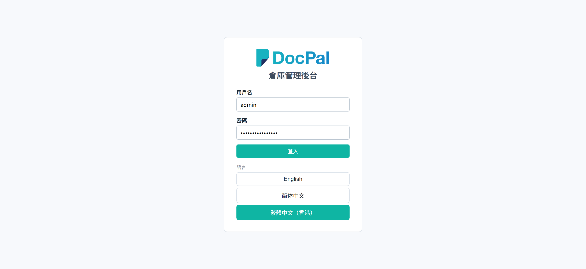

1. 輸入**用戶名**。
2. 輸入**密碼**。
3. 點按**登入**。
4. 登入前可在下方切換**語言**（English／简体中文／繁體中文（香港））。

只有屬於 admin 群組的用戶才能登入後台。示範種子用戶為 `admin` / `DocPalAdmin2026!`（正式部署前必須更改）。

## 主頁與版面導覽

登入後，主頁以卡片列出所有功能入口，與左邊側欄的分組相同。

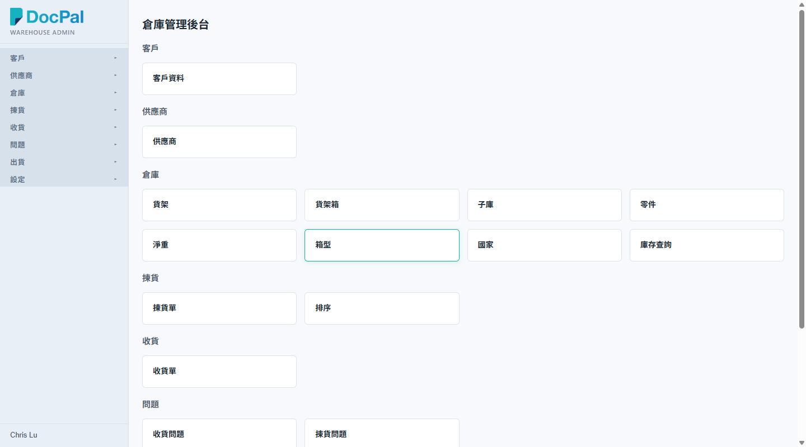

- **側欄** — 功能分為：客戶、供應商、倉庫、揀貨、收貨、問題、出貨、設定；點按分組可展開／收起。
- **主頁卡片** — 與側欄項目一一對應，點按直接進入該頁。
- **左下角用戶名**（圖中「Demo Admin」）— 點按開啟彈出選單：切換語言及**登出**。

---

## 客戶

### 客戶資料

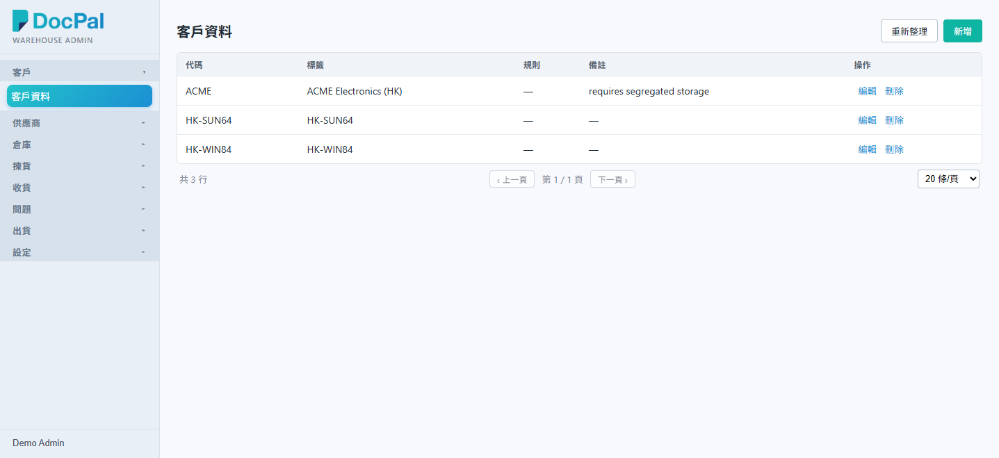

- 客戶主檔：新增、編輯、刪除客戶資料。
- **rule** 欄位記錄客戶的自訂要求（例如標籤或文件的特殊規定）。

## 供應商

### 供應商

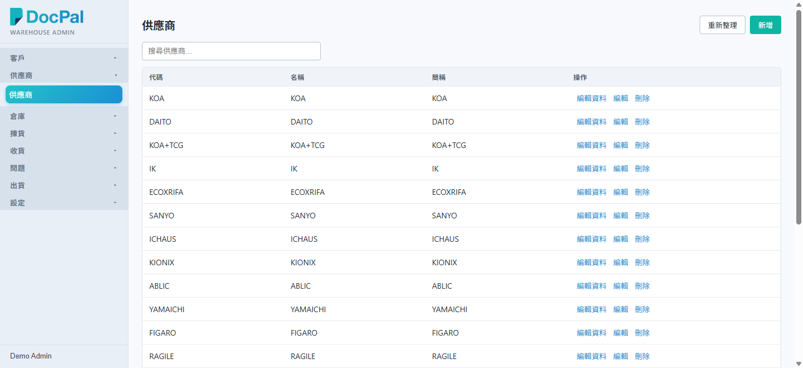

- 供應商主檔（與 Oracle AP_SUPPLIERS 同步的鏡像）：**新增**、**編輯**、**刪除**。
- 頂部**搜尋欄**可按關鍵字即時篩選列表。
- 每行的**編輯資料**開啟供應商資料（Supplier profile）對話框 — 編輯 PDA 本地的供應商設定，包括 QR 掃描模板（見下文）。

### QR 掃描模板編輯器

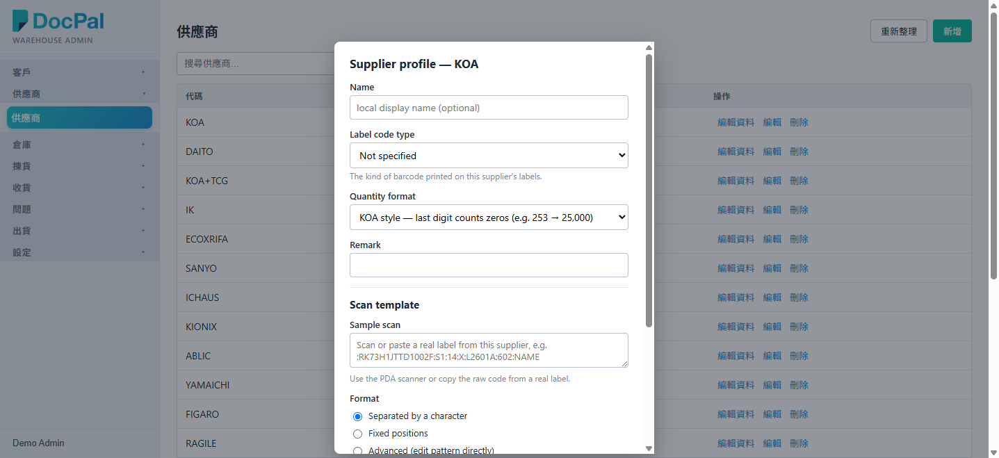

- 供應商資料對話框內的 **Scan template** 區段，用於教 PDA 解析該供應商標籤的 QR／條碼內容（此對話框內部維持英文介面）。
- **Sample scan** — 貼上或掃描一個真實標籤內容作為範例。
- **Format** — 選擇解析方式：以分隔字元拆分（Separated by a character）、固定位置（Fixed positions）或進階（直接編輯規則）。
- 為每段內容標記欄位（料號、數量、日期碼等）後，下方會即時顯示解析預覽，並可用測試台驗證其他標籤。
- **Quantity format** — 該供應商標籤的數量編碼方式（例如 KOA 格式：最後一位代表零的個數）。

## 倉庫

### 貨架

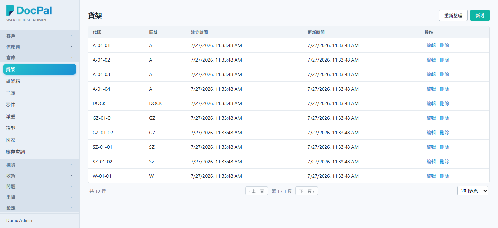

- 貨架主檔：新增、編輯、刪除貨架（區域、代碼等）。

### 貨架箱

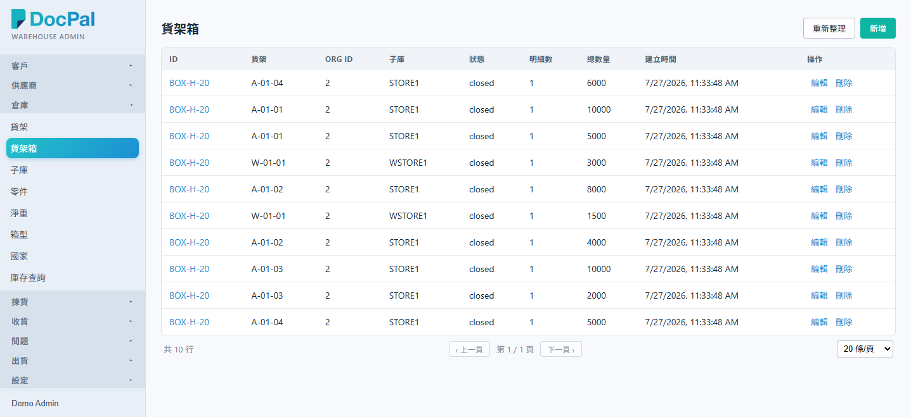

- 列出所有貨架箱：箱號、所屬貨架、ORG／子庫及狀態。
- 點按箱號開啟箱詳情。

### 貨架箱詳情

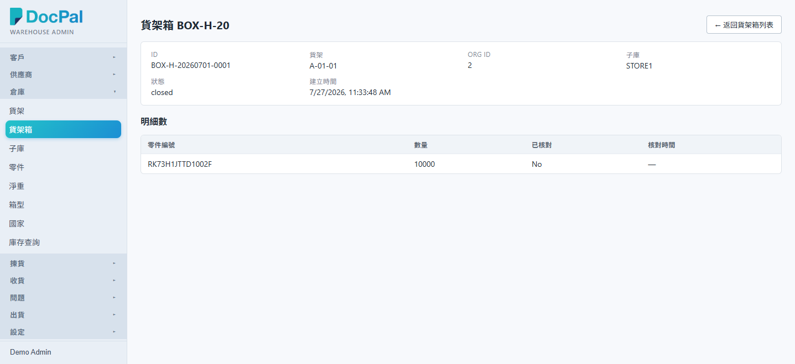

- 顯示箱的基本資料及箱內批次（料號、數量、日期碼等）。
- 箱內項目為**唯讀** — 庫存異動只能透過 PDA 流程（上架、揀貨、查貨）進行。

### 子庫

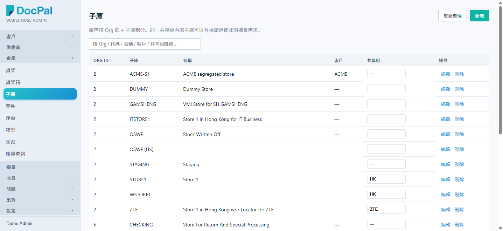

- 子庫（Sub-inventory）主檔：以 ORG + 代碼為群組，客戶專屬倉會標示客戶代碼。
- 每行可直接編輯**共享群組**（share group）— 同一共享群組的子庫可互相供貨給對方的揀貨需求；留空表示只供自己使用。
- 頂部可按關鍵字篩選及排序。

### 零件

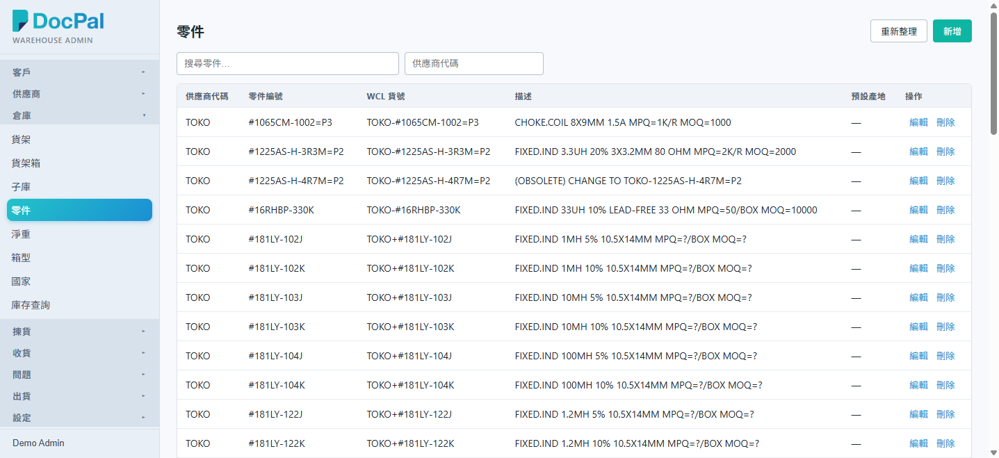

- 零件主檔（約十萬筆 Oracle 料號）：**伺服器端分頁**，頂部可按料號關鍵字搜尋、按供應商篩選，欄位標題可點按排序。
- 新增、編輯、刪除零件（料號為唯一鍵，其他表以此引用）。

### 淨重

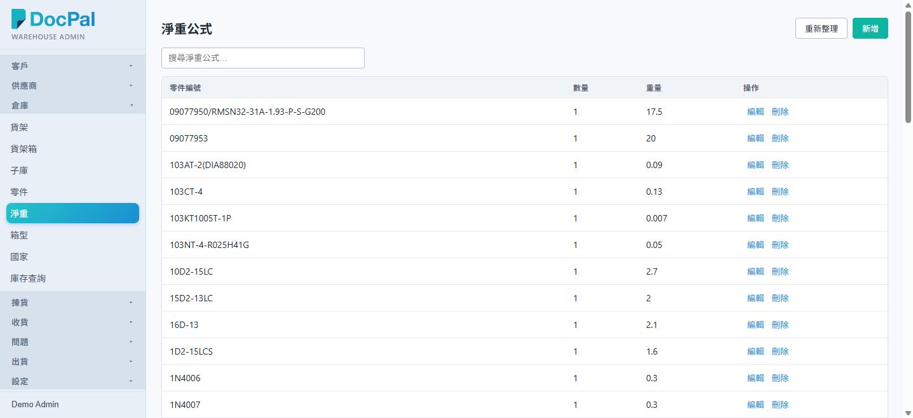

- 淨重公式表：按料號設定單件淨重，供測量／覆核流程自動計算並預填箱件淨重（公斤）。

### 箱型

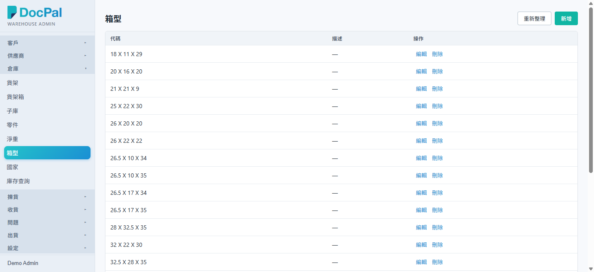

- 箱型主檔：箱子的尺寸資料，供測量流程選用。

### 國家

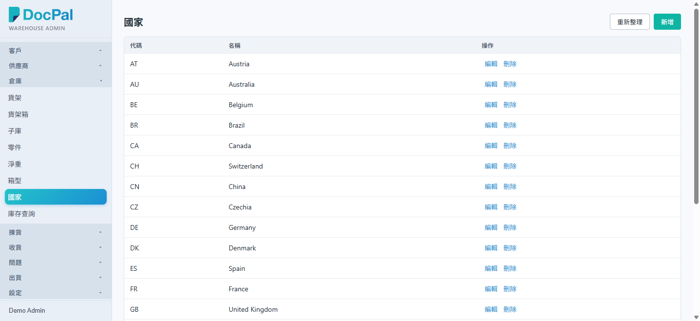

- 國家主檔：目的地國家清單，供測量流程選用。

### 庫存查詢

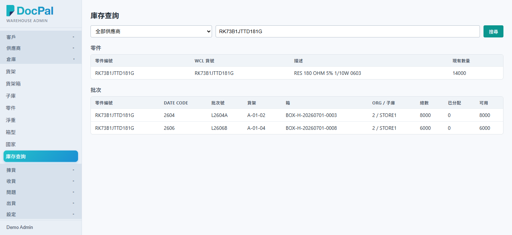

- 唯讀查詢：選擇**供應商**（或全部）及輸入**料號關鍵字**，按**搜尋**。
- **零件**表顯示匹配料號的概要（料號、WCL 貨號、描述、現有數量）。
- **批次**表顯示每個庫存批次：DATE CODE、批次號、貨架、箱、ORG／子庫、總數、已分配及可用數量。

---

## 揀貨

### 揀貨單

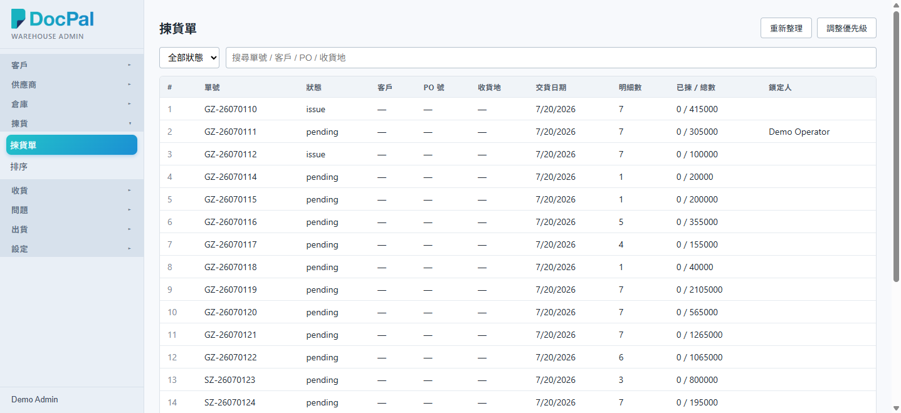

- 以**優先順序**（priority_seq）列出揀貨單：單號、客戶、交貨日期、狀態等。
- **狀態篩選** — 全部、pending、issue 等；揀貨員在 PDA 上報問題的單會以 issue 狀態顯示。
- 點按單號開啟揀貨單詳情。

### 排序

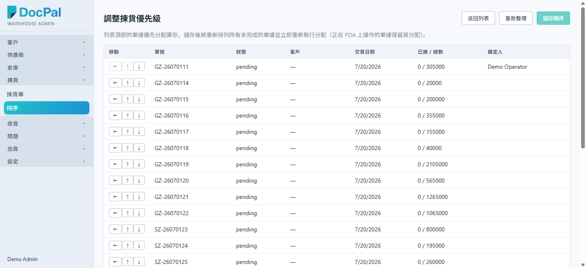

- 拖拉調整揀貨單的優先順序，儲存後系統會按新順序**重新分配庫存**（排前的單先取貨）。
- 正被揀貨員操作的單（工作鎖定中）不會被重新分配影響。

### 揀貨單詳情

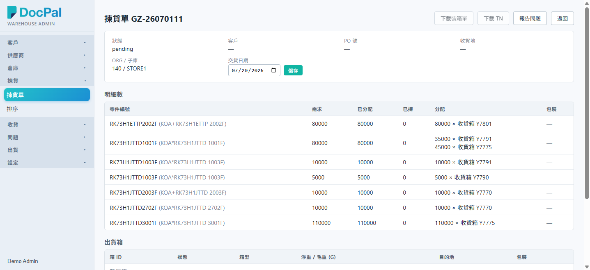

- 頂部顯示狀態、客戶、PO 號、收貨地、ORG／子庫。
- **交貨日期** — 可直接修改後按**儲存**（會寫入操作記錄）。
- **明細數** — 每個項目的零件編號、需求、已分配、已揀數量，以及分配來源（哪個收貨箱）及包裝進度。
- **出貨箱** — 此單的運輸箱：箱 ID、狀態、箱型、淨重／毛重（公斤）、目的地及包裝進度。
- **操作記錄** — 頁底的審計日誌（見下文「通用操作說明」）。
- 右上角：**報告問題**（見下文）；**下載裝箱單**／**下載 TN** 為佔位按鈕（文件格式待定，暫未開通）。

### 報告揀貨問題

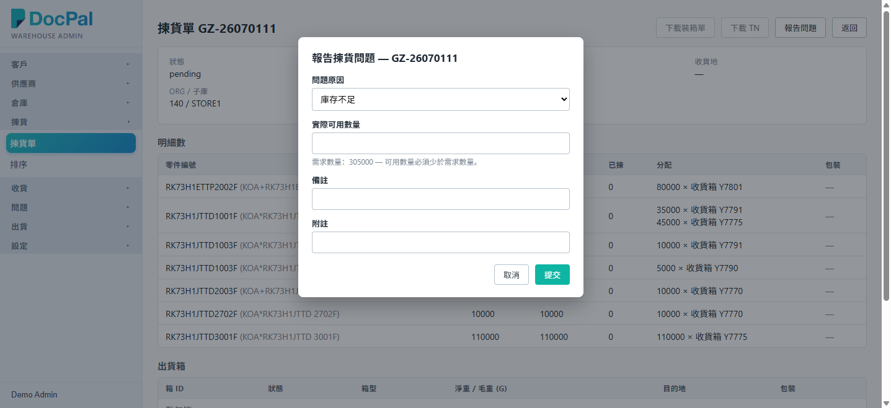

- 揀貨單詳情的**報告問題**開啟此對話框（與 PDA 揀貨員上報問題相同效果）：
  - **問題原因** — 例如「庫存不足」。
  - **實際可用數量** — 必須少於需求數量（對話框會顯示需求數量作提示）。
  - **備註**及**附註** — 補充說明。
- 提交後揀貨單轉為 **issue** 狀態，並從揀貨員的待辦中暫停，直至問題解決。

### 問題單詳情與解決

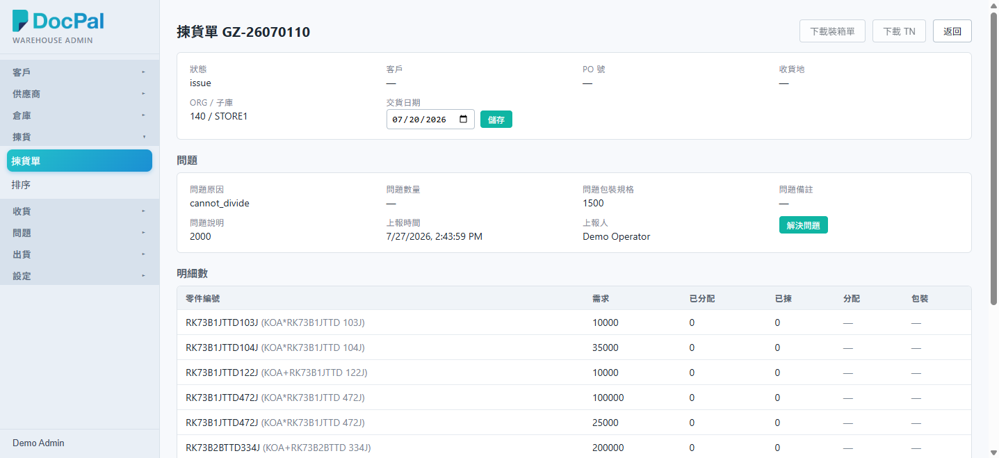

- 狀態為 issue 的揀貨單會在詳情頂部顯示**問題**區塊：問題原因、問題數量、問題包裝規格、問題備註、問題說明、**上報時間**及**上報人**（顯示用戶姓名）。
- 按**解決問題**（可附解決備註）— 揀貨單回到 **pending** 狀態，系統隨即**重新分配庫存**，揀貨員可繼續作業。
- 上報及解決都會記入頁底的**操作記錄**。

## 收貨

### 收貨單

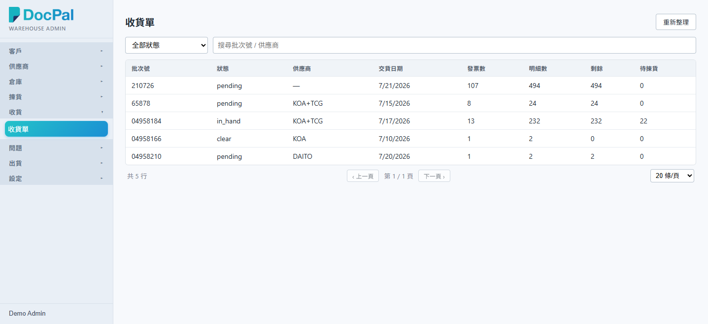

- 列出收貨單：批次號、供應商、交貨日期、狀態等。
- **狀態篩選** — 全部、pending、provisional_received、received 等；有待揀貨需求的單會顯示待揀貨標記。
- 點按批次號開啟收貨單詳情。

### 收貨單詳情

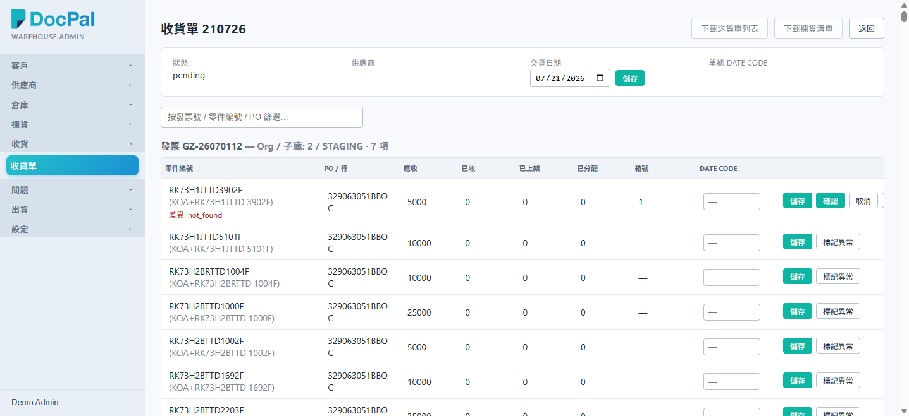

- 頂部顯示狀態及**單據 DATE CODE**（可修改後按**儲存**）。
- **篩選欄** — 按發票號／零件編號／PO 即時篩選下方項目。
- 每張發票列出其項目：零件編號、數量、箱號、DATE CODE（可逐項修改後按**儲存**）及每項進度。
- 每個項目的操作：
  - **標記異常** — 開啟異常對話框（見下文）。
  - 已標記異常的項目會顯示紅色「**差異：**」註記及原因，並提供：**確認**（已知悉，標記保留作審計記錄）、**取消**（清除該差異）、**移除**（從訂單刪除該項目；若該項目已開始收貨作業會被拒絕）。
- **操作記錄** — 頁底的審計日誌（見下文「通用操作說明」）。
- 右上角：**下載送貨單列表**／**下載揀貨清單** 為佔位按鈕（文件格式待定，暫未開通）。

### 標記異常

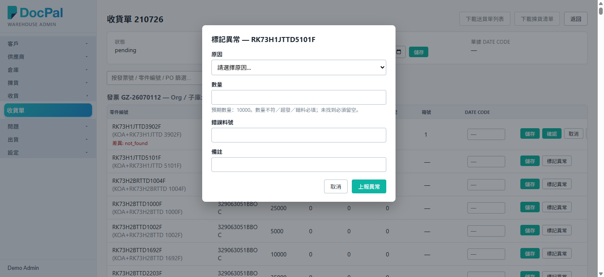

- 項目上的**標記異常**開啟此對話框（與 PDA 收貨員匯報問題相同效果）：
  - **原因** — 找不到（not_found）、損壞（damaged）、數量不符（qty_mismatch）、錯誤物料（wrong_part）、超量出貨（over_shipment）、品質拒收（quality_rejection）。
  - **數量** — 數量不符／超發／錯料時必填；找不到時必須留空（對話框會顯示預期數量作提示）。
  - **錯誤料號** — 原因為錯誤物料時填寫實際收到的料號。
  - **備註** — 補充說明。
- 按**上報異常**提交後，項目會加上差異註記，並出現在「問題 → 收貨問題」頁。

---

## 問題

### 收貨問題（收貨差異）

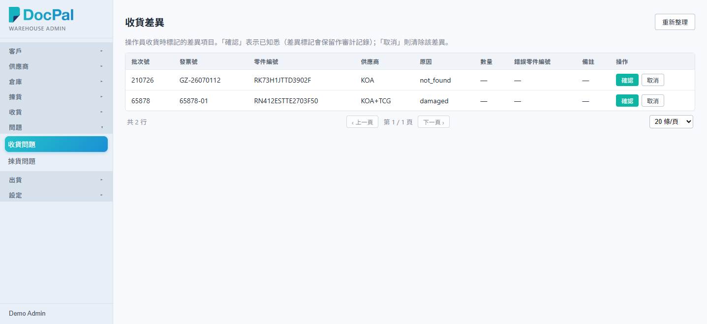

- 跨訂單列出所有**未處理**的收貨差異：批次號、發票號、零件編號、供應商、原因、數量、錯誤零件編號及備註。
- 每行操作：**確認**（已知悉 — 差異標記會保留作審計記錄）；**取消**（清除該差異）。
- 差異的完整歷史（包括已處理的）可在該收貨單詳情頁底的**操作記錄**查看。

### 揀貨問題

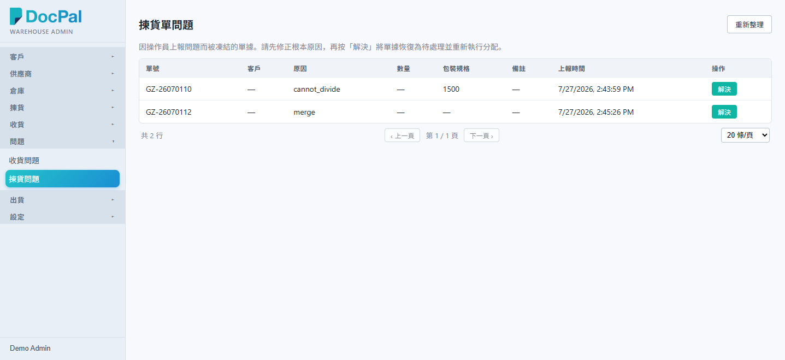

- 列出所有狀態為 **issue** 的揀貨單及上報的問題資料（原因、數量、上報人、上報時間）。
- 點按單號進入詳情，按**解決問題** — 訂單回到 pending 並重新分配庫存。

## 出貨

### 出貨單

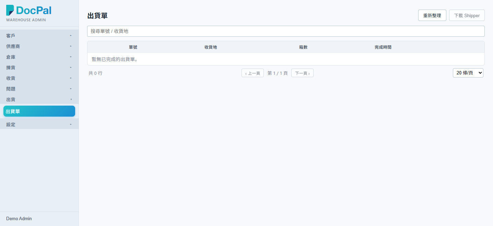

- 列出**可以出貨**的訂單：單號、收貨地、箱數（已封箱進度）及完成時間；頂部搜尋欄可按單號／收貨地即時篩選。
- 列表來源會按流程設定（哪些步驟已啟用）自動調整：
  - **覆核步驟啟用** — 已完成覆核的任務；
  - **覆核關閉、測量啟用** — 已完成測量的任務；
  - **兩者都關閉** — 已完成揀貨的訂單。
- 點按單號開啟出貨單詳情：顯示單據狀態、客戶、PO 號，以及每個箱的箱型、**淨重／毛重（公斤）**、目的地及箱內包裹清單（含核對狀態）。
- **核取方塊**可多選多張出貨單，供日後下載承運商（Shipper）文件之用。
- 示範種子資料沒有走完流程的訂單，所以列表為空 — 需先在 PDA 完成揀貨、測量（及覆核）流程才會出現資料。
- 下載按鈕為佔位功能（承運商文件格式待定，暫未開通）。

## 設定

### 用戶

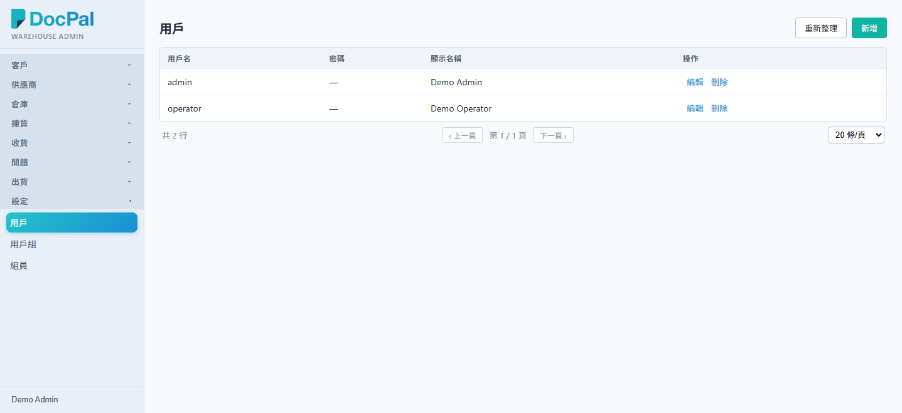

- 用戶主檔：新增、編輯、刪除用戶（登入名稱、顯示姓名、密碼）。
- 用戶本身沒有角色欄位 — 權限由所屬群組決定。

### 用戶群組

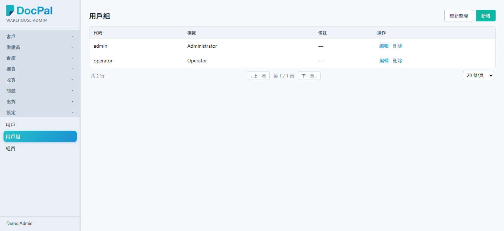

- 群組主檔：新增、編輯、刪除群組（例如 admin、operator）。
- 只有 **admin** 群組的成員可以登入此後台。

### 群組成員

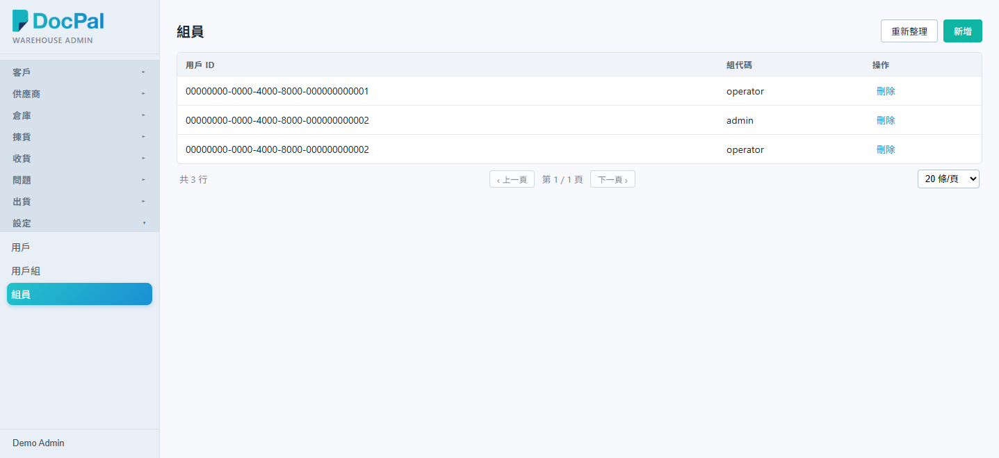

- 群組與用戶的多對多關係：把用戶加入或移出群組。
- 一個用戶可屬於多個群組。

---

## 通用操作說明

- **分頁** — 列表頁底部可切換每頁 20／50／100 條及上一頁／下一頁；零件及淨重頁為伺服器端分頁。
- **排序** — 點按欄位標題可切換升序／降序。
- **搜尋／篩選** — 列表頂部的搜尋欄即時篩選（供應商、子庫等），或送往伺服器查詢（零件、庫存查詢）。
- **重新整理** — 大部分列表頁右上角有**重新整理**按鈕。
- **錯誤提示** — 操作失敗時頁面會顯示錯誤橫額及原因（例如移除已開始作業的項目會被拒絕）。
- **操作記錄** — 收貨單及揀貨單詳情頁底的審計日誌表：記錄每項改動的時間、操作人（顯示用戶姓名）、動作及內容 — 包括上報問題、解決問題、修改交貨日期、修改 DATE CODE、移除項目等，可用於追查訂單過往是否曾出現問題及如何處理。
- **下載按鈕** — 裝箱單、TN、送貨單列表、揀貨清單及承運商文件均為佔位功能，待文件 Excel 格式確定後才開通。

## 注意事項

- 後台直接修改主檔及訂單資料，**沒有二次確認以外的安全網** — 刪除及移除操作請謹慎。
- 示範種子密碼（`admin` / `DocPalAdmin2026!`）只供演示，正式部署前必須更改。
- 後台的資料改動（例如解決問題、調整優先順序）會即時反映到 PDA — PDA 列表會在重新聚焦或收到伺服器事件時自動更新。
