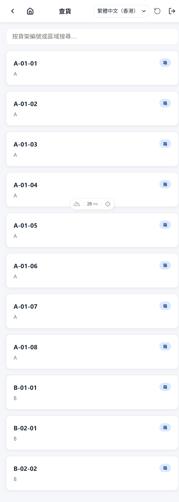
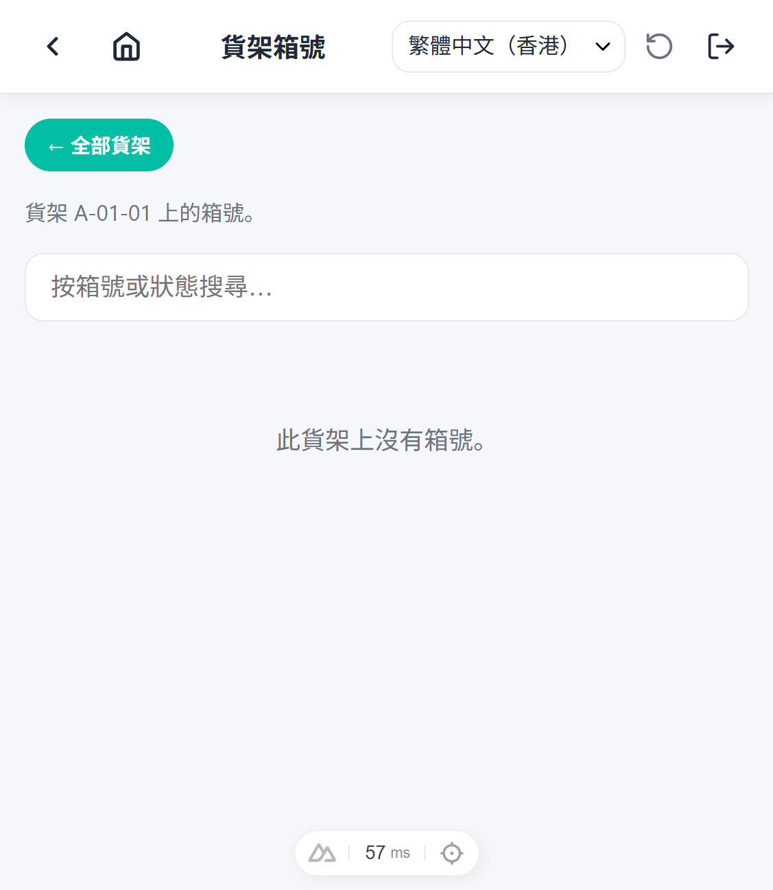

# Goods Verify Steps

## 1. Open the goods verify queue

From the home screen, tap **Goods Verify**. The queue shows verify tasks for
the selected date (today by default), filterable by status
(pending / verified / skipped) and searchable by shelf, box, or part number.

## 2. Generate today's tasks

Tap **Generate today's tasks**. The backend creates one pending task for
every inventory lot that moved today. A toast reports how many tasks were
created; generating again the same day creates no duplicates.

## 3. Select a task

Tap a task card to open its detail page.

## 4. Review the lot

The detail shows the task's expected quantity plus the lot's full context:
part, description, date/lot codes, COO/COW, warehouse → section →
sub-inventory, shelf and box, current total / allocated / available
quantities, and — when the lot is boxed — the box's contents.

## 5. Verify the task

Physically count the stock, then:

- **Count matches** — leave the counted quantity empty (or enter the same
  number) and tap **Verify**. The task is marked verified.
- **Count differs** — enter the counted quantity. The app shows the delta
  and warns that an ADJUST will be written to the lot. Tap **Verify** to
  confirm: the backend corrects the lot's total quantity and records the
  adjustment in the inventory ledger.

The task flips to `verified` and shows who verified it and when.
