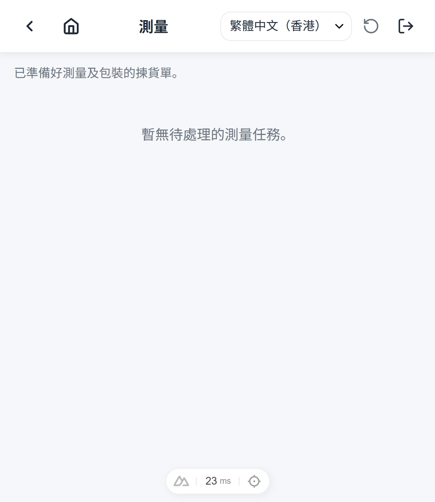

# Measuring Overview

Measuring is the process of verifying a shipping box's contents and recording its measurements (box size, weights, destination) before closing it.

## When to use it

Use the Measuring flow once picking has packed items into shipping boxes. There is no measuring task: the list shows the open shipping boxes that contain packages, and closing a box *is* the measuring completion.

## Concept

1. The operator opens the Measuring list.

   
   *Measuring list — open boxes that contain packages (empty state when none are ready)*

2. The operator selects a box — the page shows the box's packages with their verification progress. A box may contain packages from several picking orders (cross-order packing).
3. On the box page (a table of the box's packages) the operator scans each package's QR label to verify it; a per-row camera Scan button is the OCR fallback.
4. Once all packages are verified, the operator records box size, net/gross weight (kg — the net weight is pre-filled from the part net-weight master and can be adjusted), and destination country, then taps **Confirm box** — one action that saves and closes the box.
5. Closing the box completes its measuring; when the verify step is enabled, a verify task is created for the box.

## Related guides

- [Step-by-step operator guide](./steps.md)
- [Box measurements](./box-measurements.md)
- [AI scope](./ai-scope.md)
