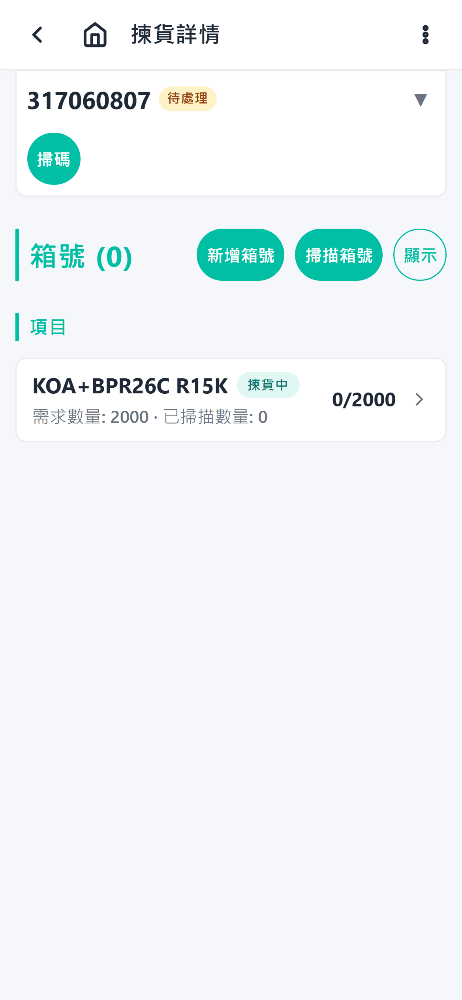

# Picking Steps

## 1. Open the picking list

From the home screen, tap **Picking**. The list shows open picking orders with status and summary information.

## 2. Select a picking order

Tap the order you want to work on. The detail page opens.

Opening an order locks it to you: while your page is open, the system will not re-shuffle that order's allocations. The lock releases when you leave the page (or expires after 10 minutes if the app is closed). If a banner says the order is "being picked by" a coworker, the page is read-only — pick a different order or ask them to leave it.

The list order is the priority order set by the office — work from the top.

## 3. Review allocated lines

The detail page shows each picking item, the required quantity, and where the stock is allocated from (lot or receiving-area item). For allocations against a receiving order, any recorded box IDs from the receiving invoice items are shown as a "Box IDs" remark so the operator knows which boxes to pick from.

## 4. Pick each line

- Tap a line or the scan button.
- Confirm the part number and quantity.
- Confirm the source location.
- The picked quantity is recorded and the allocation is reduced or removed.

### Whole-box shortcut

When everything the order still needs is exactly the contents of one shelf box, a green banner appears at the top of the detail page naming that box. Tap **Use whole box**, confirm, and the box is claimed as-is: it becomes the order's shipping box with everything already packed (its received size and weights are pre-filled), and the order finishes automatically — no item-by-item scanning. If no banner shows, pick the lines normally.

### Box / shelf / carton barcode scanning

Each item row on the scan session page shows where its remaining qty is allocated from (e.g. `CTN C3001 ×500`, `BOX-H-20260701-0003 @ A-02-01 ×1000`) — go to that location and scan its barcode.

**Receiving carton** (known, sealed contents): scanning the carton barcode queues everything the order still needs from that carton in one go — no per-part scans. Re-scanning the same carton is rejected as a duplicate.

**Shelf box / shelf code** (loose stock): a **Pick from box** dialog opens listing what the order still needs from that box/shelf. Keep scanning the part labels inside the box — each scan queues that item against the box's allocation (a part that isn't in the box, or a label qty beyond what the box still needs, is rejected with a message). Scanning another box/shelf barcode switches the dialog to it.

Apply the queued scans with **Confirm** as usual.

## 5. Handle issues

If the quantity is wrong, the item is damaged, or stock cannot be found, use the issue-reporting flow. See [Issue reporting](./issue-reporting.md).

## 6. Finish the order

When all lines are fully picked, the order status changes to finished and the next enabled step's task is created — a measuring task, or a verify task when measuring is disabled (nothing when both are off, in which case the order goes straight to shipping).
