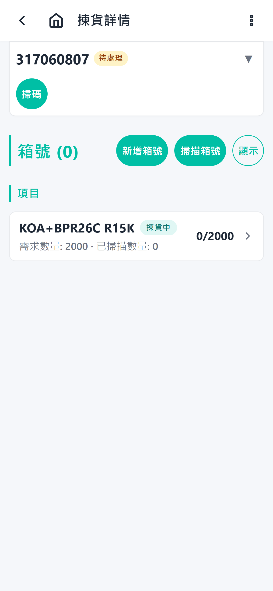

# Picking Steps

## 1. Open the picking list

From the home screen, tap **Picking**. The list shows the picking orders released for work — those confirmed by the office (`allocated`) plus orders already being picked or finished — as compact rows with status and summary information; the search bar and filter button stay pinned at the top while scrolling. The list is grouped into sections by status — **Picking** (in progress) first, then **Allocated** (ready to pick), then **Finished** — each with a count badge, and all matching orders are fetched at once (no paging). Tap the refresh button to reload. Search and filters apply to all orders.

## 2. Select a picking order

Tap the order you want to work on. The detail page opens. The order number and status badge show in the app header; the horizontal-dots menu at the top right holds the order details (customer, delivery date, PO, ship-to, …) and the **Finish picking** action. The round **Scan** floating button at the bottom right opens the scan session (hidden once the order is finished, in issue, or held by a coworker).

Opening an order locks it to you: while your page is open, the system will not re-shuffle that order's allocations. The lock releases when you leave the page (or expires after 10 minutes if the app is closed). If a banner says the order is "being picked by" a coworker, the page is read-only — pick a different order or ask them to leave it.

The list order is the priority order set by the office — work from the top.

## 3. Review allocated lines

The detail page lists each picking part as a compact row: part, status badge, and required / scanned quantities at a glance. Lines sharing the same part no are merged into one row by default (totals across the lines) — the **Merge part no** toggle next to the section title switches back to the per-line view. Tap a row to expand its required quantity and where the stock is allocated from (lot or receiving-area item), plus the package/box actions; in the merged view the contributing lines are listed as summary lines and the allocations and packages are aggregated across them (allocations fed by the same source are summed into one row). For allocations against a receiving order, any recorded box IDs from the receiving invoice items are shown as a "Box IDs" remark so the operator knows which boxes to pick from. If the allocated shelf carries a warning (set by an admin on the shelf, e.g. outdated-stock shelves), a ⚠️ icon appears next to the shelf code — hover/long-press shows the warning text; the stock is still pickable.

## 4. Pick each line

- Tap a line or the scan button.
- Confirm the part number and quantity.
- Confirm the source location.
- The picked quantity is recorded and the allocation is reduced or removed.

### Whole-box shortcut

When everything the order still needs is exactly the contents of one shelf box, a green banner appears at the top of the detail page naming that box. Tap **Use whole box**, confirm, and the box is claimed as-is: it becomes the order's shipping box with everything already packed (its received size and weights are pre-filled), and the order finishes automatically — no item-by-item scanning. If no banner shows, pick the lines normally.

### Box / shelf / carton barcode scanning

Each item row on the scan session page shows where its remaining qty is allocated from (e.g. `CTN C3001 ×500`, `BOX-H-20260701-0003 @ A-02-01 ×1000`) — go to that location and scan its barcode. When the order has several lines of the same part, they appear as one merged row (totals across the lines), and a scanned package may span those lines: a label qty that exceeds one line but fits the part's total is split across the lines automatically.

**Receiving carton** (known, sealed contents): scanning the carton barcode queues everything the order still needs from that carton in one go — no per-part scans. Re-scanning the same carton is rejected as a duplicate.

**Shelf box / shelf code** (loose stock): a **Pick from box** dialog opens listing what the order still needs from that box/shelf. Keep scanning the part labels inside the box — each scan queues that item against the box's allocation (a part that isn't in the box, or a label qty beyond what the box still needs, is rejected with a message). Scanning another box/shelf barcode switches the dialog to it.

Apply the queued scans with **Confirm** as usual.

**Outdated date code alert:** if a scanned label's date code is older than the supplier's outdated limit, the scan still applies but an alert pops up naming the supplier, the date code and the limit, and the order gets a warning chip on the list and detail pages. Keep working — an admin has been notified. The order cannot be finished while such warnings are unresolved.

### Scan item into box (cross-order)

The boxes section of the detail page has a **Scan item into box** toggle per open box. With it armed, scanning a part barcode picks that item straight into the box — even when the item belongs to a *different* picking order (a box may hold packages from several orders). The system resolves the barcode across all open orders; if nothing matches or more than one order's item could match, a message explains why nothing was added. Scanning another box's toggle switches the armed box.

## 5. Handle issues

If the quantity is wrong, the item is damaged, or stock cannot be found, use the issue-reporting flow. See [Issue reporting](./issue-reporting.md).

## 6. Finish the order

When all lines are fully picked, the order status changes to finished and the order's packed boxes move on to measuring. No task is created at finish anymore — closing a box is the measuring completion, and each closed box gets its own verify task when the verify step is enabled.

If the order has unresolved outdated date-code warnings (warning chip on the order), the order does not finish — the auto-finish is skipped and the manual **Finish picking** action shows a message with the number of unresolved warnings. Ask an admin to resolve the order's warnings (admin console → Issues → Outdated warnings); the order finishes automatically once they are resolved.
