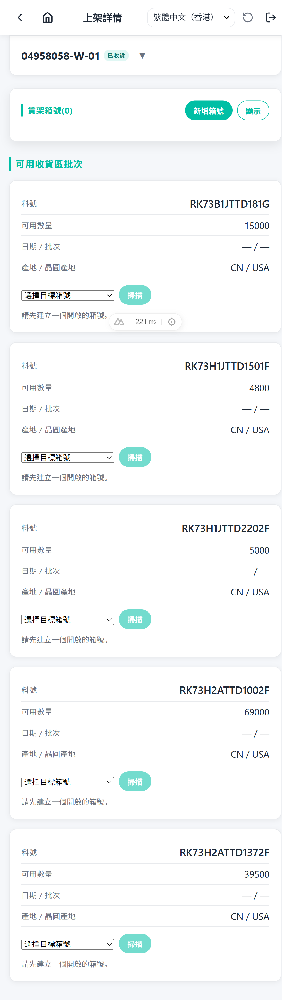

# Put-away Overview

Put-away is the process of moving received goods from the receiving area onto warehouse shelves.

## When to use it

Use the Put-away flow after receiving has created receiving-area inventory and the goods need to be stored.

## Concept

1. The operator opens the Put-away list.

   

2. The operator selects a put-away task or receiving order.

   
3. The app shows items available to move.
4. The operator scans each physical piece of an item; scanned pieces accumulate under that item.
5. The operator creates a shelf box on a selected shelf.
6. The operator assigns whole scanned pieces to the shelf box.
7. The operator closes the box when done; the inventory lot is updated with the new shelf location.

## Related guides

- [Step-by-step operator guide](./steps.md)
- [AI scope](./ai-scope.md)
