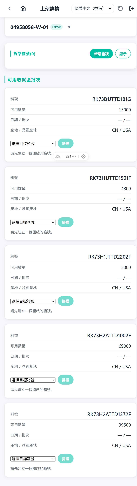

# Put-away Overview

Put-away is the process of moving received goods from the receiving area onto warehouse shelves.

## When to use it

Use the Put-away flow after receiving has created receiving-area inventory and the goods need to be stored.

## Concept

1. The operator opens the Put-away list.

   The list shows receiving orders with goods still to be shelved. Warehouses
   that run task mode (flow config `steps.put-away.autoCreateTasks`,
   `warehouse_config` row `"flow"`)
   see an auto-created put-away task per arrived order instead — the queue is
   the same work, tracked as tasks, and the detail can show a suggested shelf
   per item (based on where that part is already stored).

   

2. The operator selects a put-away task or receiving order.

   
3. The app shows items available to move, grouped by part number — lines of
   the same part on the order combine into one card with the total quantity
   (expand the card to see the individual lines).
4. The operator scans each physical piece of an item (hardware gun or camera
   OCR); scanned pieces accumulate in a **pending list**, grouped by part.

   Scanning can be free-match (the hardware gun accepts any label that matches
   an item on the order) or item-first: tapping **Gun scan** on a part card
   arms it so the next gun scans are validated strictly against that part,
   until it is disarmed or fully put away. A label's quantity may span several
   lines of the same part (e.g. one package covering a 300 + 20000 split) —
   the app distributes it across the lines automatically.
5. The operator scans the **shelf barcode** where the goods belong. A banner
   shows the selected shelf (tap × to clear). If pieces are pending, the app
   asks to confirm putting them all onto that shelf.
6. While a shelf is selected, every further scan goes straight onto that
   shelf — no extra confirmation. Pending rows can be committed individually
   with **Add to shelf**, or deleted with **Remove** if mis-scanned.
7. When every piece is put away the order clears itself; the inventory lots
   carry the new shelf location.

## Related guides

- [Step-by-step operator guide](./steps.md)
- [AI scope](./ai-scope.md)
