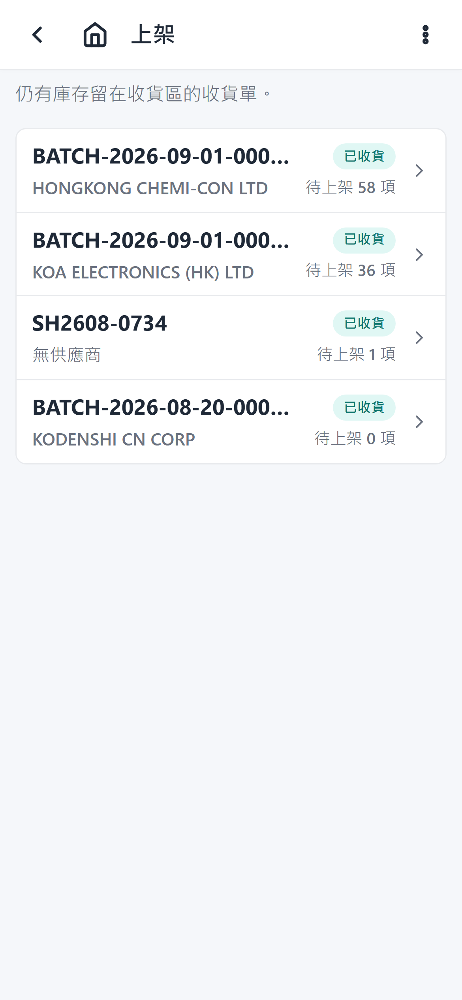

# Put-away Steps

## 1. Open the put-away list

From the home screen, tap **Put-away**. The list shows orders/tasks waiting to be put away.

## 2. Select a task

Tap the task to open the detail page. The batch number and receiving status show in the app header; the horizontal-dots menu at the top right holds the supplier and delivery date.

## 3. Review available items

The detail shows receiving-area items waiting to be put away, grouped by part
number — if the order carries the same part on several lines (for example
300 + 20000), they appear as **one card with the combined total**, with total,
scanned, and put-away quantities. Expand the card (the **expand** button) to see
the individual lines with their own remaining quantities and batch values.

## 4. Scan physical pieces

For each item, tap **Scan piece** and scan a physical label. Each scan records one piece with its own quantity, date code, lot code, COO, and COW. Repeat until the scanned quantity reaches the item total.

If the label's quantity spans several lines of the same part (one physical
package covering a 300 + 20000 split), just scan it — the app distributes the
quantity across those lines automatically.

With the hardware gun you can also just scan — a label that matches an item on the order is accepted automatically (free-match). For tighter control, tap **Gun scan** on the item you are holding first: the card is highlighted with an "armed" badge, and every following gun scan is accepted only if it matches that item (part number and remaining quantity). The item stays armed for repeated scans; tap the button again (now labelled as cancel) to disarm, or tap **Gun scan** on another item to switch. The armed state clears itself once the item is fully put away.

Scans made before a shelf is chosen wait in the **pending list** (grouped by
part, with each piece's quantity and batch values). From there a mis-scan can
be deleted with **Remove**.

## 5. Scan the shelf

Scan the barcode of the shelf where the goods belong. If pieces are pending,
the app asks **"Put N pcs to shelf X?"** — confirming puts them all onto that
shelf at once. A banner shows the selected shelf; tap × to clear it and go
back to pending mode.

## 6. Keep scanning (optional)

While a shelf is selected, every scan goes **straight onto that shelf** — no
further confirmation needed. Switch shelves at any time by scanning another
shelf barcode; the pending list (if any) is offered to the new shelf.

## 7. Finish

When every piece is put away, the order/task completes itself — no close
step. The inventory lots now carry the shelf location and the stock is
available to picking.
