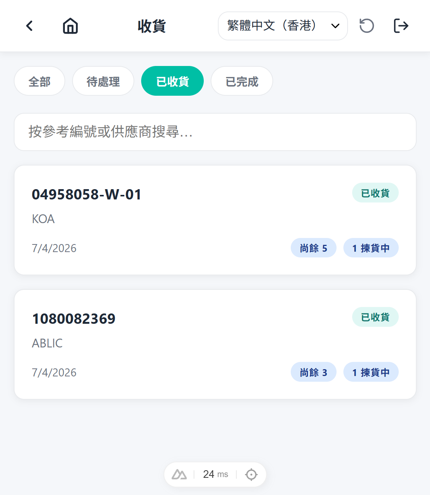

# Receiving Overview

Receiving is the process of confirming incoming shipments and creating receiving-area inventory.

## When to use it

Use the Receiving flow when a supplier shipment arrives at the warehouse.

## Concept

1. The operator opens the Receiving list.

   

2. The operator selects a receiving order.

   

3. The order detail shows invoices and invoice items.
4. The operator confirms quantities and reports any mismatches.
5. Confirmed items create receiving-area inventory lots.
6. The Receiving list can also show how many picking orders still need stock from each receiving order.

## Views on the detail page

- **Receiving view** — invoices and items.
- **Picking view** — linked picking orders and the scan modal for OCR-assisted picking.

## Related guides

- [Step-by-step operator guide](./steps.md)
- [Mismatch handling](./mismatch-handling.md)
- [AI scope](./ai-scope.md)
