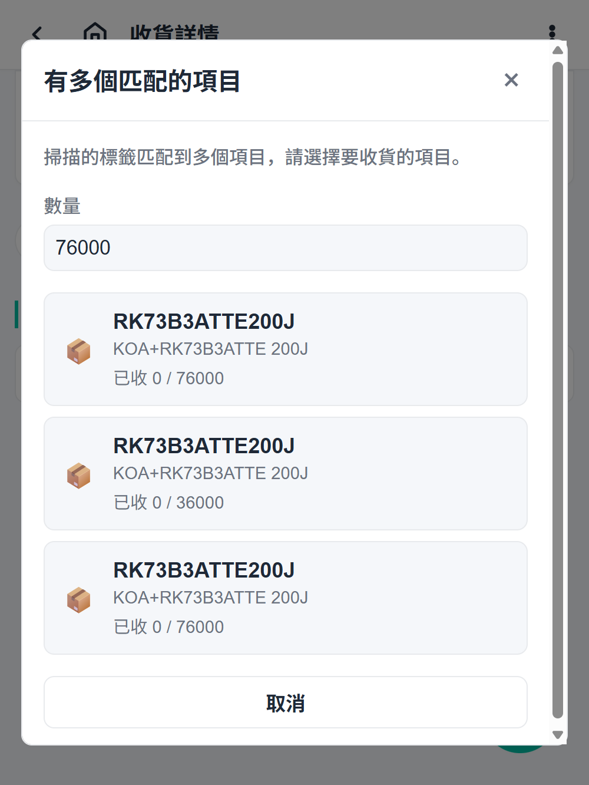
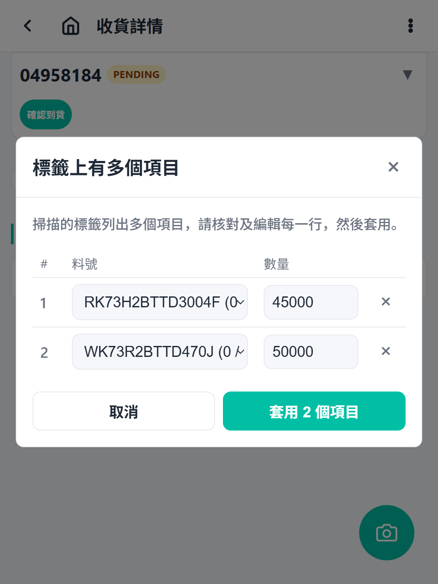

# Receiving Steps

## 1. Open the receiving list

From the home screen, tap **Receiving**. The list shows receiving orders with status and a pending picking-order count badge.

## 2. Select a receiving order

Tap the order you want to receive. The detail page opens on the Receiving view.

## 3. Review invoices and items

The detail shows each invoice and each line item (part, expected quantity, received quantity).

## 4. Confirm or adjust quantities

- If the physical quantity matches, confirm the line.
- If the quantity differs, report a mismatch. See [Mismatch handling](./mismatch-handling.md).

## 5. Create receiving-area inventory

Confirmed items become receiving-area inventory lots that can be picked or put away.

## 6. Switch to Picking view (optional)

Tap **Picking** to see linked picking orders and use OCR-assisted picking to consume receiving-area stock directly.

## Scanning labels (optional)

Tap the floating camera button to scan a supplier label instead of confirming lines manually:

- A label that matches exactly one item applies immediately.
- An ambiguous or unknown label opens the candidate review dialog — pick the
  invoice line and quantity to receive.

  

- A **carton label listing several items** opens the multi-item table: one
  editable row per item (part + quantity). Apply receives every row; failed
  rows stay editable for a retry.

  
