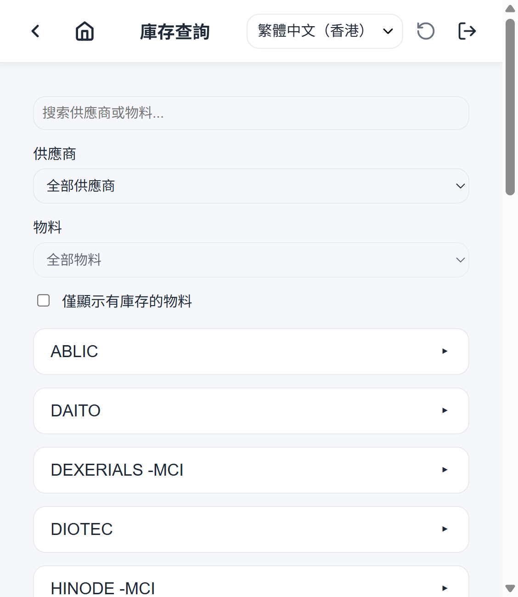
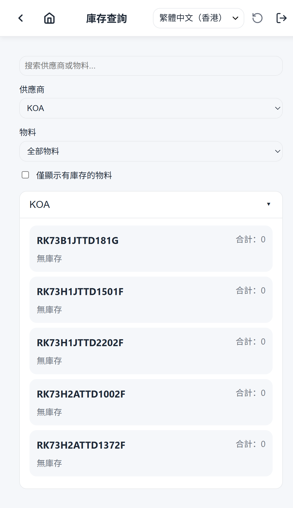

# Stock Search Overview

Stock Search lets operators look up inventory across the warehouse.

## When to use it

Use Stock Search when you need to know:

- Whether a part is in stock.
- How much of a part is available.
- Where a part is located (warehouse, section, sub-inventory, shelf, box).

## Concept

1. Open Stock Search from the home screen.
2. Type a part number (or expand the filters to pick a supplier or enter a
   shelf code) — results reload as you type.
3. Each matching part shows its total on-hand quantity and the list of
   inventory lots behind it (location, available vs. total, batch details).

## Screenshots

### Default view

The Stock Search page lists parts with their on-hand quantity and lot
breakdown.

### Filtered view

The filters panel narrows results by supplier and shelf code.

## Filters

- **Part number search** — normalized substring match on the part number.
- **Supplier filter** — show only lots traceable to one supplier's
  receiving orders.
- **Shelf filter** — show only lots on an exact shelf code.

All three filters combine (AND) in a single backend query
(`GET /stock-search`); lots with zero quantity are included by design.

## Related guides

- [AI scope](./ai-scope.md)
