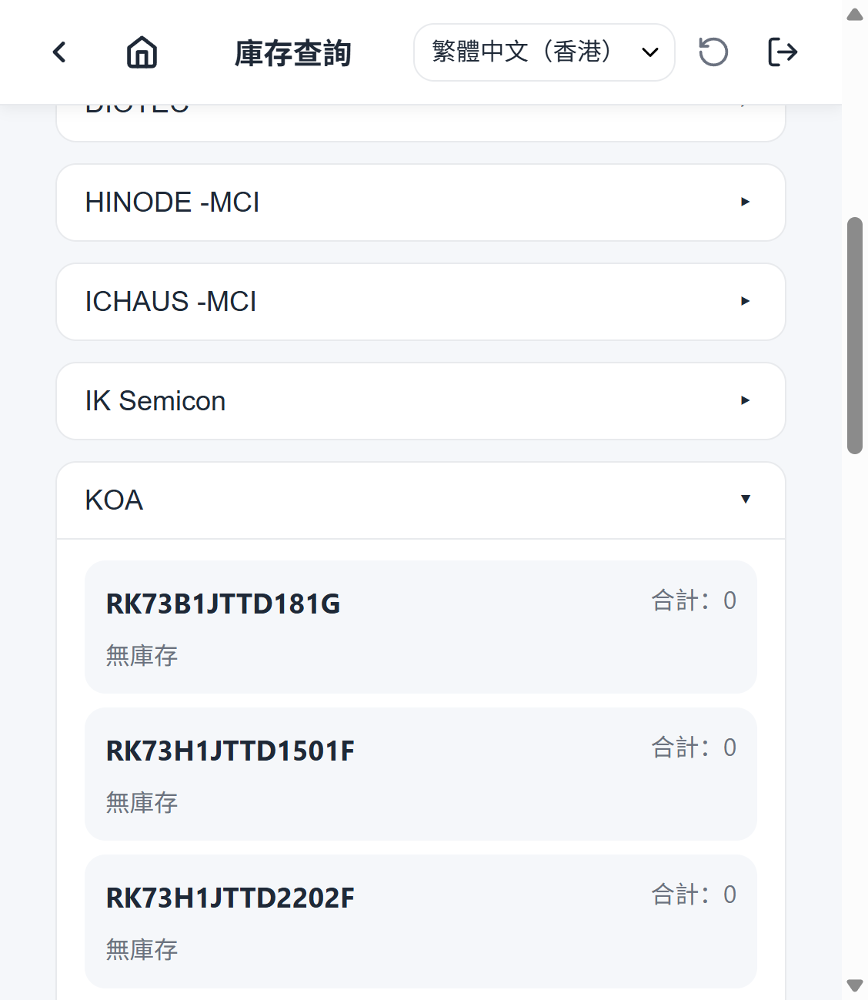

# Stock Search Overview

Stock Search lets operators look up inventory across the warehouse.

## When to use it

Use Stock Search when you need to know:

- Whether a part is in stock.
- How much of a part is available.
- Where a part is located (shelf, box, or receiving area).

## Concept

1. Open Stock Search from the home screen.
2. Use the search bar or filters to narrow suppliers and items.
3. Tap a supplier card to expand it and see its items.
4. Each item shows total quantity and a list of inventory locations.

## Screenshots

### Default view

The Stock Search page lists all suppliers. Tap a supplier to expand its items.

### Expanded supplier

Expanded supplier cards show every associated item and its inventory breakdown. Items with no stock display "No inventory".

### Filtered view

Select a supplier from the filter to narrow the list and enable the item filter. Items with zero inventory are hidden when the toggle is on.

## Filters

- **Keyword search** — search by supplier name/code, part number, internal code, or description.
- **Supplier filter** — show only one supplier.
- **Item filter** — show only one item (available after selecting a supplier).
- **Only items with inventory** — hide items that currently have no stock.

## Related guides

- [AI scope](./ai-scope.md)
