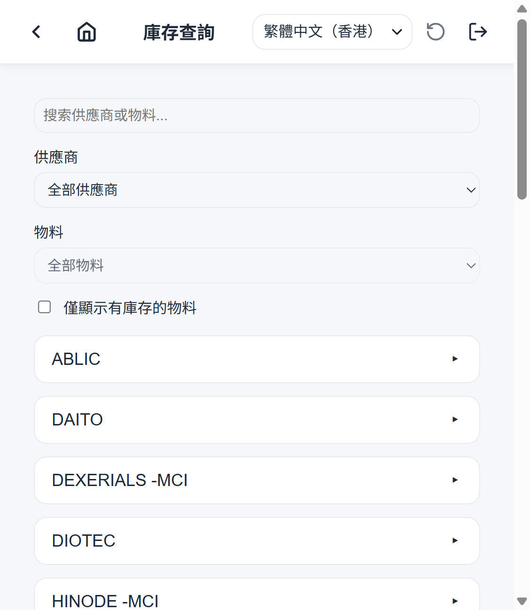
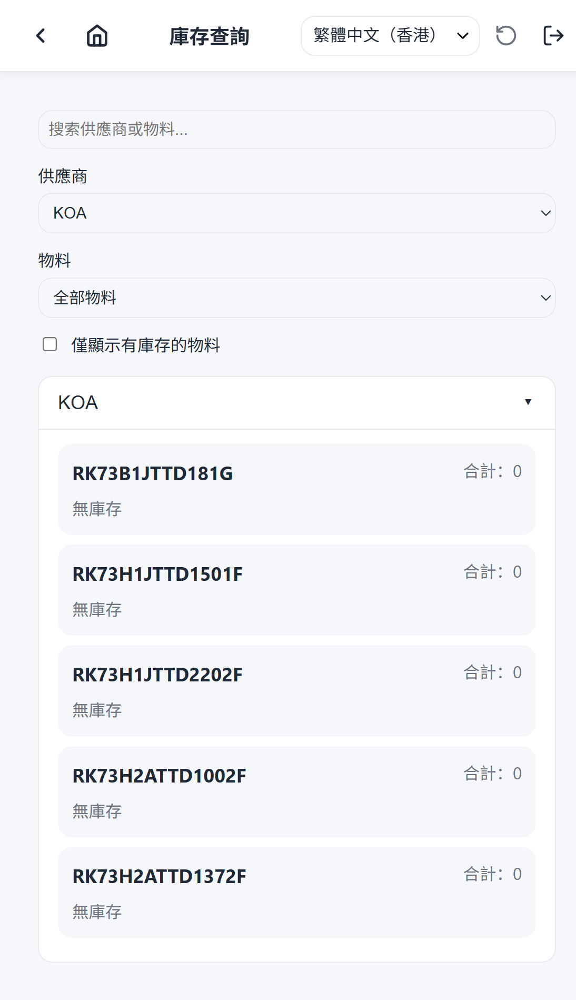

# Stock Search Overview

Stock Search lets operators look up inventory across the warehouse.

## When to use it

Use Stock Search when you need to know:

- Whether a part is in stock.
- How much of a part is available.
- Where a part is located (warehouse, section, sub-inventory, shelf, box).

## Concept

1. Open Stock Search from the home screen.
2. Type a part number (or expand the filters to pick a supplier, toggle
   brand/location/shelf chips, or set a drawing-no / date-code range) —
   results reload as you change any filter.
3. Each matching part shows its total on-hand quantity and the list of
   inventory lots behind it (location, available vs. total, batch details).
   A summary strip above the results shows the filtered item count and
   on-hand / available totals. Results load in pages of 50 lots with a
   "load more" button and a "Showing X of Y" count.

## Screenshots

### Default view

The Stock Search page lists parts with their on-hand quantity and lot
breakdown.

### Filtered view

The filters panel narrows results by supplier, brand, location (org /
sub-inventory), and shelf — the same filter set as the admin console,
presented as tap-to-toggle chips.

## Filters

- **Part number search** — normalized substring match on the part number /
  WCL item no.
- **Supplier filter** — show only lots traceable to one supplier's
  receiving orders.
- **Brand / Location / Shelf chips** — multi-select (any-of) over the
  distinct values present in the current stock; location chips are exact
  org + sub-inventory pairs and are limited to your user sub-inventory
  scope.
- **Drawing no** — substring match on the lot's drawing number.
- **Date-code range** — calendar pickers converted to WWYY date codes.

All filters combine (AND) in a single backend query
(`GET /stock-search`); lots with zero quantity are included by design.

## Related guides

- [AI scope](./ai-scope.md)
