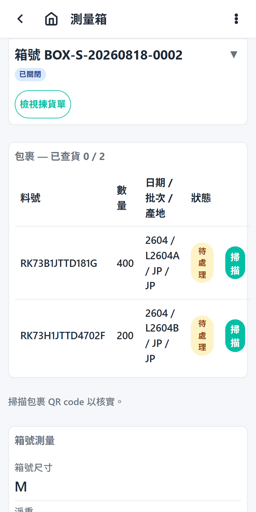

# Verify Steps

## 1. Open the verify list

From the home screen, tap **Verify**. The list shows the boxes with a pending verify task (one task per box, created when the box was closed).

## 2. Select a box

Tap the box to open its page. The page shows the box's packages with their re-scan progress and recorded measurements — a box may hold packages from several picking orders.

## 3. Reopen the box if it needs correction

A closed box shows a **Reopen** button while its task is pending. Reopening returns the box to open and clears its packages' verified flags (both passes), so they must be scanned again before the box can be re-closed.

## 4. Re-verify the packages

The box page (shared with measuring) lists the box's packages in a table. Scan each package's QR label with the hardware scanner — a matching package is re-verified immediately and its row flips to **Verified**. Scanning works on the closed box too: the normal verify pass checks every item against the sealed box without reopening it. The per-row **Scan** button (camera OCR with review) is the fallback for labels the QR parser cannot handle.

Every package in the box must be re-scanned in this pass — the task cannot complete until all of them are.

## 5. Correct measurements if needed

When every package in an open box is verified, the measurements form opens automatically (or tap **Enter measurements**). Box size, net/gross weight (kg — the net weight pre-fills from the part net-weight master), and destination country can be edited; then **Confirm box** closes the box again. See [Box measurements](../measuring/box-measurements.md).

## 6. Complete the task

When the box is closed and every package has been re-scanned, tap **Complete verify** (the button appears only then). The box moves on to the admin shipping feed.
