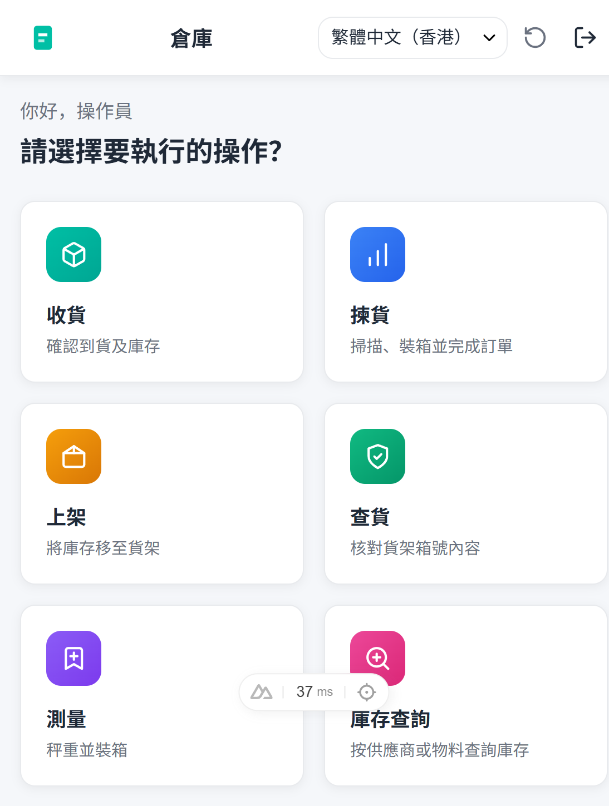
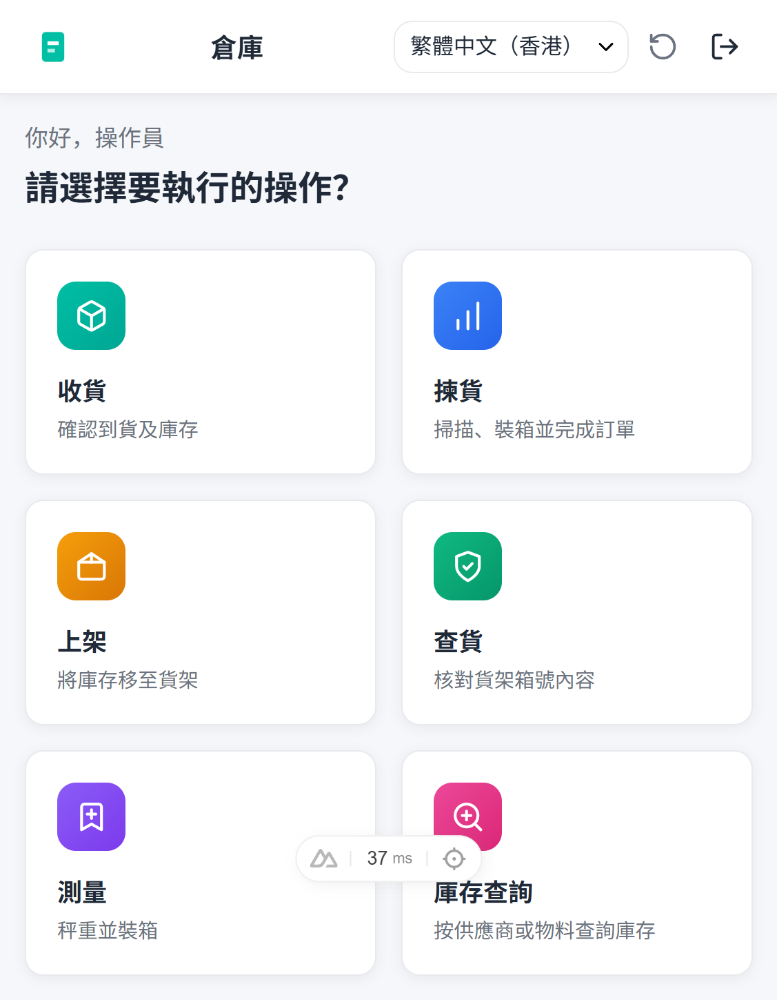

# User Menu

This guide covers the first screens an operator sees when opening the Warehouse PDA app: the login screen and the home menu.

## Login screen

When the app starts, the operator sees the DocPal login screen.

1. Enter the **username**.
2. Enter the **password**.
3. Tap **登入** (Log in).

The demo seed user is `operator` / `DocPal2026!`.

## Home screen

After logging in, the home screen shows the main operation menu.

From the home screen the operator can choose:

| Card | Flow | Purpose |
|------|------|---------|
| 收貨 | Receiving | Confirm incoming goods and inventory. |
| 揀貨 | Picking | Scan, pack, and complete orders. |
| 上架 | Put-away | Move received stock onto shelves. |
| 查貨 | Goods verify | Check shelf and box contents. |
| 測量 | Measuring | Weigh and measure boxes. |
| 庫存查詢 | Stock search | Look up stock by supplier or material. |

Tap any card to enter that flow.

## Header actions

The app header (visible on most screens) provides:

- **Language switcher** — change the interface language.
- **Reset database** — clears the local demo database and re-seeds it.
- **Logout** — return to the login screen.
