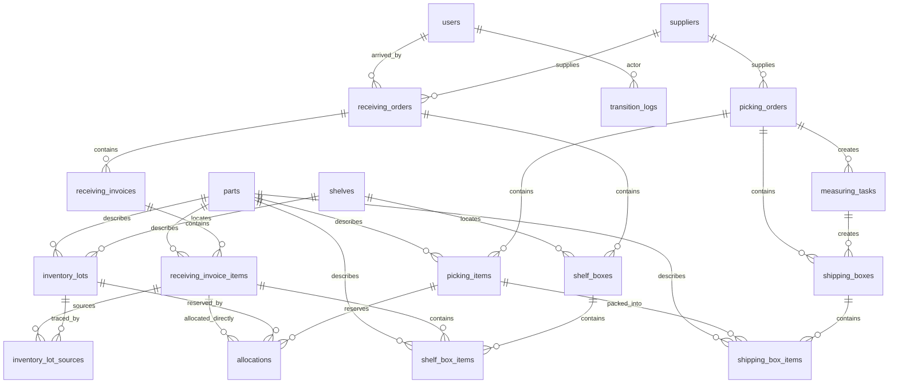

# Database Relations

This document describes the tables in the PGlite warehouse demo and how they relate to each other.

## ER diagram

## Table summary

| Table | Purpose | Key references |
|-------|---------|----------------|
| `users` | Demo operator/admin accounts | — |
| `suppliers` | Suppliers referenced by orders | — |
| `parts` | Parts referenced by invoices, lots, picking items | — |
| `shelves` | Shelf locations | — |
| `receiving_orders` | Incoming shipments | `supplier_id` → `suppliers` |
| `receiving_invoices` | Invoices within a receiving order | `receiving_order_id` → `receiving_orders` |
| `receiving_invoice_items` | Lot-level expected/received detail | `receiving_invoice_id`, `part_id` |
| `inventory_lots` | Stock view, unique by part/date/lot/origin/location | `part_id`, `shelf_code`, `box_id` |
| `inventory_lot_sources` | Traceability: which receiving invoice item produced a lot | `inventory_lot_id`, `receiving_invoice_item_id` |
| `picking_orders` | Outgoing shipments to customers | `supplier_id` → `suppliers` |
| `picking_items` | Lines to pick within a picking order | `picking_order_id`, `part_id` |
| `allocations` | Reservation of stock for a picking item | `picking_item_id`, `inventory_lot_id` (optional), `receiving_invoice_item_id` (optional) |
| `measuring_tasks` | Packing task created when a picking order is finished | `picking_order_id` |
| `shipping_boxes` | Boxes used to ship a finished picking order | `picking_order_id`, `measuring_task_id` |
| `shipping_box_items` | Items packed into a shipping box | `shipping_box_id`, `picking_item_id`, `part_id` |
| `shelf_boxes` | Boxes created during put-away | `receiving_order_id`, `shelf_code` |
| `shelf_box_items` | Items moved into a shelf box | `shelf_box_id`, `receiving_invoice_item_id`, `part_id` |
| `transition_logs` | Audit log of status changes | `actor_id` → `users` |

## Relation rules

- **Receiving → inventory.** A `receiving_invoice_item` feeds stock into `inventory_lots` in two ways:
  - Directly, as a receiving-area lot (`shelf_code = NULL, box_id = NULL`) used before put-away.
  - Through `inventory_lot_sources`, which links a located lot back to its originating receiving invoice item for traceability.
- **Picking → inventory.** A `picking_item` reserves stock through `allocations`. An allocation points to either:
  - An `inventory_lot` (shelved, shelf-box, or receiving-area lot), or
  - A `receiving_invoice_item` (direct reservation before the lot is materialized).
- **Boxes.** `shelf_boxes` group items moved into storage; `shipping_boxes` group items packed for a customer.
- **State changes.** Every status change for `receiving_orders`, `picking_orders`, `shelf_boxes`, `shipping_boxes`, and `measuring_tasks` is recorded in `transition_logs`.

## Allocation lifecycle

1. **Created.** When stock becomes available or a new picking order arrives, `db/allocate.ts` creates `allocations` rows reserving quantity for each picking item.
2. **Materialized.** Before picking from a receiving-area allocation, `db/picking.ts` creates a dedicated `inventory_lots` row and moves or splits the allocation onto that lot.
3. **Picked.** `db/picking.ts` confirms the picked quantity, reduces the allocation, and updates `picking_items.picked_qty` and `inventory_lots` totals.
4. **Removed.** When an allocation is fully picked, it is deleted.
