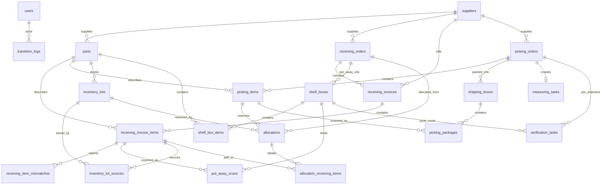

# Warehouse API Database Schema — SQLite Reference

> This document describes the database behind the Hono API in `apps/api` (better-sqlite3 + Drizzle ORM) — the schema the web app uses by default. The legacy in-browser PGlite/Postgres schema (available behind `warehouseAdapter: "pglite"`) is similar but not identical; its source of truth is the code in `apps/web/db/`. For anything the API serves, this file is authoritative.

## Overview

- **Engine:** SQLite via better-sqlite3 (`apps/api/src/db/client.ts`), file-backed at `./dev.sqlite` (override with `DATABASE_URL`).
- **Pragmas:** `journal_mode = WAL`, `synchronous = NORMAL`, `busy_timeout = 5000`, `foreign_keys = ON`.
- **No migration tool.** `createTables()` (`apps/api/src/db/tables.ts`) runs on every boot and is idempotent: it executes the full `CREATE TABLE IF NOT EXISTS` DDL below, preceded by `ensureColumn(...)` calls that `ALTER TABLE ADD COLUMN` any columns a pre-existing `dev.sqlite` predates. Add new columns in **both** places.
- **Drizzle schema:** `apps/api/src/db/schema/*.ts` (re-exported from `schema/index.ts`) mirrors the DDL and is the typed view used by queries.
- **Seed:** `apps/api/src/db/seedSql.ts` is a committed, generated artifact (do not hand-edit). Regenerate with `pnpm --filter @warehouse/api gen:seed` (runs `apps/web/scripts/export-api-seed.test.ts`, which projects the web seed onto this schema). `POST /dev/reset` wipes and re-seeds.
- **Ids & timestamps:** ids are UUID strings; all `created_at` / `updated_at` columns are ISO 8601 UTC text.

## Full SQL Schema

This is the runtime DDL from `apps/api/src/db/tables.ts` (`createTablesSql`).

```sql
CREATE TABLE IF NOT EXISTS users (
  id TEXT PRIMARY KEY, username TEXT NOT NULL UNIQUE, password_hash TEXT NOT NULL,
  role TEXT NOT NULL, name TEXT NOT NULL, created_at TEXT NOT NULL, updated_at TEXT NOT NULL);

CREATE TABLE IF NOT EXISTS suppliers (
  id TEXT PRIMARY KEY, code TEXT NOT NULL UNIQUE, name TEXT NOT NULL, qr_template TEXT,
  qrcode_qty_encoding TEXT,
  created_at TEXT NOT NULL, updated_at TEXT NOT NULL);

CREATE TABLE IF NOT EXISTS parts (
  id TEXT PRIMARY KEY, part_no TEXT NOT NULL, part_no_norm TEXT NOT NULL, description TEXT,
  supplier_id TEXT REFERENCES suppliers(id),
  created_at TEXT NOT NULL, updated_at TEXT NOT NULL);
CREATE INDEX IF NOT EXISTS parts_part_no_norm_idx ON parts(part_no_norm);
CREATE INDEX IF NOT EXISTS parts_supplier_idx ON parts(supplier_id);

CREATE TABLE IF NOT EXISTS shelves (
  id TEXT PRIMARY KEY, code TEXT NOT NULL UNIQUE, created_at TEXT NOT NULL, updated_at TEXT NOT NULL);

CREATE TABLE IF NOT EXISTS receiving_orders (
  id TEXT PRIMARY KEY, external_id TEXT NOT NULL UNIQUE, ref_no TEXT NOT NULL, delivery_date TEXT,
  status TEXT NOT NULL CHECK(status IN ('pending','in_hand','clear')), supplier_id TEXT REFERENCES suppliers(id),
  created_at TEXT NOT NULL, updated_at TEXT NOT NULL);
CREATE INDEX IF NOT EXISTS receiving_orders_status_updated_idx ON receiving_orders(status, updated_at);
CREATE INDEX IF NOT EXISTS receiving_orders_supplier_idx ON receiving_orders(supplier_id);

CREATE TABLE IF NOT EXISTS receiving_invoices (
  id TEXT PRIMARY KEY, external_id TEXT, receiving_order_id TEXT NOT NULL REFERENCES receiving_orders(id) ON DELETE CASCADE,
  invoice_no TEXT NOT NULL, supplier_id TEXT REFERENCES suppliers(id),
  created_at TEXT NOT NULL, updated_at TEXT NOT NULL, UNIQUE(receiving_order_id, invoice_no));
CREATE INDEX IF NOT EXISTS receiving_invoices_order_idx ON receiving_invoices(receiving_order_id);
CREATE INDEX IF NOT EXISTS receiving_invoices_supplier_idx ON receiving_invoices(supplier_id);

CREATE TABLE IF NOT EXISTS receiving_invoice_items (
  id TEXT PRIMARY KEY, receiving_invoice_id TEXT NOT NULL REFERENCES receiving_invoices(id) ON DELETE CASCADE,
  part_id TEXT NOT NULL REFERENCES parts(id), qty INTEGER NOT NULL DEFAULT 0, received_qty INTEGER NOT NULL DEFAULT 0,
  picked_qty INTEGER NOT NULL DEFAULT 0, put_away_qty INTEGER NOT NULL DEFAULT 0,
  allocated_qty INTEGER NOT NULL DEFAULT 0, available_qty INTEGER NOT NULL DEFAULT 0, box_id TEXT,
  date_code TEXT, lot_code TEXT, coo TEXT, cow TEXT, date_code_norm TEXT, lot_code_norm TEXT, coo_norm TEXT, cow_norm TEXT, line_no INTEGER,
  created_at TEXT NOT NULL, updated_at TEXT NOT NULL);
CREATE INDEX IF NOT EXISTS rii_part_available_idx ON receiving_invoice_items(part_id, available_qty);
CREATE INDEX IF NOT EXISTS rii_invoice_idx ON receiving_invoice_items(receiving_invoice_id);
CREATE UNIQUE INDEX IF NOT EXISTS rii_invoice_line_uq ON receiving_invoice_items(receiving_invoice_id, line_no) WHERE line_no IS NOT NULL;

CREATE TABLE IF NOT EXISTS receiving_item_mismatches (
  id TEXT PRIMARY KEY, receiving_invoice_item_id TEXT NOT NULL REFERENCES receiving_invoice_items(id) ON DELETE CASCADE,
  kind TEXT NOT NULL, mismatch_qty INTEGER, wrong_part_no TEXT, note TEXT,
  status TEXT NOT NULL DEFAULT 'pending' CHECK(status IN ('pending','confirmed','cancelled')),
  effective_received_qty INTEGER, previous_received_qty INTEGER,
  reported_by TEXT, confirmed_by TEXT, confirmed_at TEXT, cancelled_by TEXT, cancelled_at TEXT,
  created_at TEXT NOT NULL, updated_at TEXT NOT NULL);
CREATE INDEX IF NOT EXISTS rim_item_idx ON receiving_item_mismatches(receiving_invoice_item_id);

CREATE TABLE IF NOT EXISTS picking_orders (
  id TEXT PRIMARY KEY, external_id TEXT NOT NULL UNIQUE, ref_no TEXT NOT NULL,
  status TEXT NOT NULL CHECK(status IN ('pending','picking','finished','issue')), ship_to TEXT, destination_country TEXT,
  delivery_date TEXT, supplier_id TEXT REFERENCES suppliers(id),
  po_no TEXT, required_date_code_notice TEXT,
  issue_reason TEXT, issue_note TEXT, issue_qty INTEGER, issue_pack_size INTEGER, issue_remark TEXT,
  issue_reported_at TEXT, issue_reported_by TEXT, created_at TEXT NOT NULL, updated_at TEXT NOT NULL);
CREATE INDEX IF NOT EXISTS picking_orders_status_updated_idx ON picking_orders(status, updated_at);

CREATE TABLE IF NOT EXISTS picking_items (
  id TEXT PRIMARY KEY, picking_order_id TEXT NOT NULL REFERENCES picking_orders(id) ON DELETE CASCADE,
  part_id TEXT NOT NULL REFERENCES parts(id), qty INTEGER NOT NULL DEFAULT 0, picked_qty INTEGER NOT NULL DEFAULT 0,
  allocated_qty INTEGER NOT NULL DEFAULT 0, required_date_code TEXT, source_shelf_code TEXT,
  scanned_not_boxed_qty INTEGER NOT NULL DEFAULT 0,
  remaining_qty INTEGER GENERATED ALWAYS AS (qty - picked_qty - scanned_not_boxed_qty) STORED,
  line_id TEXT,
  created_at TEXT NOT NULL, updated_at TEXT NOT NULL);
CREATE INDEX IF NOT EXISTS picking_items_part_idx ON picking_items(part_id);
CREATE INDEX IF NOT EXISTS picking_items_order_idx ON picking_items(picking_order_id);
CREATE UNIQUE INDEX IF NOT EXISTS picking_items_order_line_uq ON picking_items(picking_order_id, line_id) WHERE line_id IS NOT NULL;

CREATE TABLE IF NOT EXISTS shipping_boxes (
  id TEXT PRIMARY KEY, picking_order_id TEXT NOT NULL REFERENCES picking_orders(id) ON DELETE CASCADE,
  status TEXT NOT NULL DEFAULT 'open' CHECK(status IN ('open','closed','verified')), box_size TEXT,
  net_weight_g INTEGER, gross_weight_g INTEGER, destination_country TEXT,
  created_at TEXT NOT NULL, updated_at TEXT NOT NULL);
CREATE INDEX IF NOT EXISTS shipping_boxes_order_idx ON shipping_boxes(picking_order_id);
CREATE INDEX IF NOT EXISTS shipping_boxes_status_idx ON shipping_boxes(status);

CREATE TABLE IF NOT EXISTS picking_packages (
  id TEXT PRIMARY KEY, picking_item_id TEXT NOT NULL REFERENCES picking_items(id) ON DELETE CASCADE,
  source_type TEXT NOT NULL CHECK(source_type IN ('receiving_invoice_item','inventory_lot')), source_id TEXT NOT NULL,
  qty INTEGER NOT NULL DEFAULT 0, shipping_box_id TEXT REFERENCES shipping_boxes(id),
  date_code TEXT, lot_code TEXT, coo TEXT, cow TEXT, verified INTEGER NOT NULL DEFAULT 0,
  created_at TEXT NOT NULL, updated_at TEXT NOT NULL);
CREATE INDEX IF NOT EXISTS picking_packages_box_idx ON picking_packages(shipping_box_id);
CREATE INDEX IF NOT EXISTS picking_packages_item_idx ON picking_packages(picking_item_id);

CREATE TABLE IF NOT EXISTS inventory_lots (
  id TEXT PRIMARY KEY, part_id TEXT NOT NULL REFERENCES parts(id),
  date_code TEXT, lot_code TEXT, coo TEXT, cow TEXT, date_code_norm TEXT, lot_code_norm TEXT, coo_norm TEXT, cow_norm TEXT,
  shelf_code TEXT, box_id TEXT, total_qty INTEGER NOT NULL DEFAULT 0, allocated_qty INTEGER NOT NULL DEFAULT 0,
  available_qty INTEGER GENERATED ALWAYS AS (total_qty - allocated_qty) STORED,
  created_at TEXT NOT NULL, updated_at TEXT NOT NULL);
CREATE INDEX IF NOT EXISTS inventory_lots_part_shelf_avail_idx ON inventory_lots(part_id, shelf_code, available_qty);

CREATE TABLE IF NOT EXISTS inventory_lot_sources (
  id TEXT PRIMARY KEY, inventory_lot_id TEXT NOT NULL REFERENCES inventory_lots(id) ON DELETE CASCADE,
  receiving_invoice_item_id TEXT NOT NULL REFERENCES receiving_invoice_items(id), qty INTEGER NOT NULL DEFAULT 0,
  created_at TEXT NOT NULL, updated_at TEXT NOT NULL);
CREATE INDEX IF NOT EXISTS ils_lot_idx ON inventory_lot_sources(inventory_lot_id);
CREATE INDEX IF NOT EXISTS ils_item_idx ON inventory_lot_sources(receiving_invoice_item_id);

CREATE TABLE IF NOT EXISTS shelf_boxes (
  id TEXT PRIMARY KEY, shelf_code TEXT NOT NULL, box_id TEXT,
  receiving_order_id TEXT REFERENCES receiving_orders(id),
  status TEXT NOT NULL DEFAULT 'open' CHECK(status IN ('open','closed','verified')),
  created_at TEXT NOT NULL, updated_at TEXT NOT NULL);
CREATE INDEX IF NOT EXISTS shelf_boxes_shelf_idx ON shelf_boxes(shelf_code);
CREATE INDEX IF NOT EXISTS shelf_boxes_status_idx ON shelf_boxes(status);
CREATE INDEX IF NOT EXISTS shelf_boxes_receiving_order_idx ON shelf_boxes(receiving_order_id);

CREATE TABLE IF NOT EXISTS shelf_box_items (
  id TEXT PRIMARY KEY, shelf_box_id TEXT NOT NULL REFERENCES shelf_boxes(id) ON DELETE CASCADE,
  part_id TEXT NOT NULL REFERENCES parts(id), qty INTEGER NOT NULL DEFAULT 0, verified INTEGER NOT NULL DEFAULT 0,
  verified_at TEXT, created_at TEXT NOT NULL, updated_at TEXT NOT NULL);
CREATE INDEX IF NOT EXISTS shelf_box_items_box_idx ON shelf_box_items(shelf_box_id);
CREATE INDEX IF NOT EXISTS shelf_box_items_part_idx ON shelf_box_items(part_id);

CREATE TABLE IF NOT EXISTS put_away_scans (
  id TEXT PRIMARY KEY, receiving_invoice_item_id TEXT NOT NULL REFERENCES receiving_invoice_items(id),
  qty INTEGER NOT NULL DEFAULT 0, shelf_box_id TEXT REFERENCES shelf_boxes(id), verified INTEGER NOT NULL DEFAULT 0,
  verified_at TEXT, date_code TEXT, lot_code TEXT, coo TEXT, cow TEXT, created_at TEXT NOT NULL, updated_at TEXT NOT NULL);
CREATE INDEX IF NOT EXISTS put_away_scans_item_idx ON put_away_scans(receiving_invoice_item_id);
CREATE INDEX IF NOT EXISTS put_away_scans_box_idx ON put_away_scans(shelf_box_id);

CREATE TABLE IF NOT EXISTS allocations (
  id TEXT PRIMARY KEY, picking_item_id TEXT NOT NULL REFERENCES picking_items(id) ON DELETE CASCADE,
  qty INTEGER NOT NULL DEFAULT 0, remark TEXT, inventory_lot_id TEXT REFERENCES inventory_lots(id),
  receiving_order_id TEXT REFERENCES receiving_orders(id),
  created_at TEXT NOT NULL, updated_at TEXT NOT NULL,
  CHECK ((inventory_lot_id IS NOT NULL) != (receiving_order_id IS NOT NULL)));
CREATE INDEX IF NOT EXISTS allocations_item_idx ON allocations(picking_item_id);
CREATE INDEX IF NOT EXISTS allocations_lot_idx ON allocations(inventory_lot_id);
CREATE INDEX IF NOT EXISTS allocations_receiving_order_idx ON allocations(receiving_order_id);

CREATE TABLE IF NOT EXISTS allocation_receiving_items (
  id TEXT PRIMARY KEY, allocation_id TEXT NOT NULL REFERENCES allocations(id) ON DELETE CASCADE,
  receiving_invoice_item_id TEXT NOT NULL REFERENCES receiving_invoice_items(id), qty INTEGER NOT NULL DEFAULT 0,
  created_at TEXT NOT NULL, updated_at TEXT NOT NULL,
  UNIQUE(allocation_id, receiving_invoice_item_id));
CREATE INDEX IF NOT EXISTS ari_item_idx ON allocation_receiving_items(receiving_invoice_item_id);
CREATE INDEX IF NOT EXISTS ari_allocation_idx ON allocation_receiving_items(allocation_id);

CREATE TABLE IF NOT EXISTS measuring_tasks (
  id TEXT PRIMARY KEY, picking_order_id TEXT NOT NULL UNIQUE REFERENCES picking_orders(id) ON DELETE CASCADE,
  status TEXT NOT NULL DEFAULT 'pending' CHECK(status IN ('pending','completed')),
  created_at TEXT NOT NULL, updated_at TEXT NOT NULL);
CREATE INDEX IF NOT EXISTS measuring_tasks_status_updated_idx ON measuring_tasks(status, updated_at);

CREATE TABLE IF NOT EXISTS verification_tasks (
  id TEXT PRIMARY KEY, kind TEXT NOT NULL CHECK(kind IN ('pre_shipment','cycle_count')),
  status TEXT NOT NULL DEFAULT 'pending' CHECK(status IN ('pending','completed')), due_at TEXT,
  picking_order_id TEXT REFERENCES picking_orders(id) ON DELETE CASCADE,
  shelf_box_id TEXT REFERENCES shelf_boxes(id) ON DELETE CASCADE,
  created_at TEXT NOT NULL, updated_at TEXT NOT NULL,
  CHECK ((kind = 'pre_shipment') = (picking_order_id IS NOT NULL)),
  CHECK ((kind = 'cycle_count') = (shelf_box_id IS NOT NULL)));
CREATE INDEX IF NOT EXISTS verification_tasks_kind_status_updated_idx ON verification_tasks(kind, status, updated_at);
CREATE INDEX IF NOT EXISTS verification_tasks_picking_order_idx ON verification_tasks(picking_order_id);
CREATE INDEX IF NOT EXISTS verification_tasks_shelf_box_idx ON verification_tasks(shelf_box_id);
CREATE UNIQUE INDEX IF NOT EXISTS verification_tasks_cycle_coalesce_uq ON verification_tasks(kind, shelf_box_id, date(due_at)) WHERE kind = 'cycle_count' AND status = 'pending';
CREATE UNIQUE INDEX IF NOT EXISTS verification_tasks_preship_pending_uq ON verification_tasks(picking_order_id) WHERE kind='pre_shipment' AND status='pending';

CREATE TABLE IF NOT EXISTS transition_logs (
  id TEXT PRIMARY KEY, entity_type TEXT NOT NULL, entity_id TEXT NOT NULL, from_status TEXT, to_status TEXT,
  actor_id TEXT, note TEXT, created_at TEXT NOT NULL, updated_at TEXT NOT NULL);
CREATE INDEX IF NOT EXISTS transition_logs_entity_idx ON transition_logs(entity_type, entity_id);
```

## Entity Relationship Diagram



## Table Reference

| Table | Purpose | Key references |
|-------|---------|----------------|
| `users` | Demo operator/admin accounts (plain-text demo passwords) | — |
| `suppliers` | Suppliers; QR-label parsing templates | — |
| `parts` | Part master, deduplicated by `part_no_norm` | `supplier_id` → `suppliers` |
| `shelves` | Shelf locations (`code` is the business key) | — |
| `receiving_orders` | Incoming shipments from suppliers | `supplier_id` → `suppliers` |
| `receiving_invoices` | Invoices within a receiving order | `receiving_order_id`, `supplier_id` |
| `receiving_invoice_items` | Lot-level expected/received quantities | `receiving_invoice_id`, `part_id` |
| `receiving_item_mismatches` | Mismatch reports with confirm/cancel workflow | `receiving_invoice_item_id` |
| `picking_orders` | Outgoing shipments to customers | `supplier_id` → `suppliers` |
| `picking_items` | Lines to pick within a picking order | `picking_order_id`, `part_id` |
| `shipping_boxes` | Boxes a finished picking order is packed into | `picking_order_id` |
| `picking_packages` | Physical packages created by scanning, then boxed | `picking_item_id`, `shipping_box_id` |
| `inventory_lots` | Stock by part/date/lot/origin/location (`shelf_code` NULL = receiving area) | `part_id` |
| `inventory_lot_sources` | Traceability: which receiving invoice item produced a lot | `inventory_lot_id`, `receiving_invoice_item_id` |
| `shelf_boxes` | Boxes created during put-away, one shelf each | `receiving_order_id`, `shelf_code` |
| `shelf_box_items` | Aggregated items in a shelf box | `shelf_box_id`, `part_id` |
| `put_away_scans` | Individual scanned pieces awaiting/assigned to a shelf box | `receiving_invoice_item_id`, `shelf_box_id` |
| `allocations` | Stock reserved for a picking item (lot XOR receiving order) | `picking_item_id`, `inventory_lot_id`, `receiving_order_id` |
| `allocation_receiving_items` | Per-invoice-item split of an allocation | `allocation_id`, `receiving_invoice_item_id` |
| `measuring_tasks` | Weigh/measure task created when picking finishes (1 per order) | `picking_order_id` |
| `verification_tasks` | Pre-shipment and cycle-count verification tasks | `picking_order_id` XOR `shelf_box_id` |
| `transition_logs` | Audit log of status changes | `actor_id` → `users` (soft) |

## Enums

| Field | Values | Enforced by |
|-------|--------|-------------|
| `users.role` | `operator`, `admin` | app only |
| `receiving_orders.status` | `pending`, `in_hand`, `clear` | CHECK |
| `receiving_item_mismatches.kind` | `not_found`, `damaged`, `qty_mismatch`, `wrong_part`, `over_shipment`, `quality_rejection` | app only (`mismatchReasons` in `@warehouse/shared`) |
| `receiving_item_mismatches.status` | `pending`, `confirmed`, `cancelled` | CHECK |
| `picking_orders.status` | `pending`, `picking`, `finished`, `issue` | CHECK |
| `picking_orders.issue_reason` | `insufficient_stock`, `cannot_divide`, `merge`, `other` | app only |
| `picking_packages.source_type` | `receiving_invoice_item`, `inventory_lot` | CHECK |
| `shipping_boxes.status`, `shelf_boxes.status` | `open`, `closed`, `verified` | CHECK |
| `measuring_tasks.status` | `pending`, `completed` | CHECK |
| `verification_tasks.kind` | `pre_shipment`, `cycle_count` | CHECK |
| `verification_tasks.status` | `pending`, `completed` | CHECK |

## Normalized columns

`part_no_norm`, `date_code_norm`, `lot_code_norm` are produced by `normalizeCode` (`apps/api/src/db/schema/normalize.ts`): trim → collapse whitespace → uppercase → confusable mapping `O→0, I/L→1, Z→2, S→5`. `coo_norm` / `cow_norm` use `normalizePlain` (same, without the confusable mapping). Parts are deduplicated on `part_no_norm` at ingest time (`resolveOrCreatePart`).

## Maintained columns and invariants

- `receiving_invoice_items.allocated_qty` = Σ `allocation_receiving_items.qty` for the item; `available_qty` = `received_qty − picked_qty − put_away_qty − allocated_qty`. Both are maintained by the db layer (`db/invariants.ts`), not generated.
- `picking_items.allocated_qty` = Σ `allocations.qty` for the item (maintained); `scanned_not_boxed_qty` = qty of unboxed packages (maintained); `remaining_qty` is a **generated stored** column: `qty − picked_qty − scanned_not_boxed_qty`.
- `inventory_lots.allocated_qty` = Σ `allocations.qty` for the lot (maintained); `available_qty` is **generated stored**: `total_qty − allocated_qty`.
- `allocations` targets exactly one source: CHECK `(inventory_lot_id IS NOT NULL) != (receiving_order_id IS NOT NULL)`. Lot allocations are split across invoice items via `allocation_receiving_items`.
- `verification_tasks` links exactly one subject per kind: CHECKs tie `pre_shipment` ⇔ `picking_order_id` and `cycle_count` ⇔ `shelf_box_id`. Partial unique indexes keep at most one pending pre-shipment task per picking order and coalesce pending cycle counts per box per day.
- `measuring_tasks.picking_order_id` is UNIQUE — at most one measuring task per picking order.

## Business Flows

### Receiving → put-away

1. Ingest creates a `receiving_orders` row (`pending`) with invoices and items (`PUT /receiving-orders/:external_id`).
2. `confirm-arrival` sets `in_hand` and applies the expected qty to `received_qty`/`available_qty`, then runs allocation (`db/allocate.ts`).
3. Put-away scans create `put_away_scans` (initially `shelf_box_id` NULL), which are then assigned to `shelf_boxes` on a shelf.
4. Closing/verifying shelf boxes materializes located `inventory_lots` rows linked back via `inventory_lot_sources`; when an order is fully put away it becomes `clear`.
5. Mismatches are reported per invoice item (`receiving_item_mismatches`); confirming applies the effective received qty.

### Picking → measuring → verification

1. Ingest creates a `picking_orders` row (`pending`) with items (`PUT /picking-orders/:external_id`); allocation reserves stock into `allocations` (from `inventory_lots`, or directly from a `receiving_orders` when stock is still in the receiving area).
2. Scanning an allocation creates `picking_packages` (`shipping_box_id` NULL = scanned, not boxed).
3. Packages are added to `shipping_boxes`; when the order is finished (`finished`) a `measuring_tasks` row is created.
4. Measuring fills box size/weights and completes the task; `verification_tasks` (`pre_shipment` per order, `cycle_count` per shelf box/day) close the loop.

## Important Notes

- **Schema changes = three places.** Add the column to `schema/*.ts` (Drizzle), to `createTablesSql` (fresh DBs), and as an `ensureColumn(...)` call (pre-existing `dev.sqlite`). `apps/api/src/db/schemaEvolution.test.ts` is the pattern for testing this.
- **`external_id` vs `id`.** Orders have an internal UUID `id` and an ingest-supplied unique `external_id` (the ERP reference, seeded equal to `ref_no`).
- **Booleans are INTEGER** (`verified` 0/1); SQLite has no boolean type.
- **Partial unique indexes** (`rii_invoice_line_uq`, `picking_items_order_line_uq`, both `verification_tasks_*_uq`) only constrain rows matching their `WHERE` clause.
- **No `shipping_box_items` in the API** — that web table is deprecated and was not ported; box contents are derived from `picking_packages`.
- **`shelf_box_items` exists but the put-away read paths aggregate `put_away_scans` instead.**

## Files to Look At

- `apps/api/src/db/tables.ts` — runtime DDL + idempotent `ensureColumn` evolution (source of the schema above).
- `apps/api/src/db/schema/*.ts` — Drizzle table definitions used by typed queries.
- `apps/api/src/db/schema/normalize.ts` — normalization rules for `*_norm` columns.
- `apps/api/src/db/seedSql.ts` + `apps/api/src/db/seed.ts` — generated demo seed and reset logic.
- `apps/api/src/db/invariants.ts` — maintained-column updates and quantity guards.
- `apps/web/db/init.ts`, `apps/web/db/schema.ts` — legacy PGlite schema (only relevant with `warehouseAdapter: "pglite"`).
- `docs/api-reference-backend.md` — HTTP endpoints served on top of this schema.
