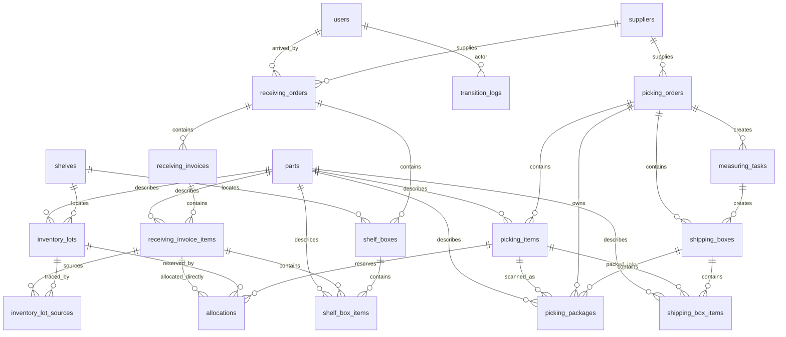
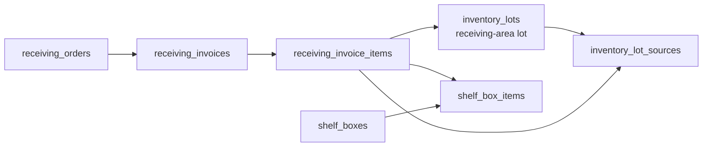
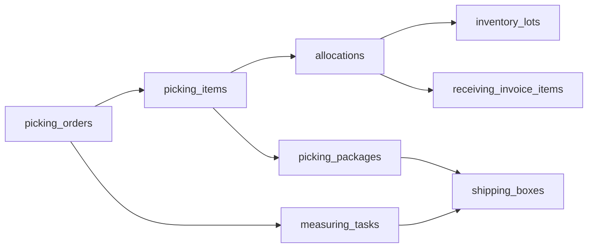
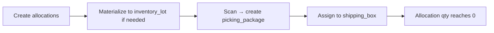

# Warehouse PDA Database Schema — Backend Reference

> This document is intended for backend developers who need to understand the data model behind the warehouse PDA demo. It includes the full PostgreSQL schema, an ER diagram, table descriptions, enums, and the main business flows.

## Overview

The demo runs PostgreSQL in the browser via PGlite. The schema is bootstrapped once from `db/init.ts` when the `users` table does not exist. There are no migrations; schema changes require clearing IndexedDB.

## Full SQL Schema

```sql
CREATE TABLE IF NOT EXISTS users (
  id TEXT PRIMARY KEY,
  username TEXT NOT NULL UNIQUE,
  password_hash TEXT NOT NULL,
  display_name TEXT NOT NULL,
  role TEXT NOT NULL DEFAULT 'operator',
  created_at TIMESTAMP NOT NULL
);

CREATE TABLE IF NOT EXISTS suppliers (
  id TEXT PRIMARY KEY,
  code TEXT NOT NULL UNIQUE,
  name TEXT NOT NULL
);

CREATE TABLE IF NOT EXISTS parts (
  id TEXT PRIMARY KEY,
  part_no TEXT NOT NULL UNIQUE,
  internal_code TEXT,
  description TEXT,
  default_coo TEXT
);

CREATE TABLE IF NOT EXISTS shelves (
  code TEXT PRIMARY KEY,
  zone TEXT
);

CREATE TABLE IF NOT EXISTS receiving_orders (
  id TEXT PRIMARY KEY,
  ref_no TEXT NOT NULL,
  supplier_id TEXT REFERENCES suppliers(id),
  delivery_date TIMESTAMP,
  status TEXT NOT NULL DEFAULT 'pending',
  arrived_at TIMESTAMP,
  arrived_by TEXT REFERENCES users(id),
  created_at TIMESTAMP NOT NULL,
  updated_at TIMESTAMP NOT NULL
);

CREATE INDEX IF NOT EXISTS idx_receiving_orders_status ON receiving_orders(status);

CREATE TABLE IF NOT EXISTS receiving_invoices (
  id TEXT PRIMARY KEY,
  receiving_order_id TEXT NOT NULL REFERENCES receiving_orders(id) ON DELETE CASCADE,
  invoice_no TEXT NOT NULL,
  supplier_id TEXT REFERENCES suppliers(id)
);

CREATE TABLE IF NOT EXISTS receiving_invoice_items (
  id TEXT PRIMARY KEY,
  receiving_invoice_id TEXT NOT NULL REFERENCES receiving_invoices(id) ON DELETE CASCADE,
  part_id TEXT NOT NULL REFERENCES parts(id),
  po_no TEXT,
  po_line TEXT,
  qty INTEGER NOT NULL,
  received_qty INTEGER NOT NULL DEFAULT 0,
  picked_qty INTEGER NOT NULL DEFAULT 0,
  put_away_qty INTEGER NOT NULL DEFAULT 0,
  box_id TEXT,
  date_code TEXT,
  lot_code TEXT,
  coo TEXT,
  cow TEXT,
  reported_mismatch BOOLEAN NOT NULL DEFAULT FALSE,
  mismatch_reason TEXT,
  mismatch_qty INTEGER,
  wrong_part_no TEXT,
  mismatch_note TEXT
);

CREATE TABLE IF NOT EXISTS picking_orders (
  id TEXT PRIMARY KEY,
  ref_no TEXT NOT NULL,
  supplier_id TEXT REFERENCES suppliers(id),
  delivery_date TIMESTAMP,
  po_no TEXT,
  required_date_code_notice TEXT,
  ship_to TEXT,
  destination_country TEXT,
  issue_reason TEXT,
  issue_qty INTEGER,
  issue_pack_size INTEGER,
  issue_note TEXT,
  issue_remark TEXT,
  issue_reported_at TIMESTAMP,
  issue_reported_by TEXT REFERENCES users(id),
  status TEXT NOT NULL DEFAULT 'pending',
  created_at TIMESTAMP NOT NULL,
  updated_at TIMESTAMP NOT NULL
);

CREATE INDEX IF NOT EXISTS idx_picking_orders_status ON picking_orders(status);

CREATE TABLE IF NOT EXISTS picking_items (
  id TEXT PRIMARY KEY,
  picking_order_id TEXT NOT NULL REFERENCES picking_orders(id) ON DELETE CASCADE,
  part_id TEXT NOT NULL REFERENCES parts(id),
  qty INTEGER NOT NULL,
  picked_qty INTEGER NOT NULL DEFAULT 0,
  allocated_qty INTEGER NOT NULL DEFAULT 0,
  required_date_code TEXT,
  source_shelf_code TEXT
);

CREATE INDEX IF NOT EXISTS idx_picking_items_order ON picking_items(picking_order_id);

CREATE TABLE IF NOT EXISTS inventory_lots (
  id TEXT PRIMARY KEY,
  part_id TEXT NOT NULL REFERENCES parts(id),
  date_code TEXT,
  lot_code TEXT,
  coo TEXT,
  cow TEXT,
  shelf_code TEXT REFERENCES shelves(code),
  box_id TEXT,
  total_qty INTEGER NOT NULL DEFAULT 0,
  allocated_qty INTEGER NOT NULL DEFAULT 0,
  available_qty INTEGER NOT NULL GENERATED ALWAYS AS (total_qty - allocated_qty) STORED
);

CREATE UNIQUE INDEX IF NOT EXISTS inventory_lots_unique_lot
  ON inventory_lots(part_id, date_code, coo, cow, shelf_code, box_id)
  WHERE shelf_code IS NOT NULL OR box_id IS NOT NULL;

CREATE INDEX IF NOT EXISTS idx_inventory_lots_part ON inventory_lots(part_id);
CREATE INDEX IF NOT EXISTS idx_inventory_lots_available ON inventory_lots(part_id, available_qty);
CREATE INDEX IF NOT EXISTS idx_inventory_lots_location ON inventory_lots(shelf_code, box_id);

CREATE TABLE IF NOT EXISTS inventory_lot_sources (
  id TEXT PRIMARY KEY,
  inventory_lot_id TEXT NOT NULL REFERENCES inventory_lots(id) ON DELETE CASCADE,
  receiving_invoice_item_id TEXT NOT NULL REFERENCES receiving_invoice_items(id) ON DELETE CASCADE,
  qty INTEGER NOT NULL
);

CREATE UNIQUE INDEX IF NOT EXISTS inventory_lot_sources_unique
  ON inventory_lot_sources(inventory_lot_id, receiving_invoice_item_id);

CREATE INDEX IF NOT EXISTS idx_inventory_lot_sources_receiving_item ON inventory_lot_sources(receiving_invoice_item_id);
CREATE INDEX IF NOT EXISTS idx_inventory_lot_sources_lot ON inventory_lot_sources(inventory_lot_id);

CREATE TABLE IF NOT EXISTS allocations (
  id TEXT PRIMARY KEY,
  picking_item_id TEXT NOT NULL REFERENCES picking_items(id) ON DELETE CASCADE,
  inventory_lot_id TEXT REFERENCES inventory_lots(id) ON DELETE CASCADE,
  receiving_invoice_item_id TEXT REFERENCES receiving_invoice_items(id) ON DELETE CASCADE,
  qty INTEGER NOT NULL
);

CREATE INDEX IF NOT EXISTS idx_allocations_picking_item ON allocations(picking_item_id);
CREATE INDEX IF NOT EXISTS idx_allocations_lot ON allocations(inventory_lot_id);

CREATE TABLE IF NOT EXISTS measuring_tasks (
  id TEXT PRIMARY KEY,
  picking_order_id TEXT NOT NULL REFERENCES picking_orders(id) ON DELETE CASCADE,
  status TEXT NOT NULL DEFAULT 'pending',
  created_at TIMESTAMP NOT NULL
);

CREATE UNIQUE INDEX IF NOT EXISTS idx_measuring_tasks_picking_order
  ON measuring_tasks(picking_order_id);

CREATE TABLE IF NOT EXISTS shipping_boxes (
  id TEXT PRIMARY KEY,
  picking_order_id TEXT REFERENCES picking_orders(id),
  measuring_task_id TEXT REFERENCES measuring_tasks(id),
  status TEXT NOT NULL DEFAULT 'open',
  gross_weight REAL,
  net_weight REAL,
  destination_country TEXT,
  box_size TEXT,
  created_at TIMESTAMP NOT NULL
);

CREATE INDEX IF NOT EXISTS idx_shipping_boxes_task ON shipping_boxes(measuring_task_id);

CREATE TABLE IF NOT EXISTS picking_packages (
  id TEXT PRIMARY KEY,
  picking_item_id TEXT NOT NULL REFERENCES picking_items(id) ON DELETE CASCADE,
  picking_order_id TEXT NOT NULL REFERENCES picking_orders(id) ON DELETE CASCADE,
  source_type TEXT NOT NULL,
  source_id TEXT NOT NULL,
  qty INTEGER NOT NULL,
  shipping_box_id TEXT REFERENCES shipping_boxes(id),
  date_code TEXT,
  lot_code TEXT,
  coo TEXT,
  cow TEXT,
  verified BOOLEAN NOT NULL DEFAULT FALSE,
  created_at TIMESTAMP NOT NULL
);

CREATE INDEX IF NOT EXISTS idx_picking_packages_item ON picking_packages(picking_item_id);
CREATE INDEX IF NOT EXISTS idx_picking_packages_order ON picking_packages(picking_order_id);
CREATE INDEX IF NOT EXISTS idx_picking_packages_box ON picking_packages(shipping_box_id);

CREATE TABLE IF NOT EXISTS shipping_box_items (
  id TEXT PRIMARY KEY,
  shipping_box_id TEXT NOT NULL REFERENCES shipping_boxes(id) ON DELETE CASCADE,
  picking_item_id TEXT REFERENCES picking_items(id),
  part_id TEXT NOT NULL REFERENCES parts(id),
  qty INTEGER NOT NULL
);

CREATE INDEX IF NOT EXISTS idx_shipping_box_items_box ON shipping_box_items(shipping_box_id);

CREATE TABLE IF NOT EXISTS shelf_boxes (
  id TEXT PRIMARY KEY,
  receiving_order_id TEXT REFERENCES receiving_orders(id),
  shelf_code TEXT REFERENCES shelves(code),
  status TEXT NOT NULL DEFAULT 'open',
  created_at TIMESTAMP NOT NULL
);

CREATE INDEX IF NOT EXISTS idx_shelf_boxes_order ON shelf_boxes(receiving_order_id);
CREATE INDEX IF NOT EXISTS idx_shelf_boxes_shelf ON shelf_boxes(shelf_code);

CREATE TABLE IF NOT EXISTS shelf_box_items (
  id TEXT PRIMARY KEY,
  shelf_box_id TEXT NOT NULL REFERENCES shelf_boxes(id) ON DELETE CASCADE,
  receiving_invoice_item_id TEXT REFERENCES receiving_invoice_items(id),
  part_id TEXT NOT NULL REFERENCES parts(id),
  qty INTEGER NOT NULL,
  verified BOOLEAN DEFAULT FALSE,
  verified_at TIMESTAMP
);

CREATE INDEX IF NOT EXISTS idx_shelf_box_items_box ON shelf_box_items(shelf_box_id);

CREATE TABLE IF NOT EXISTS transition_logs (
  id TEXT PRIMARY KEY,
  entity_type TEXT NOT NULL,
  entity_id TEXT NOT NULL,
  from_state TEXT,
  to_state TEXT NOT NULL,
  actor_id TEXT REFERENCES users(id),
  metadata TEXT,
  created_at TIMESTAMP NOT NULL
);

CREATE INDEX IF NOT EXISTS idx_transition_logs_entity ON transition_logs(entity_type, entity_id);

CREATE INDEX IF NOT EXISTS idx_receiving_invoice_items_invoice ON receiving_invoice_items(receiving_invoice_id);
CREATE INDEX IF NOT EXISTS idx_receiving_invoice_items_part ON receiving_invoice_items(part_id);
CREATE INDEX IF NOT EXISTS idx_picking_items_part ON picking_items(part_id);
CREATE INDEX IF NOT EXISTS idx_allocations_receiving_item ON allocations(receiving_invoice_item_id);
CREATE INDEX IF NOT EXISTS idx_shipping_boxes_order ON shipping_boxes(picking_order_id);
CREATE INDEX IF NOT EXISTS idx_transition_logs_created_at ON transition_logs(created_at);
```

## Entity Relationship Diagram



## Table Reference

| Table | Purpose | Key references |
|-------|---------|----------------|
| `users` | Demo operator/admin accounts | — |
| `suppliers` | Suppliers referenced by orders | — |
| `parts` | Parts referenced by invoices, lots, picking items | — |
| `shelves` | Shelf locations | — |
| `receiving_orders` | Incoming shipments | `supplier_id` → `suppliers` |
| `receiving_invoices` | Invoices within a receiving order | `receiving_order_id` → `receiving_orders` |
| `receiving_invoice_items` | Lot-level expected/received detail | `receiving_invoice_id`, `part_id` |
| `inventory_lots` | Stock view, unique by part/date/lot/origin/location | `part_id`, `shelf_code`, `box_id` |
| `inventory_lot_sources` | Traceability: which receiving invoice item produced a lot | `inventory_lot_id`, `receiving_invoice_item_id` |
| `picking_orders` | Outgoing shipments to customers | `supplier_id` → `suppliers` |
| `picking_items` | Lines to pick within a picking order | `picking_order_id`, `part_id` |
| `allocations` | Reservation of stock for a picking item | `picking_item_id`, `inventory_lot_id` (optional), `receiving_invoice_item_id` (optional) |
| `picking_packages` | Physical packages scanned and then boxed | `picking_item_id`, `picking_order_id`, `shipping_box_id` (optional) |
| `measuring_tasks` | Packing task created when a picking order is finished | `picking_order_id` |
| `shipping_boxes` | Boxes used to ship a finished picking order | `picking_order_id`, `measuring_task_id` |
| `shipping_box_items` | Deprecated summary of items packed into a shipping box | `shipping_box_id`, `picking_item_id`, `part_id` |
| `shelf_boxes` | Boxes created during put-away | `receiving_order_id`, `shelf_code` |
| `shelf_box_items` | Items moved into a shelf box | `shelf_box_id`, `receiving_invoice_item_id`, `part_id` |
| `transition_logs` | Audit log of status changes | `actor_id` → `users` |

## Enums

| Field | Values |
|-------|--------|
| `users.role` | `operator`, `admin` |
| `receiving_orders.status` | `pending`, `in_hand`, `clear` |
| `picking_orders.status` | `pending`, `picking`, `finished`, `issue` |
| `receiving_invoice_items.mismatch_reason` | `not_found`, `damaged`, `qty_mismatch`, `wrong_part`, `over_shipment`, `quality_rejection` |
| `picking_orders.issue_reason` | `insufficient_stock`, `cannot_divide`, `merge`, `other` |
| `picking_packages.source_type` | `receiving_invoice_item`, `inventory_lot` |
| `shipping_boxes.status`, `shelf_boxes.status` | `open`, `closed`, `verified` |
| `measuring_tasks.status` | `pending`, `completed` |

## Business Flows

### Receiving Flow



1. A `receiving_order` is created for an incoming shipment.
2. One or more `receiving_invoices` are attached.
3. Each invoice has `receiving_invoice_items` describing expected quantities.
4. On arrival, items may sit in a receiving-area lot (`inventory_lots` with no location).
5. During put-away, `shelf_boxes` and `shelf_box_items` are created.
6. Located lots are linked back to receiving invoice items via `inventory_lot_sources`.

### Picking Flow



1. A `picking_order` is created with `picking_items`.
2. `allocations` reserve stock from `inventory_lots` or directly from `receiving_invoice_items`.
3. Scanning creates `picking_packages` rows.
4. Packages are assigned to `shipping_boxes`.
5. When picking finishes, a `measuring_task` is created for packing/weighing.

### Allocation Lifecycle



1. **Created.** `db/allocate.ts` creates `allocations` rows reserving quantity for each picking item.
2. **Materialized.** Before scanning from a receiving-area allocation, `db/picking.ts` creates a dedicated `inventory_lots` row and moves or splits the allocation onto that lot.
3. **Scanned.** `db/picking.ts` creates a `picking_packages` row, reduces the allocation, and updates `inventory_lots` totals.
4. **Boxed.** The package is assigned to a `shipping_box`, and `picking_items.picked_qty` is recalculated.
5. **Removed.** When fully scanned, the allocation quantity reaches zero; the row is kept for traceability.

## Important Notes for Backend Developers

- **No migrations.** The schema is created once when the `users` table does not exist. Schema changes require clearing IndexedDB.
- **Demo passwords only.** Passwords are stored as plain-text hashes in the seed file.
- **Per-browser database.** PGlite stores data in IndexedDB, so each browser has its own isolated demo database.
- **Generated column.** `inventory_lots.available_qty` is generated as `total_qty - allocated_qty`.
- **Partial unique index.** `inventory_lots` are unique by `part_id + date_code + coo + cow + shelf_code + box_id`, but only when `shelf_code` or `box_id` is set. Receiving-area lots (no location) may be duplicated.
- **Allocation polymorphism.** An `allocation` points to either an `inventory_lot_id` **or** a `receiving_invoice_item_id`, not necessarily both.
- **Picking packages source.** `picking_packages.source_type` tells you whether `source_id` is a `receiving_invoice_item.id` or an `inventory_lot.id`.
- **State audit.** Every status change for orders, items, boxes, and measuring tasks is recorded in `transition_logs`.
- **Cascading deletes.** Most child tables use `ON DELETE CASCADE` from their parent order/invoice/item.

## Files to Look At

- `db/schema.ts` — Drizzle ORM definitions and TypeScript types.
- `db/init.ts` — Raw SQL bootstrap script (the source of the schema above).
- `docs/database-relations.md` — Shorter relation summary already in the repo.
