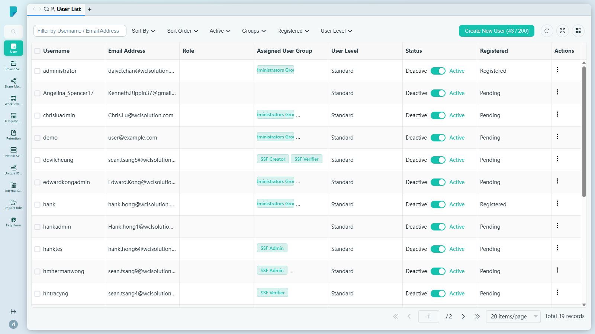
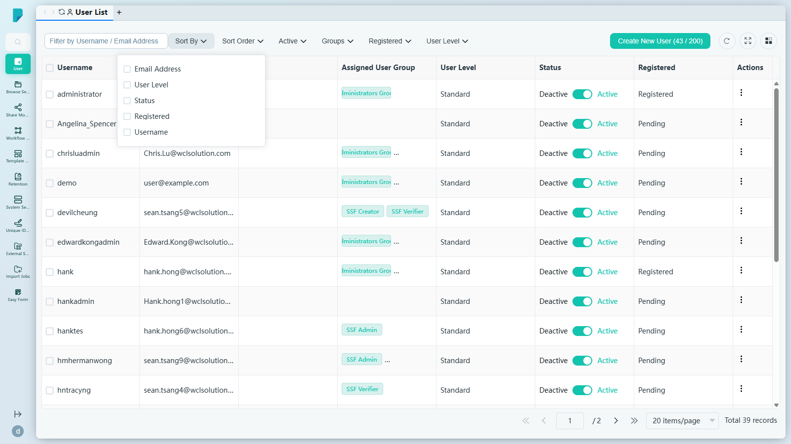
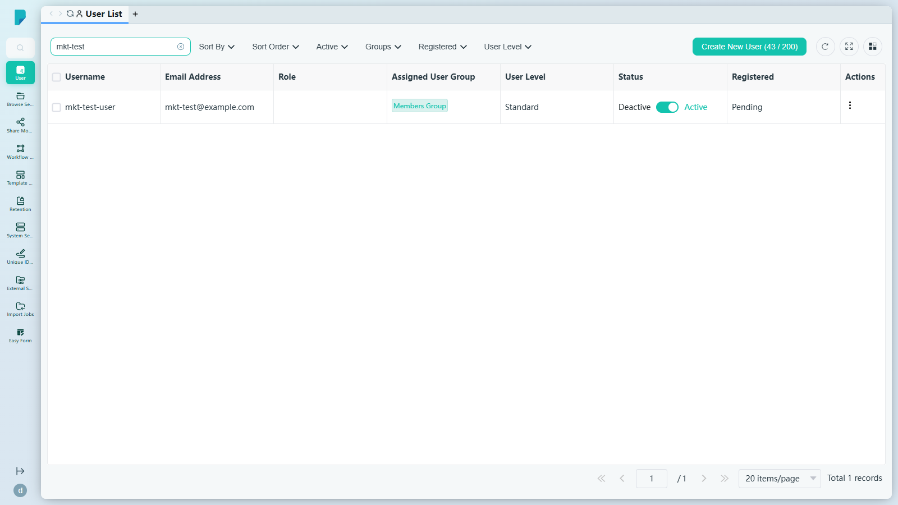
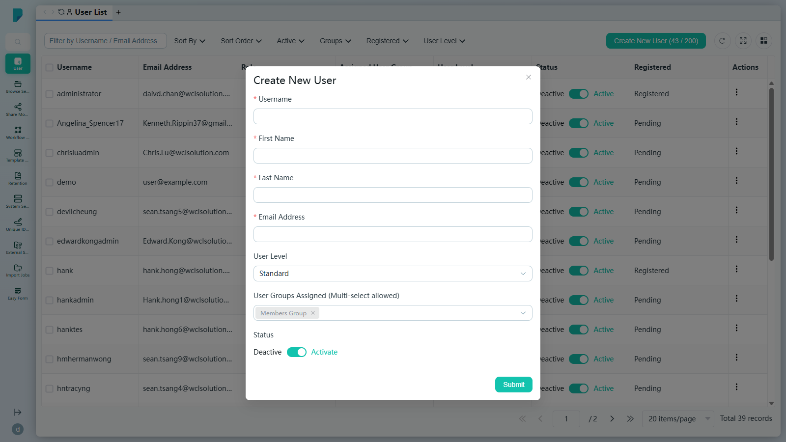
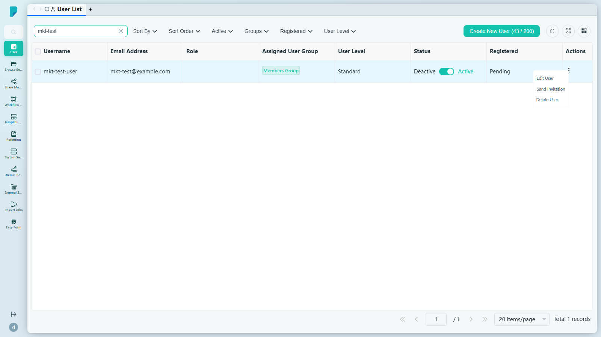
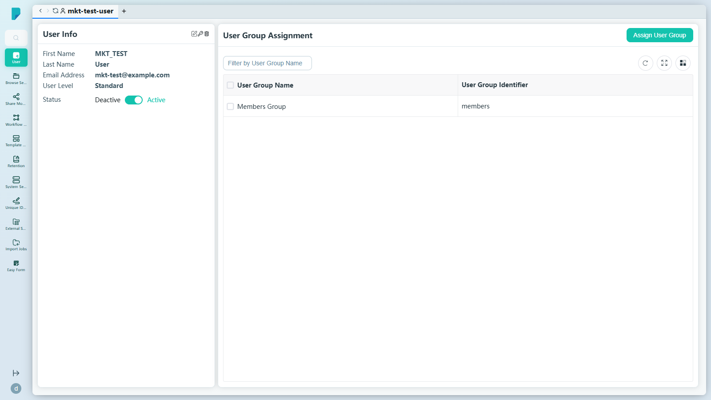

# User List

**Menu path:** Admin → User → User List

## 此畫面的用途
這是系統中所有用戶帳號的中央登記冊。管理員可以在同一個畫面查看誰擁有存取權限、篩選及排序列表、建立新帳號、啟用或停用用戶、指派用戶群組，以及管理邀請。建立按鈕上的授權計數器（例如「43 / 200」）顯示已使用的用戶席位數與授權上限。

## 工具列與操作
- **Filter by Username / Email Address**（按用戶名稱／電郵地址篩選）— 自由文字搜尋框；輸入後按 Enter 即可收窄列表範圍。
- **Sort By**（排序依據）— 核取方塊群組，用於選擇以哪一個（些）欄位排序：Username、Email Address、User Level、Status、Registered。

- **Sort Order**（排序方式）— 核取方塊群組：A–Z 或 Z–A。
- **Active** — 按帳號狀態篩選：Active 或 Deactive。
- **Groups**（群組）— 按所屬用戶群組篩選（例如 Administrators Group、IT Team、Members Group、SSF Admin、SSF Creator、SSF Dashboard、SSF Exporter、SSF Verifier、Test Sales — 反映此網站上已定義的群組）。
- **Registered**（已註冊）— 按註冊狀態篩選：Pending 或 Registered。
- **User Level**（用戶級別）— 按級別篩選：Essential、Premium、Standard。
- **Create New User (x / 200)**（建立新用戶）— 開啟建立對話框；計數器顯示已使用席位數與 200 席授權上限。
- 表格工具圖示：**Refresh**（重新整理）、**Full screen**（全螢幕）及 **Column settings**（欄位設定，顯示／隱藏欄位）。
- 分頁頁尾：跳至第一頁／上一頁／下一頁／最後一頁、頁碼輸入框、每頁項目數選擇器（預設每頁 20 項），以及總記錄數。

## 列表與欄位
每一列顯示一位用戶，包括：

- **Username**（用戶名稱）— 登入名稱。
- **Email Address**（電郵地址）— 帳號電郵。
- **Role**（角色）— 已指派的角色（如有）。
- **Assigned User Group**（已指派用戶群組）— 用戶所屬的所有群組（可有多個值）。
- **User Level**（用戶級別）— Essential / Standard / Premium 級別。
- **Status**（狀態）— 內嵌的 Active/Deactive 切換開關及目前狀態標籤，管理員可直接在表格中啟用或暫停帳號。
- **Registered**（已註冊）— 用戶是否已完成註冊（Pending / Registered）。
- **Actions**（操作）— 每列的 ⋯ 選單。

## 對話框與面板

### Create New User
由工具列按鈕開啟。欄位包括：

- **Username**（必填）— 必須以字母開頭；只可使用字母、數字、底線（_）及連字號（-）。
- **First Name**（必填）— 只可使用字母、數字、底線或中文字元。
- **Last Name**（必填）— 字元規則相同。
- **Email Address**（必填）。
- **User Level** — 下拉選單，預設為 Standard（Essential / Premium / Standard）。
- **User Groups Assigned**（已指派用戶群組）— 多選欄位；預先填入「Members Group」，標籤可以移除。
- **Status** — Activate 開關（預設為開啟）。
- **Submit** 會建立帳號；關閉（X）按鈕會取消操作。

### 列操作選單（⋯）
每位用戶的選單提供三項操作：

- **Edit User**（編輯用戶）— 開啟用戶詳情面板（見下文）。
- **Send Invitation**（發送邀請）— 重新發送邀請電郵給該用戶。
- **Delete User**（刪除用戶）— 移除該帳號。

### Edit User 面板
顯示所選用戶的詳情及群組成員資格：

- **User Info**（用戶資料）— First Name、Last Name、Email Address、User Level，以及 Status（Active/Deactive）開關，均提供內嵌編輯功能；此處亦設有 **Delete** 按鈕。
- **User Group Assignment**（用戶群組指派）— 設有 **Assign User Group** 按鈕，以及一個可篩選的小型表格（User Group Name、User Group Identifier，附 Refresh / Full screen / Column settings），列出用戶所屬的所有群組，例如「Members Group (members)」。

## 誰會使用
負責開設帳號、管理群組成員資格與用戶級別、啟用或暫停存取權限，以及追蹤授權席位使用情況的系統管理員與用戶管理員。
