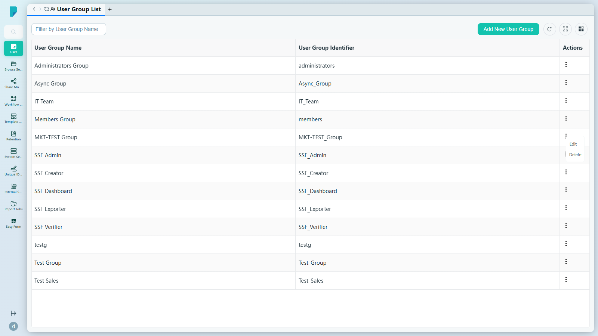
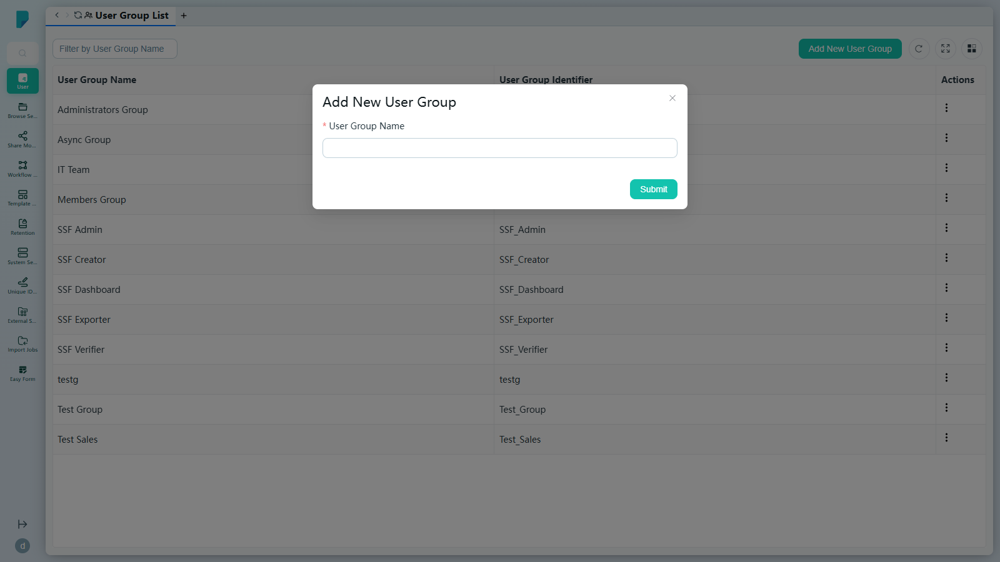
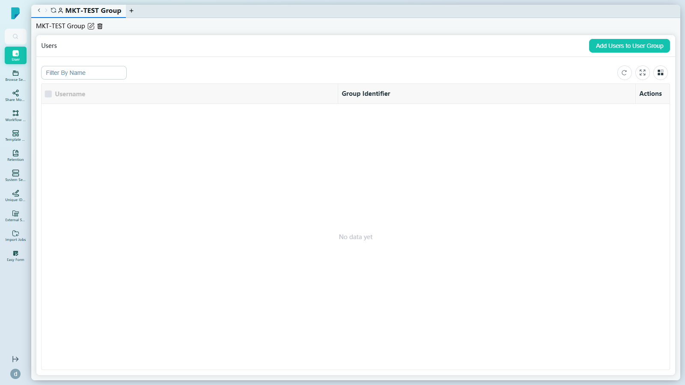
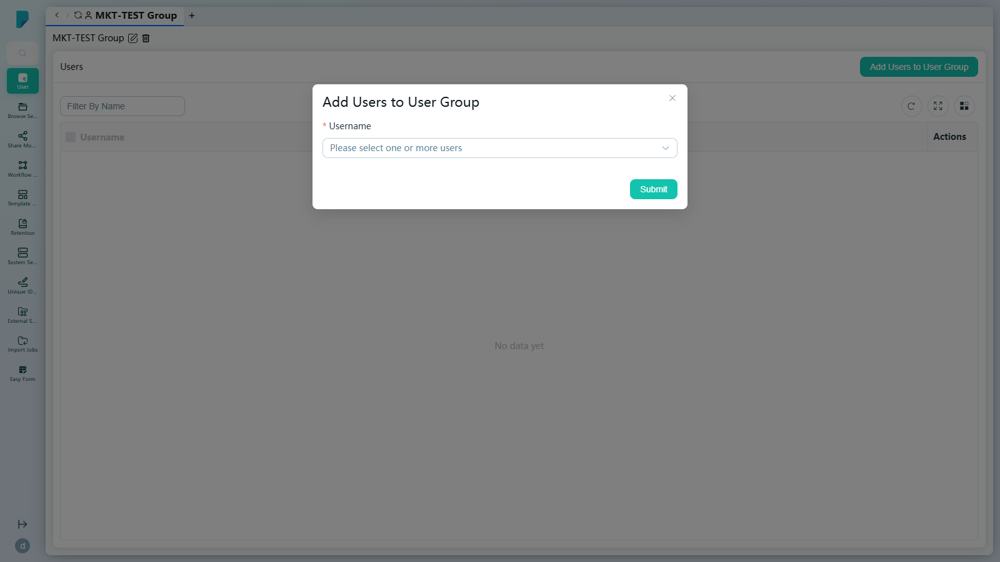
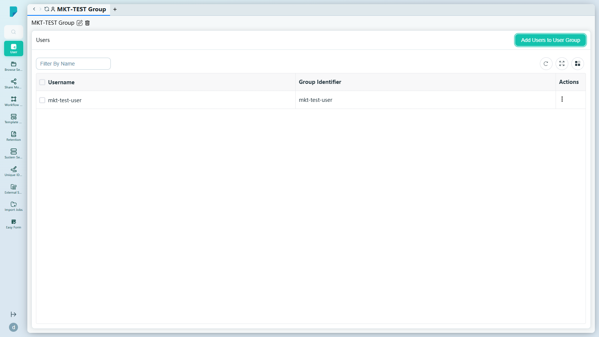

# User Group List

**Menu path:** Admin → User → User Group List

## 此畫面的用途
這是網站上所有用戶群組的登記冊。群組是 DocPal 中權限與指派的基本單位 — 它們會出現在用戶篩選、分享、工作流程及安全性設定中。管理員可在此建立新群組、重新命名或刪除群組，並管理每位用戶屬於哪些群組。

## 工具列與操作
- **Filter by User Group Name**（按用戶群組名稱篩選）— 自由文字篩選框。
- **Add New User Group**（新增用戶群組）— 開啟建立對話框。
- 表格工具圖示：**Refresh**、**Full screen** 及 **Column settings**。

## 列表與欄位
- **User Group Name**（用戶群組名稱）— 群組的顯示名稱（例如 Administrators Group、Members Group、IT Team）。
- **User Group Identifier**（用戶群組識別碼）— 由名稱衍生而成的系統識別碼（例如 `administrators`、`members`、`MKT-TEST_Group`）。
- **Actions**（操作）— 每列的 ⋯ 選單，包括：
  - **Edit**（編輯）— 開啟群組詳情面板。
  - **Delete**（刪除）— 移除該群組。

## 對話框與面板

### Add New User Group
單一欄位的對話框：

- **User Group Name**（必填）— 識別碼會由名稱自動產生。
- **Submit** 會建立群組；關閉（X）按鈕會取消操作。

### 群組詳情面板（Edit）
由該列的 Edit 操作開啟。頂部顯示群組名稱，下方的 **Users** 區段列出目前成員：

- **Add Users to User Group**（新增用戶至群組）— 開啟成員選擇對話框。
- **Filter By Name**，以及成員表格的 Refresh / Full screen / Column settings。
- 成員表格欄位：**Username**、**Group Identifier**、**Actions**。
- 每位成員列的 ⋯ 選單提供 **Remove**（將該用戶從群組移除）。

### Add Users to User Group 對話框
- **Username**（必填）— 可搜尋的多選欄位，涵蓋所有用戶（「Please select one or more users」）；已選用戶會以可移除的標籤顯示。
- **Submit** 會將所選用戶加入群組。

## 誰會使用
負責將組織劃分為群組，以進行權限指派、分享範圍設定、工作流程路由及用戶篩選的系統管理員。
