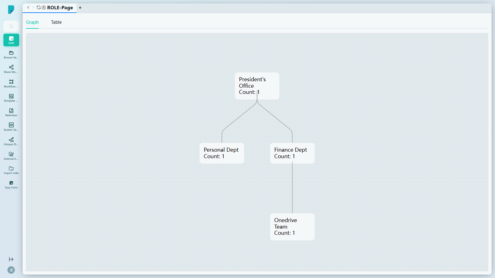
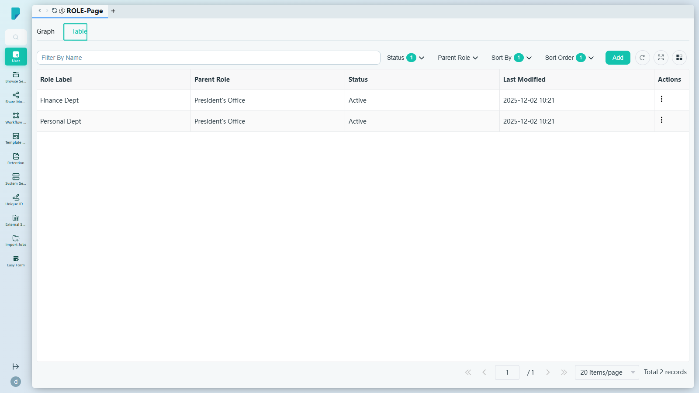
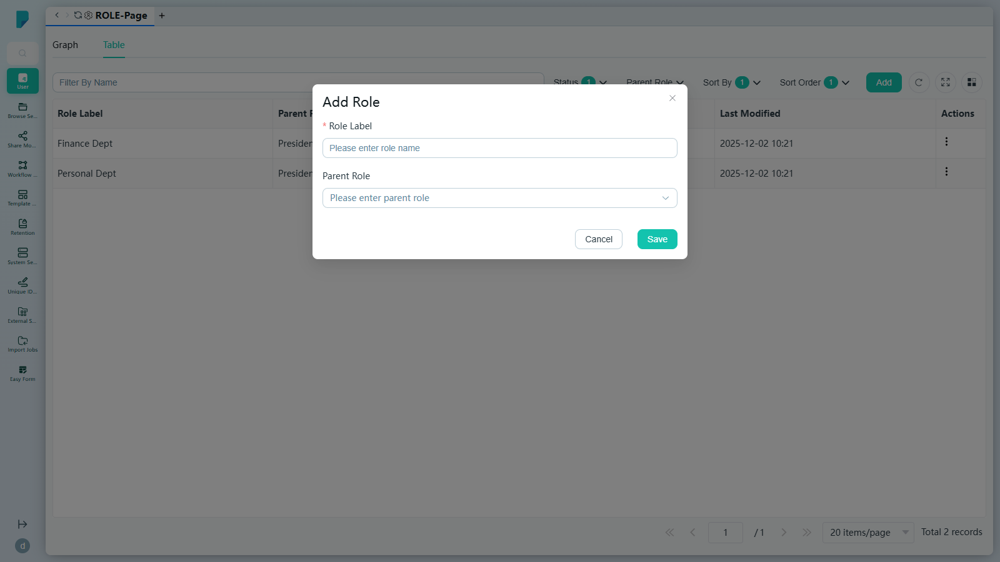
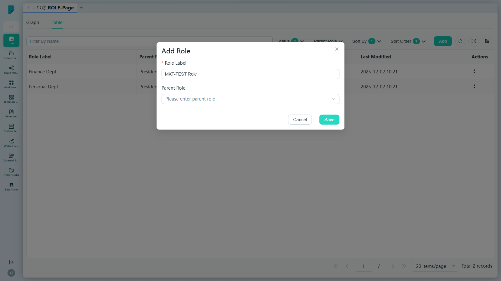

# ROLE-Page

**Menu path:** Admin → User → ROLE-Page

## 此畫面的用途
這是角色階層的設定畫面。角色用於模擬組織架構（例如 President's Office → Personal Dept / Finance Dept → Onedrive Team），凡 DocPal 按角色路由或指派的地方都會用到。此頁面提供同一組資料的兩種檢視方式：視覺化的階層 **Graph**（圖表），以及用於管理的 **Table**（表格）。

## 工具列與操作
- **Graph / Table 分頁** — 在視覺化階層圖與列表檢視之間切換。
- 在 Table 檢視中：
  - **Filter By Name**（按名稱篩選）— 自由文字篩選。
  - **Status** — 按 Active / Deactive 篩選（徽章會顯示已啟用的篩選值數目）。
  - **Parent Role**（上層角色）— 按任何現有角色篩選（例如 President's Office、Personal Dept、Finance Dept、Onedrive Team）。
  - **Sort By** — Name、Last Modified、Parent Role、Status。
  - **Sort Order** — A–Z / Z–A。
  - **Add** — 開啟 Add Role 對話框。
  - Refresh、Full screen 及 Column settings 圖示，另設附總記錄數的分頁頁尾。

## 列表與欄位

### Graph 檢視
以組織架構圖形式呈現的圖表，置於網格畫布上。每個角色是一張節點卡片，顯示角色名稱及成員 **Count**（數目）（例如「President's Office — Count: 1」）；連接線顯示上下層階層關係。

### Table 檢視
- **Role Label**（角色標籤）— 角色名稱（例如 Finance Dept、Personal Dept）。
- **Parent Role**（上層角色）— 該角色所隸屬的上層角色（例如 President's Office）。
- **Status** — Active / Deactive。
- **Last Modified**（最後修改）— 最後一次變更的時間戳記。
- **Actions** — 每列的操作選單。

## 對話框與面板

### Add Role
由 Table 檢視中的 **Add** 按鈕開啟：

- **Role Label**（必填）— 自由文字的角色名稱。
- **Parent Role** — 下拉選單，用於將角色置於某個現有角色之下（「Please enter parent role」）。
- **Cancel** 及 **Save** 按鈕，另設關閉（X）按鈕。

> **在此網站觀察到的已知問題：** 在 Role Label 有效且未選擇上層角色的情況下按 Save，`POST /admin/api/docpal/acl/role` 回傳 HTTP 500（「Internal server error, please contact administrator」），對話框維持開啟，角色並未建立。

## 誰會使用
負責定義及維護角色階層的系統管理員，此階層用於整個平台的角色式路由、指派及權限管理。
