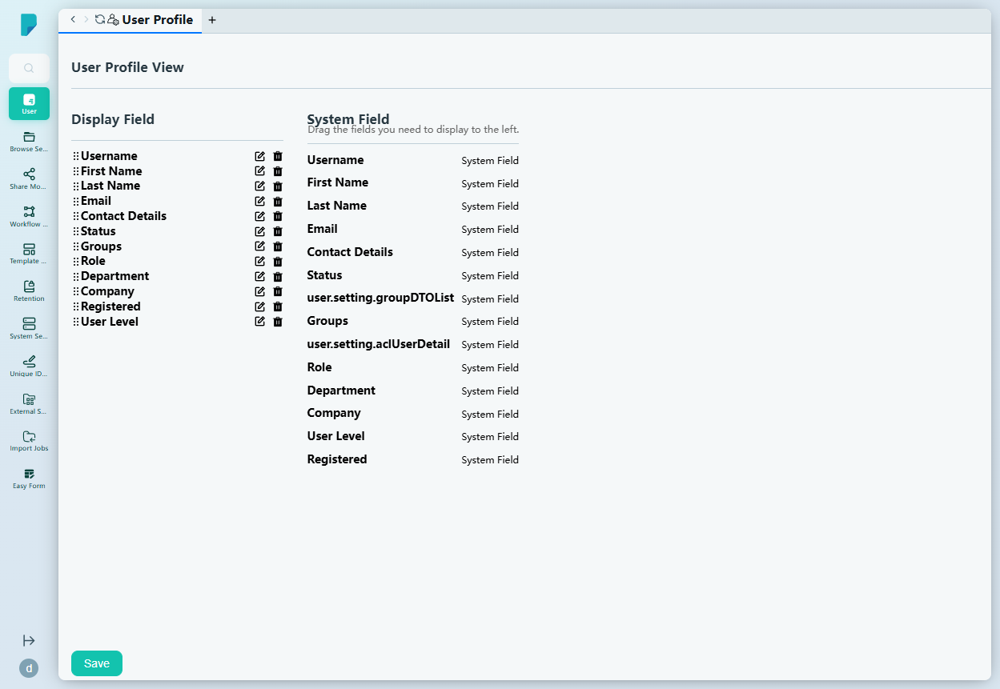
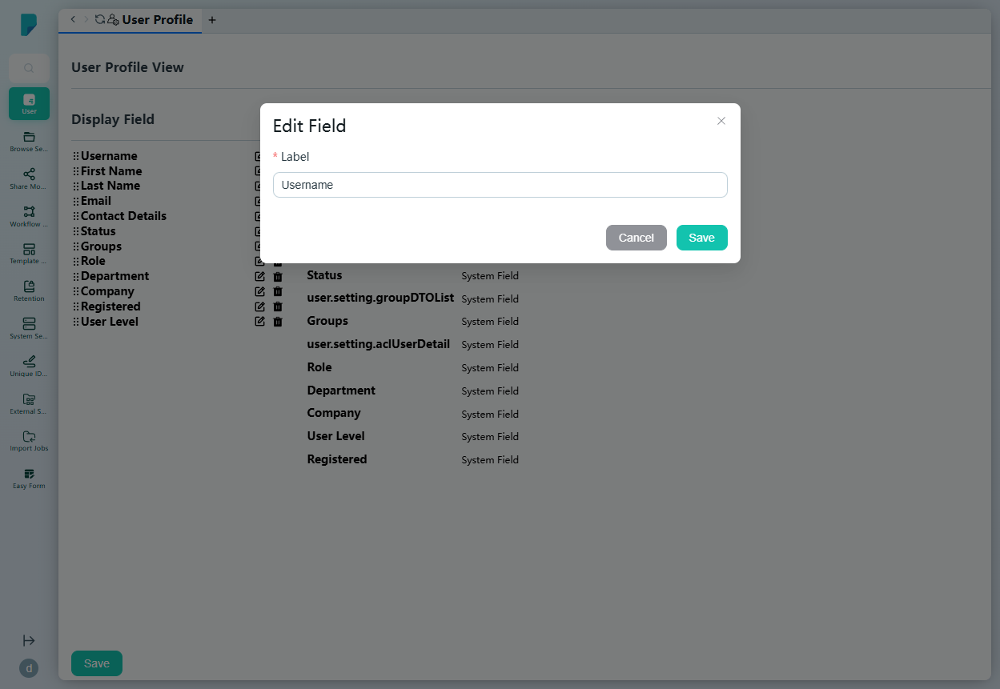

# User Profile

**Menu path:** Admin → User → User Profile

## 此畫面的用途
此畫面用於設定用戶個人檔案（「User Profile View」）上顯示哪些欄位。管理員可決定顯示哪些資料及其排列次序 — 方法是將系統欄位拖曳至顯示列表、重新命名欄位標籤，以及移除需要隱藏的欄位。

## 工具列與操作
- **Save**（頁面底部）— 儲存目前的顯示欄位設定。
- Display Field 列表中每個欄位的控制項：
  - **拖曳手柄（⋮⋮）** — 以拖曳方式重新排列欄位。
  - **Edit（鉛筆圖示）** — 開啟該欄位的 Edit Field 對話框。
  - **Delete（垃圾桶圖示）** — 將該欄位從顯示列表中移除。

## 列表與欄位

### Display Field（左面板）
目前顯示於用戶個人檔案上的欄位，按顯示次序排列。此網站已啟用全部十二個欄位：

1. Username
2. First Name
3. Last Name
4. Email
5. Contact Details
6. Status
7. Groups
8. Role
9. Department
10. Company
11. Registered
12. User Level

### System Field（右面板）
可用欄位的資源池，每個欄位均標示為「System Field」，並附提示「Drag the fields you need to display to the left.」。資源池與顯示列表對應，同時亦顯示原始的內部綁定（例如 `user.setting.groupDTOList`、`user.setting.aclUserDetail`）：Username、First Name、Last Name、Email、Contact Details、Status、Groups、Role、Department、Company、User Level、Registered。

## 對話框與面板

### Edit Field
由顯示欄位的鉛筆圖示開啟：

- **Label** — 文字輸入框，預先填入欄位的目前標籤（例如「Username」）；可重新命名欄位在個人檔案上的顯示名稱。
- **Cancel** 及 **Save** 按鈕，另設關閉（X）按鈕。

## 誰會使用
負責按組織需要度身訂造用戶個人檔案版面的系統管理員 — 顯示用戶需要的欄位（部門、公司、聯絡資料），並隱藏其餘欄位。
