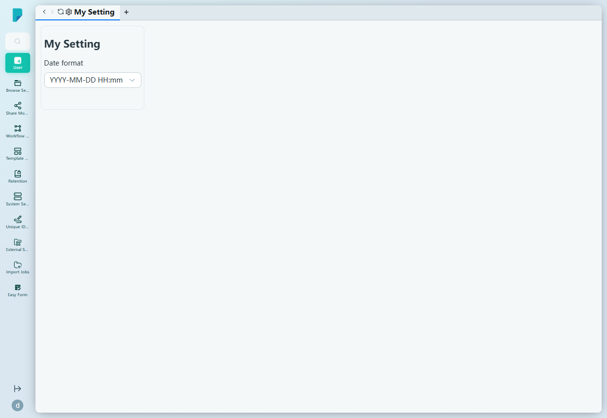
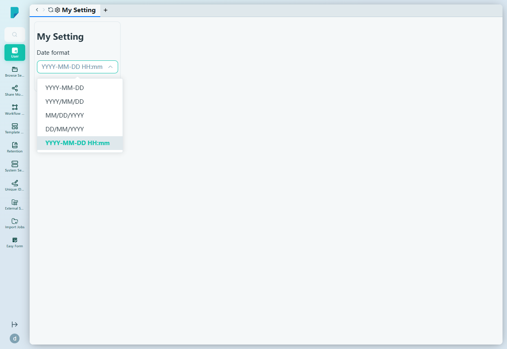
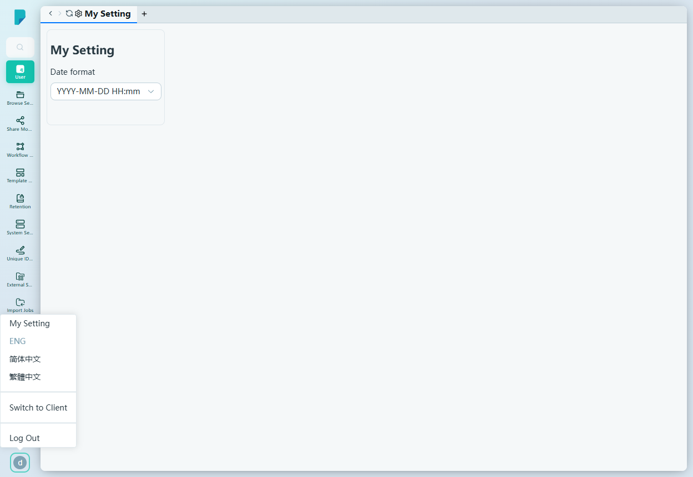

# My Setting

**Menu path:** Admin → User → My Setting

## 此畫面的用途
這是管理員在管理主控台的個人喜好設定 — 只套用於目前登入的帳號，不影響整個網站。

## 工具列與操作
此頁面是一個只有一項喜好設定的小型表單：

- **Date format**（日期格式）— 下拉選單，選擇此用戶的日期顯示方式。選項：
  - `YYYY-MM-DD`
  - `YYYY/MM/DD`
  - `MM/DD/YYYY`
  - `DD/MM/YYYY`
  - `YYYY-MM-DD HH:mm`（目前選擇）

## 列表與欄位
沒有列表 — 此頁面只包含上述的喜好設定表單。

## 對話框與面板

### 頭像選單（側欄底部）
管理側欄左下角的圓形頭像按鈕（示範帳號顯示「d」）會開啟帳號選單：

- **My Setting** — 跳轉至此頁面。
- **ENG** — 將介面切換為英文。
- **简体中文** — 將介面切換為簡體中文。
- **繁體中文** — 將介面切換為繁體中文。
- **Switch to Client** — 離開管理主控台，開啟客戶端（一般用戶）網站。
- **Log Out** — 登出目前的工作階段。

## 誰會使用
每位管理員 — 各自設定自己的日期顯示喜好，並使用頭像選單切換語言、轉換使用環境及登出。
