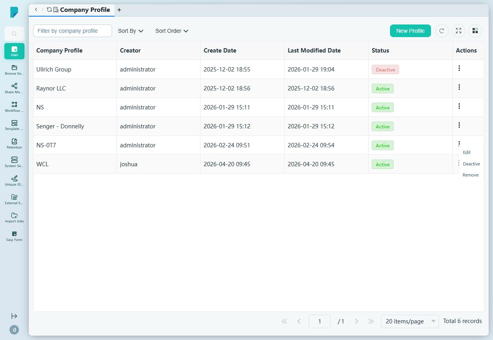
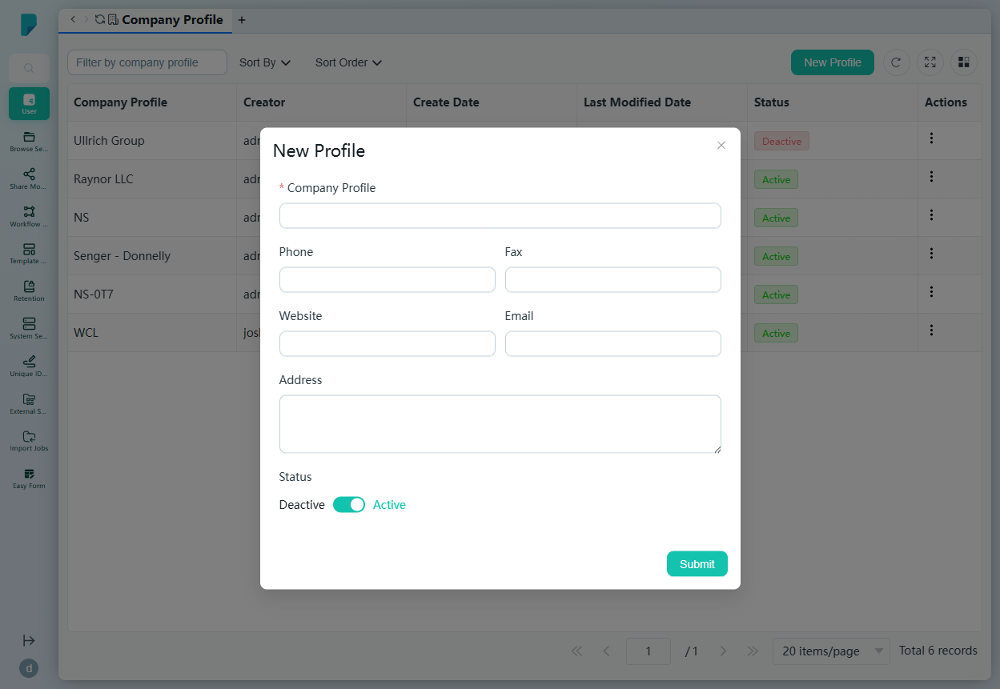

# Company Profile

**Menu path:** Admin → User → Company Profile

## 此畫面的用途
公司檔案（Company Profile）的登記冊——用戶可以關聯的機構（即用戶檔案中所見的「Company」欄位）。管理員可在此建立、編輯、啟用／停用及移除公司檔案。

## 工具列與操作
- **Filter by company profile**（按公司檔案篩選）——自由文字篩選框。
- **Sort By**（排序方式）——複選框群組：Company Profile、Create Date、Status、Last Modified Date。
- **Sort Order**（排序次序）——A–Z 或 Z–A。
- **New Profile**——開啟建立對話框。
- 表格工具圖示：**Refresh**、**Full screen**、**Column settings**，以及顯示總記錄數的分頁頁尾。

## 列表與欄位
- **Company Profile**——公司名稱（例如 Raynor LLC、NS、WCL）。
- **Creator**——建立該檔案的帳戶（例如 administrator、joshua）。
- **Create Date**——建立時間戳記。
- **Last Modified Date**——最後修改時間戳記。
- **Status**——Active 或 Deactive。
- **Actions**——每列的 ⋯ 選單，包括：
  - **Edit**——編輯該檔案。
  - **Deactive**——停用該檔案。
  - **Remove**——刪除該檔案。

## 對話框與面板

### New Profile
由 **New Profile** 按鈕開啟。欄位：

- **Company Profile**（必填）——公司名稱。
- **Phone**——選填。
- **Website**——選填。
- **Fax**——選填。
- **Email**——選填。
- **Address**——選填的多行文字。
- **Status**——Active 開關（預設為開啟）。
- **Submit** 建立檔案；關閉（X）按鈕則取消。

## 誰會使用
負責維護公司清單的系統管理員——平台上用戶帳戶所連結的公司皆由此管理。
