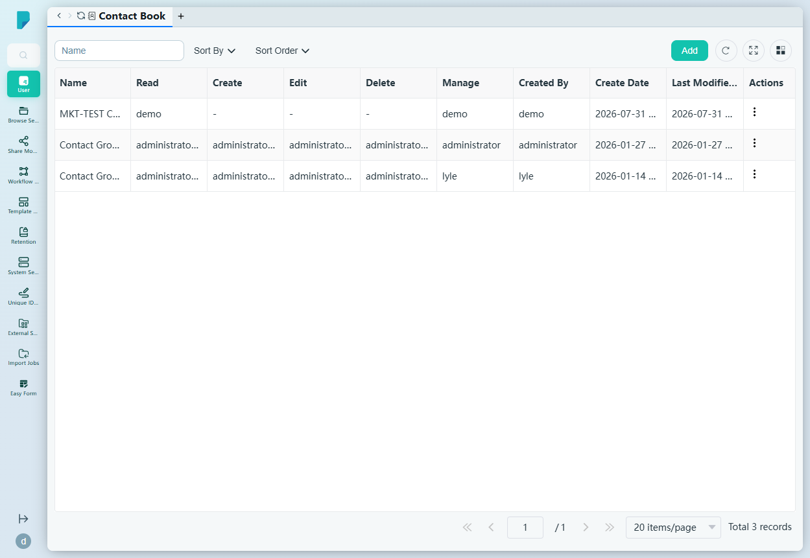
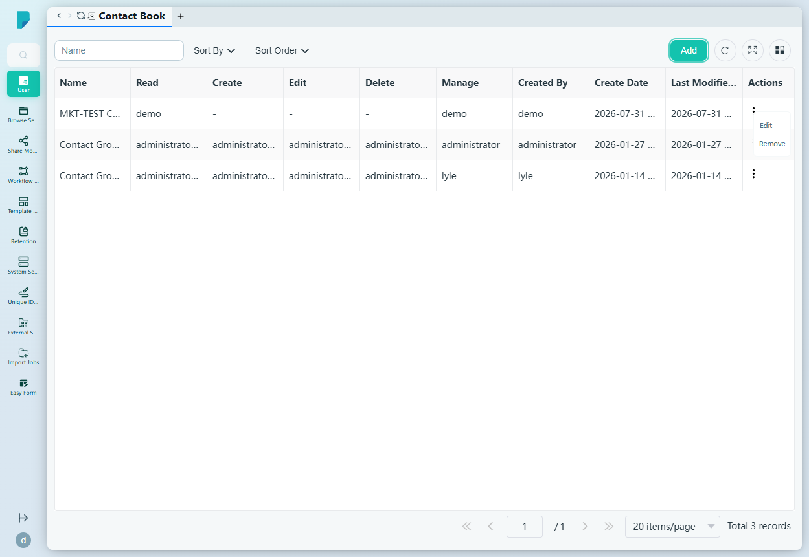
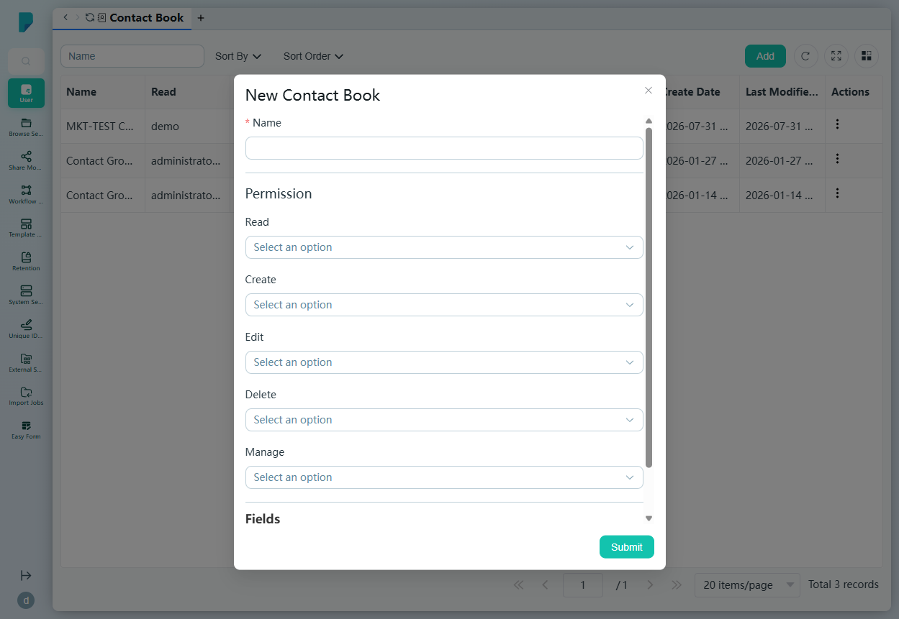
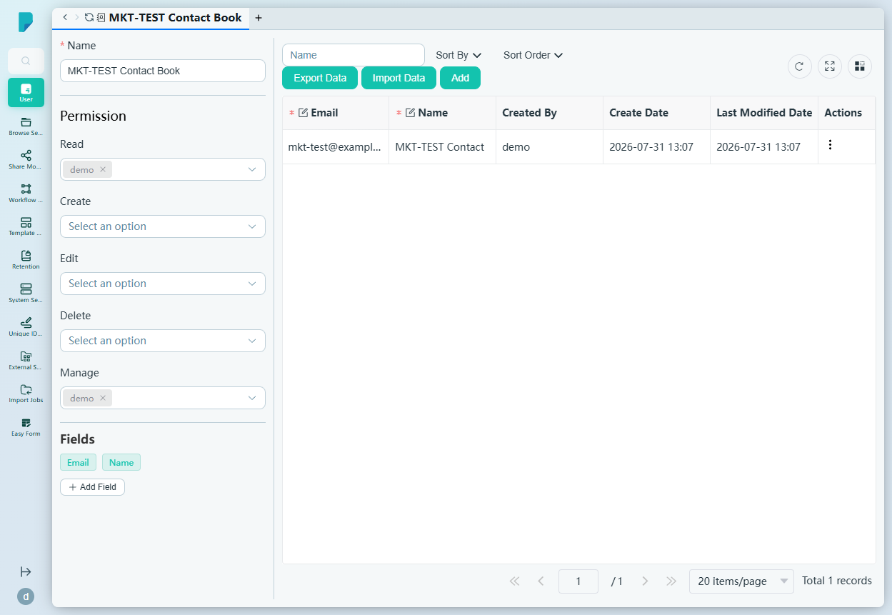

# Contact Book

**Menu path:** Admin → User → Contact Book

## 此畫面的用途
集中管理網站上的所有通訊錄（Contact Book）。每個通訊錄都是一本共用的地址簿，擁有專屬的欄位組合及細緻的權限設定——管理員可以查看誰獲准讀取、建立、編輯、刪除及管理每本通訊錄，並可開啟任何通訊錄以管理當中的聯絡人。

## 工具列與操作
- **Name**——自由文字篩選框。
- **Sort By**——複選框群組：Name、Created By、Create Date、Last Modified Date。
- **Sort Order**——A–Z 或 Z–A。
- **Add**——開啟 New Contact Book 對話框。
- 表格工具圖示：**Refresh**、**Full screen**、**Column settings**，以及顯示總記錄數的分頁頁尾。

## 列表與欄位
每列代表一本通訊錄：

- **Name**——通訊錄名稱（例如 MKT-TEST Contact Book、Contact Group Bacon）。
- **Read / Create / Edit / Delete / Manage**——五個權限欄，各自列出獲授該權限的用戶及用戶群組（以逗號分隔；沒有時顯示「-」）。
- **Created By**——建立該通訊錄的帳戶。
- **Create Date** / **Last Modified Date**——時間戳記。
- **Actions**——每列的 ⋯ 選單，包括 **Edit**（開啟該通訊錄，見下文）及 **Remove**（刪除該通訊錄）。

## 對話框與面板

### New Contact Book
由 **Add** 按鈕開啟：

- **Name**（必填）——通訊錄名稱。
- **Permission**——五個用戶／群組選擇下拉框：**Read**、**Create**、**Edit**、**Delete**、**Manage**（顯示「Select an option」；選擇器列出所有用戶及群組）。
- **Fields** 區段——通訊錄所儲存的聯絡人欄位；預設包含 **Name** 及 **Email**，可按 **Add Field** 新增更多欄位。
- **Submit** 建立通訊錄；關閉（X）按鈕則取消。

### Contact book edit view（通訊錄編輯檢視）
由某列的 **Edit** 操作開啟。在同一畫面結合通訊錄的設定與內容：

- **Name**（必填）及五個 **Permission** 選擇器，已預填現有授權（以可移除的標籤顯示）。
- **Fields** 區段，附 **Add Field**。
- 聯絡人表格，附專屬工具列——**Name** 篩選、**Sort By**、**Sort Order**、**Export Data**（Export Excel / Export CSV / Export vCard (VCF)）、**Import Data**、**Add**（新增聯絡人），以及 Refresh / Full screen / Column settings。
- 聯絡人欄位：**Email**（必填）、**Name**（必填）、**Created By**、**Create Date**、**Last Modified Date**、**Actions**。
- 範例：MKT-TEST Contact Book 包含一個聯絡人——「MKT-TEST Contact」（mkt-test@example.com），由 demo 建立。

## 誰會使用
負責管理共用通訊錄的系統管理員——管理其欄位、內容，以及哪些用戶和群組可以讀取、貢獻或管理每本通訊錄。
