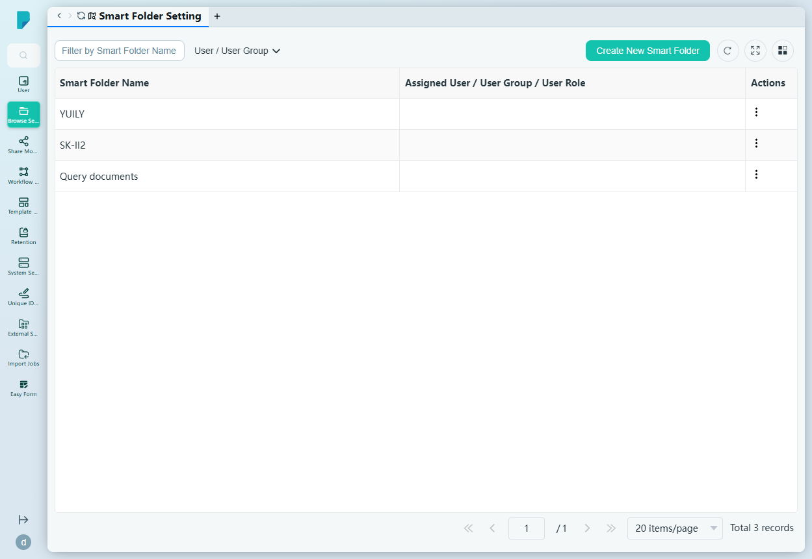
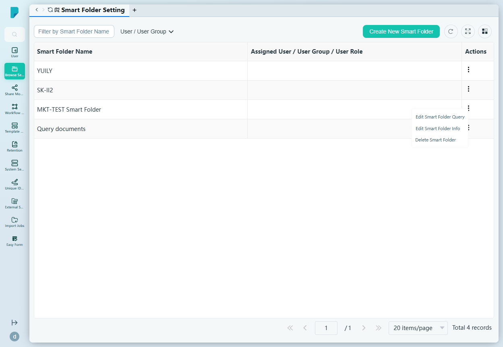
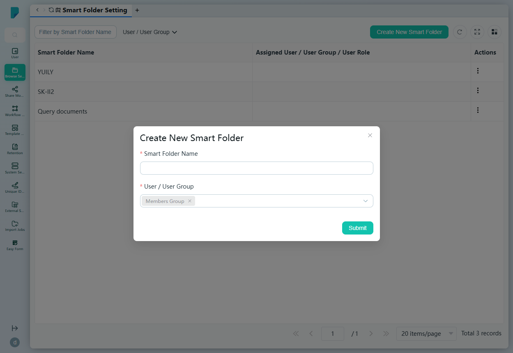
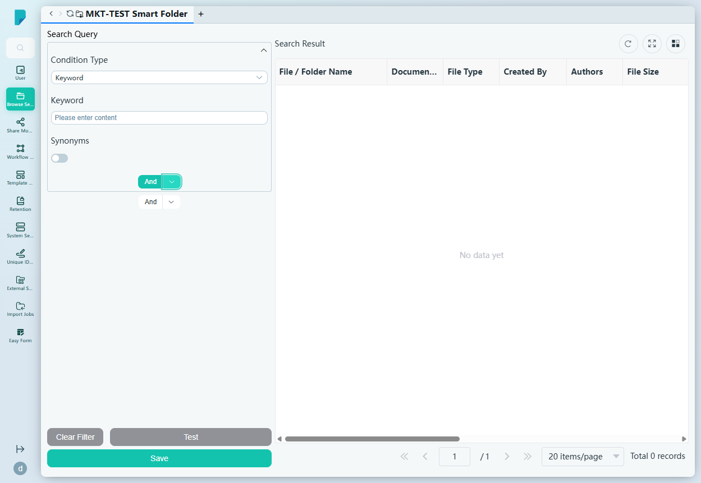

# Smart Folder Setting

**Menu path:** Admin → Browse Setting → Smart Folder Setting

## 此畫面的用途
智能資料夾（Smart Folder）是已儲存的搜尋查詢，對最終用戶顯示為虛擬資料夾。管理員在此畫面建立智能資料夾、定義每個資料夾背後的查詢，並控制哪些用戶、群組或角色可以看到它們。

## 工具列與操作
- **Filter by Smart Folder Name**（按智能資料夾名稱篩選）——自由文字篩選框。
- **User / User Group**——按指派對象篩選列表（複選框群組；本網站上有：Members Group、administrator、Administrators Group）。
- **Create New Smart Folder**——開啟建立對話框。
- 表格工具圖示：**Refresh**、**Full screen**、**Column settings**，以及顯示總記錄數的分頁頁尾。

## 列表與欄位
- **Smart Folder Name**——資料夾名稱（例如 YUILY、SK-II2、Query documents）。
- **Assigned User / User Group / User Role**——該智能資料夾對誰可見。
- **Actions**——每列的 ⋯ 選單，包括：
  - **Edit Smart Folder Query**——開啟查詢編輯器（見下文）。
  - **Edit Smart Folder Info**——編輯名稱及指派對象。
  - **Delete Smart Folder**——移除該智能資料夾。

## 對話框與面板

### Create New Smart Folder
- **Smart Folder Name**（必填）。
- **User / User Group**（必填）——用戶及群組的多選欄位，預填「Members Group」（可移除的標籤）。
- **Submit** 建立資料夾；關閉（X）按鈕則取消。

### Edit Smart Folder Query
智能資料夾的完整查詢建構畫面：

- **Condition Type**——可搜尋屬性的下拉框：Author groups、Authors、Collections、Create Date、Created By、Creator groups、Document Type、File Size、File Type、Keyword、Last Modified Date、Metadata。
- 條件的數值輸入框（例如 **Keyword** 文字框），以及關鍵字條件專用的 **Synonyms**（同義詞）開關。
- **And** 按鈕，附 **Toggle Dropdown** 提供 **And / Or** 選項——以布林邏輯組合多個條件。
- **Clear Filter**、**Test**（執行查詢）及 **Save**。
- **Search Result** 表格顯示符合條件的文件，欄位包括：File / Folder Name、Document Type、File Type、Created By、Authors、File Size、File / Folder Path、Summary、Create Date、Last Modified Date、Tags。

## 誰會使用
系統管理員及知識管理員——他們將經常使用的搜尋包裝成現成的虛擬資料夾供團隊使用（例如「本月修改過的所有合約」），並指派給合適的對象。
