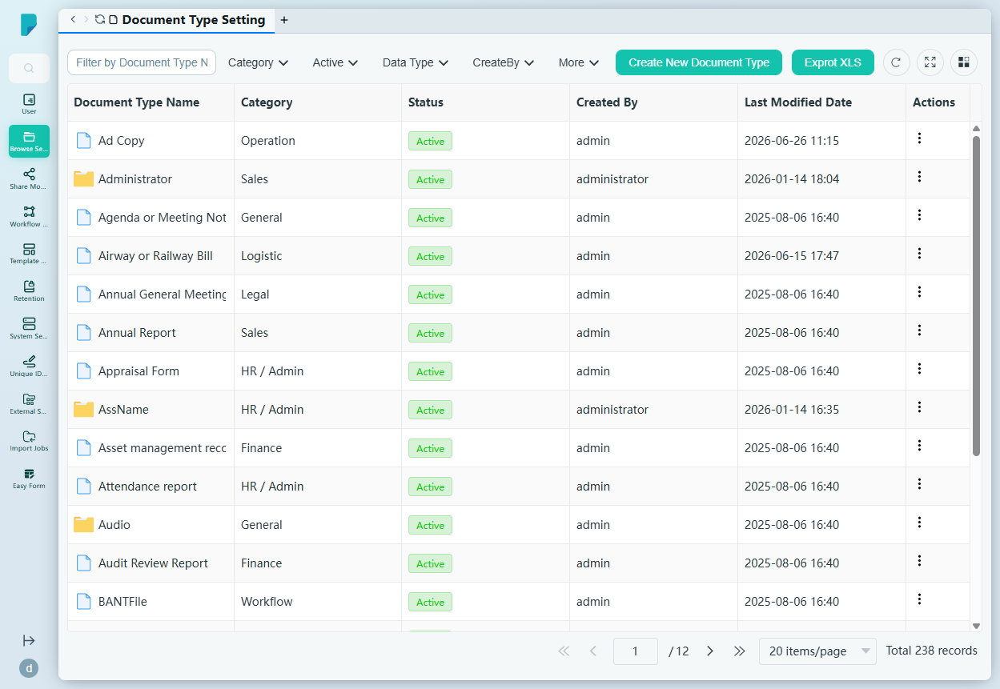
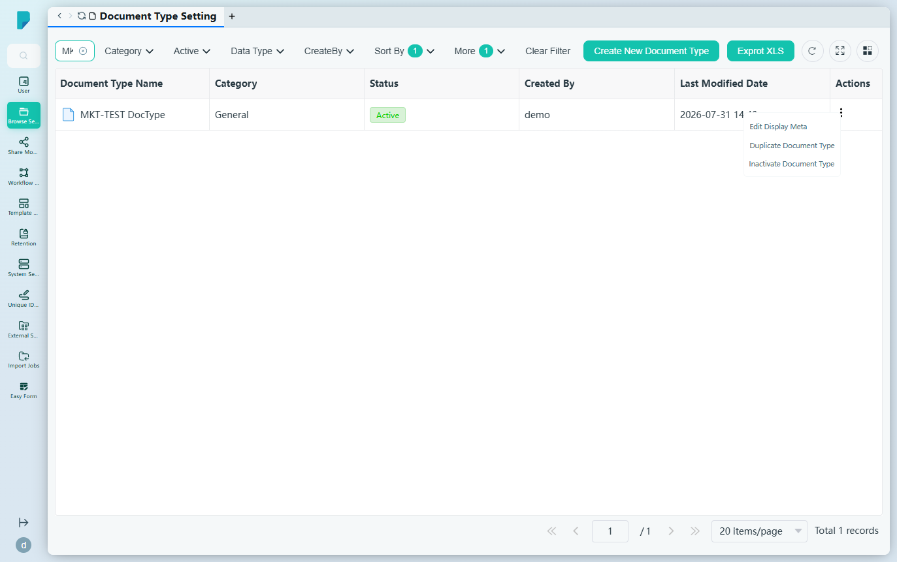
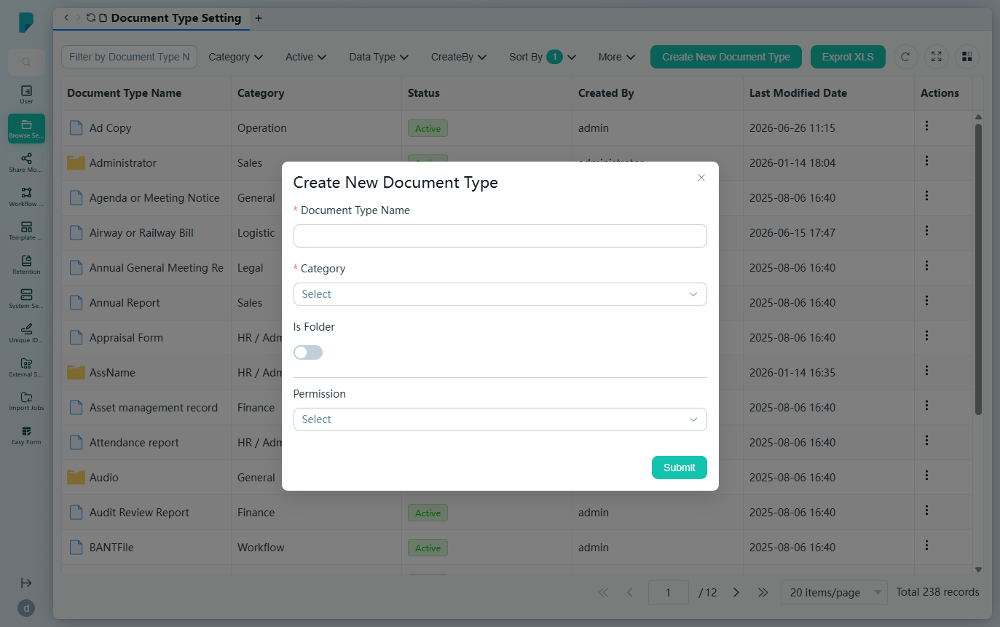
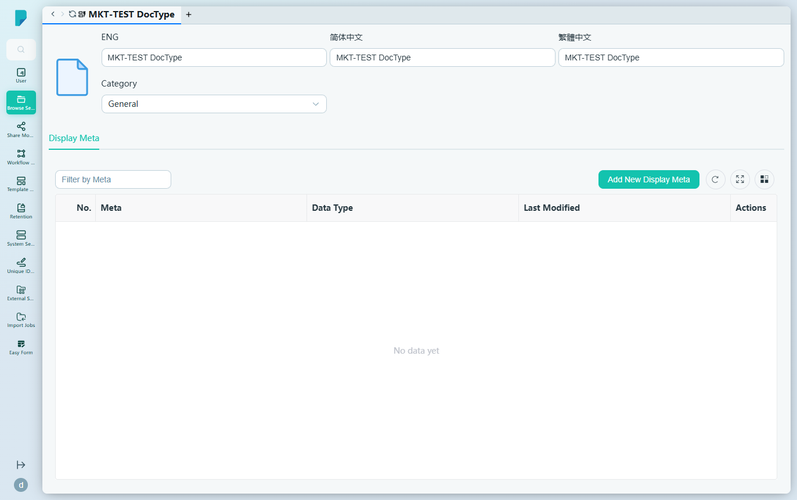
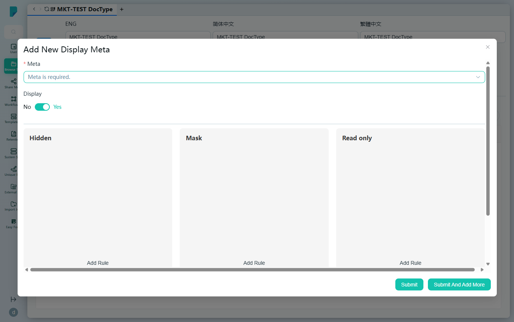

# Document Type Setting

**Menu path:** Admin → Browse Setting → Document Type Setting

## 此畫面的用途
系統中所有文件類型（Document Type）的登記冊（本網站共 238 個）。文件類型定義了一類檔案或資料夾——其所屬類別、誰可以使用，以及該類型文件所附帶的中繼資料欄位。管理員可在此建立、複製、停用及豐富文件類型。

## 工具列與操作
- **Filter by Document Type Name**（按文件類型名稱篩選）——自由文字篩選框。
- **Category**——按類別篩選：HR / Admin、Sales、Finance、Legal、IT、Marketing、Project、Operation、Customer Service、General、Logistic、CRM、Workflow（另有 intranet）。
- **Active**——按 Enable / Disable 篩選。
- **Data Type**——按 File / Folder 篩選。
- **CreateBy**——按建立者篩選（admin、administrator）。
- **More**——顯示額外的排序／篩選控制項（Sort By、Sort Order），以及在篩選生效時顯示 **Clear Filter** 按鈕。
- **Create New Document Type**——開啟建立對話框。
- **Exprot XLS**［原文如此］——將文件類型清單匯出至 Excel。
- 表格工具圖示：**Refresh**、**Full screen**、**Column settings**，以及分頁頁尾（每頁 20 項；此處共 12 頁）。

## 列表與欄位
- **Document Type Name**——類型名稱。
- **Category**——其業務類別（例如 Finance、Workflow）。
- **Status**——Active / inactive。
- **Created By**——建立者帳戶。
- **Last Modified Date**——最後修改時間戳記。
- **Actions**——每列的 ⋯ 選單，包括：
  - **Edit Display Meta**——開啟該類型的詳細資料／中繼資料畫面（見下文）。
  - **Duplicate Document Type**——複製該類型。
  - **Inactivate Document Type**——停用該類型。

## 對話框與面板

### Create New Document Type
- **Document Type Name**（必填）。
- **Category**（必填）——上述 13 個類別的下拉框。
- **Is Folder**——開關；令該類型套用於資料夾而非檔案。
- **Permission**——按 **Users**、**Role** 及 **Assigned User Group** 分組的多選欄位：誰可以使用該類型。
- **Submit** 建立類型；關閉（X）按鈕則取消。

### Document type detail (Edit Display Meta)（文件類型詳細資料）
顯示類型的三語名稱（**ENG / 简体中文 / 繁體中文** 輸入框）及 **Category**，並附 **Display Meta** 分頁，列出附於該類型的中繼資料欄位：

- **Filter by Meta** 篩選框及 **Add New Display Meta** 按鈕。
- 欄位：**No.**、**Meta**、**Data Type**、**Last Modified**、**Actions**。

### Add New Display Meta
將中繼資料欄位關聯至文件類型：

- **Meta**（必填）——Metadata 登記冊中所有中繼資料定義的下拉框。
- **Display**——Yes/No 開關（預設為開啟）。
- **Hidden**——附 **Add Rule** 的區段（設定欄位於何時隱藏的規則）。
- **Mask**——附 **Add Rule** 的區段（設定遮蔽欄位數值的規則）。
- **Read only**——附 **Add Rule** 的區段（設定令欄位變為唯讀的規則）。
- **Language Set**——**ENG / 简体中文 / 繁體中文** 顯示標籤輸入框。
- **Submit** 及 **Submit And Add More** 按鈕。

## 誰會使用
系統管理員及資訊架構師——他們為機構建立文件分類體系，控制有哪些類型存在、誰可以將文件歸入各類型，以及每個類型收集哪些中繼資料。
