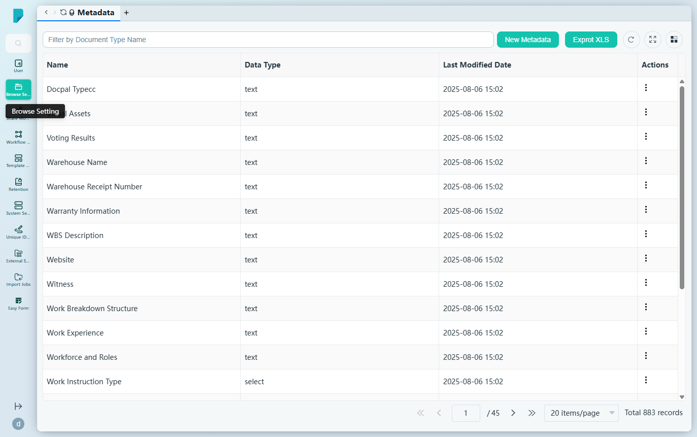
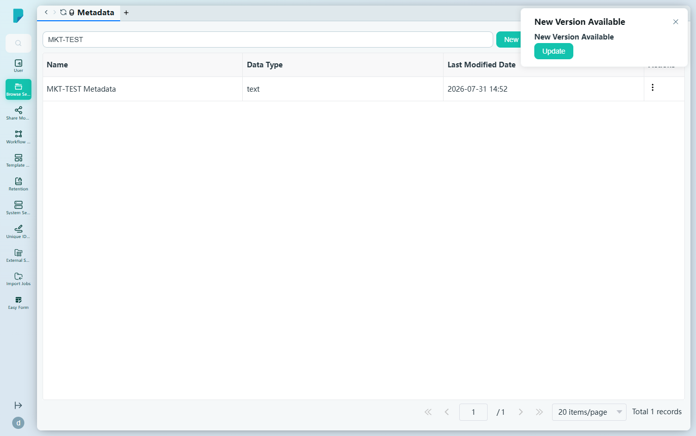
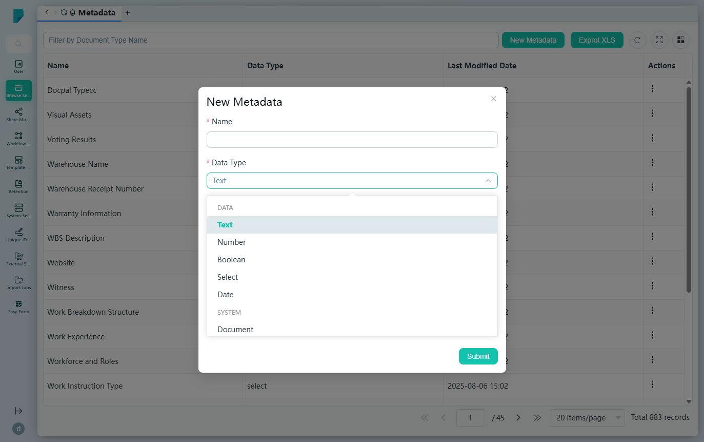
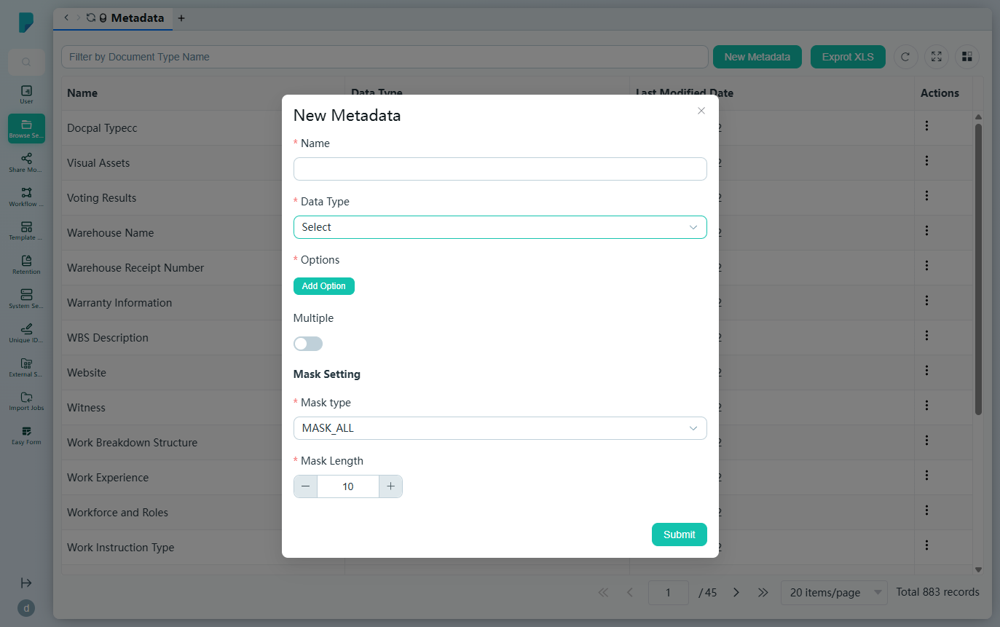

# Metadata

**Menu path:** Admin → Browse Setting → Metadata

## 此畫面的用途
系統中所有中繼資料（Metadata）欄位的主登記冊（本網站共 883 個定義）。每個定義——其名稱、資料類型及驗證／遮蔽規則——皆可透過 Display Meta 設定附加到文件類型，令文件能擷取一致而結構化的資訊。

## 工具列與操作
- **Filter by Document Type Name**——自由文字篩選框（按名稱篩選中繼資料列表）。
- **New Metadata**——開啟建立對話框。
- **Exprot XLS**［原文如此］——將登記冊匯出至 Excel；檔案在瀏覽器中產生，並下載為 `metadata.xlsx`（觀察所得為約 24 KB 的 `.xlsx` 活頁簿）。
- 表格工具圖示：**Refresh**、**Full screen**、**Column settings**，以及分頁頁尾（每頁 20 項；此處共 45 頁）。

## 列表與欄位
- **Name**——中繼資料欄位名稱（例如 Contract ID、Approve Date、Work Instruction Type）。
- **Data Type**——欄位類型（例如 text、select、date）。
- **Last Modified Date**——最後修改時間戳記。
- **Actions**——每列的 ⋯ 選單，包括 **Edit**、**Duplicate** 及 **Remove**。

## 對話框與面板

### New Metadata
- **Name**（必填）——欄位名稱。
- **Data Type**（必填）——包含 11 種類型的下拉框：Text、Number、Boolean、Select、Date、Document、Case、Workflow、MasterTable、User、UserRoleUserGroup。
- 視乎類型顯示相應選項：
  - **Text**——*Max Length* 微調輸入框（1–4000，預設 255）。
  - **Select**——**Options** 區段，附 **Add Option** 以定義選項，另設 **Multiple** 開關以允許多選。
- **Mask Setting**——*Mask type* 下拉框（預設 MASK_ALL）及 *Mask Length* 微調輸入框（1–24，預設 10），控制數值顯示時的遮蔽方式。
- **Submit** 建立定義；關閉（X）按鈕則取消。

## 誰會使用
系統管理員及資訊架構師——他們一次定義機構的中繼資料詞彙，並在文件類型、搜尋及智能資料夾中重複使用。
