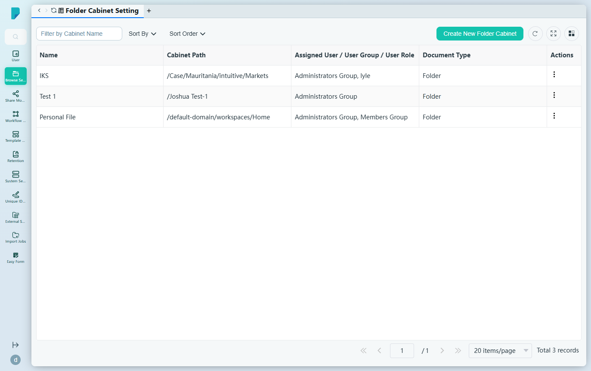
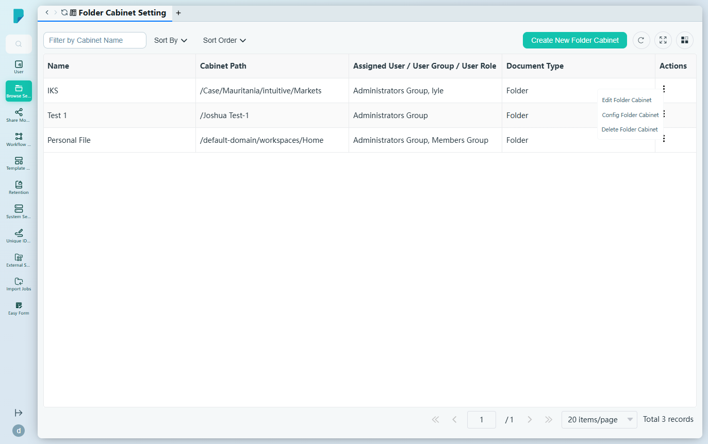
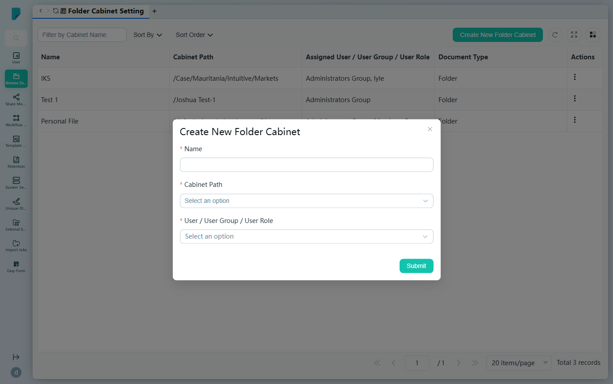

# Folder Cabinet Setting

**Menu path:** Admin → Browse Setting → Folder Cabinet Setting

## 此畫面的用途
Folder cabinet（檔案櫃）是進入儲存庫的精選入口：每個檔案櫃會釘選一個儲存庫路徑，並以「檔案櫃」的形式呈現給客戶端上指定的用戶、群組或角色。管理員在此畫面建立檔案櫃、將其指向儲存庫路徑，並控制其可見對象。

## 工具列與操作
- **Filter by Cabinet Name** — 自由文字篩選框。
- **Sort By** — 核取方塊群組：Cabinet Path、Document Type、Name。
- **Sort Order** — A–Z 或 Z–A。
- **Create New Folder Cabinet** — 開啟建立對話框。
- 表格工具圖示：**Refresh**、**Full screen**、**Column settings**，另設顯示總記錄數的分頁頁尾。

## 列表與欄位
- **Name** — 檔案櫃的顯示名稱（此網站上為：IKS、Test 1、Personal File）。
- **Cabinet Path** — 檔案櫃所指向的儲存庫路徑（例如 `/default-domain/workspaces/Home`）。
- **Assigned User / User Group / User Role** — 可看到此檔案櫃的對象（例如 Administrators Group、Members Group、lyle）。
- **Document Type** — 檔案櫃的類型（目前所有列均為 Folder）。
- **Actions** — 每列的 ⋯ 選單，包括：
  - **Edit Folder Cabinet** — 編輯名稱、路徑及指派對象。
  - **Config Folder Cabinet** — 開啟同一個編輯對話框以設定檔案櫃的配置。
  - **Delete Folder Cabinet** — 移除檔案櫃。

## 對話框與面板

### Create New Folder Cabinet / Edit Folder Cabinet
- **Name**（必填）— 檔案櫃的顯示名稱。
- **Cabinet Path**（必填）— 儲存庫路徑（以麵包屑形式顯示，例如「default-domain / workspaces / Home」）。
- **User / User Group / User Role**（必填）— 用戶、群組及角色的多選欄位；目前的指派會以可移除的標籤顯示。
- **Submit** 儲存；關閉（X）按鈕取消。

## 誰會使用
負責策劃的系統管理員：決定儲存庫的哪些部分會以現成檔案櫃的形式呈現給哪些對象。

## 實地備註 — 客戶端「folder cabinet is abnormal」錯誤（2026-07-31 觀察所得）
客戶端的 Folder Cabinet 頁面持續顯示「The folder cabinet is abnormal, please contact the administrator」。唯讀調查結果（未更改任何設定）：

- 三個已設定的檔案櫃全部出現在客戶端的檔案櫃列表中，其項目表亦能載入（Test 1：2 筆記錄、Personal File：4 筆記錄、IKS：0 筆記錄）——但無論選取哪個檔案櫃，錯誤區塊仍然可見。
- 所有 `/api/dms/cabinet/*` 呼叫均回傳 HTTP 200；未觀察到失敗的請求，因此錯誤很可能由檔案櫃資料觸發，而非硬性的 API 故障。
- 最大嫌疑：檔案櫃 **IKS** 指向 `/Case/Mauritania/intuitive/Markets` ——一個看似隨機自動產生的路徑，很可能在儲存庫中已不存在（其項目列表為空）。檔案櫃 **Test 1**（`/Joshua Test-1`）是第二個可疑的殘留項目。當檔案櫃的根路徑無法解析時，很可能令整個頁面被標記為異常。
