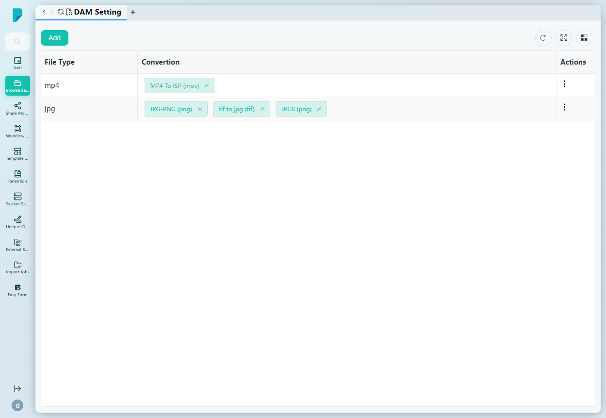
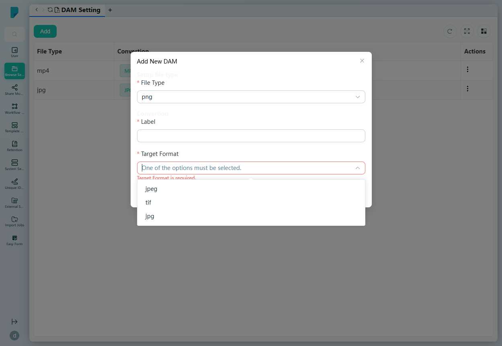

# DAM Setting

**Menu path:** Admin → Browse Setting → DAM Setting

## 此畫面的用途
Digital Asset Management（數碼資產管理）的轉換規則。管理員可為每種媒體檔案類型定義一個或多個具名轉換（標籤 + 目標格式）——例如將上傳的 `mp4` 轉為 `mov`，或將 `jpg` 轉為 `png`/`tif` 版本——讓資產自動以後續工作流程所需的格式提供。

## 工具列與操作
- **Add** — 開啟 Add New DAM 對話框以建立轉換規則。
- 表格工具圖示：**Refresh**、**Full screen**、**Column settings**。

## 列表與欄位
- **File Type** — 來源副檔名（例如 mp4、jpg）。
- **Convertion**［原文如此］— 為該類型定義的轉換，以可移除的標籤顯示，附標籤及目標格式，例如「MP4 To ISP (mov)」；jpg 有三個：「JPG-PNG (png)」、「tif to jpg (tif)」、「JPGS (png)」。
- **Actions** — 每列的 ⋯ 選單，包括 **Add**（為該檔案類型新增另一個轉換）。

## 對話框與面板

### Add New DAM
- **Setup file type** 區段：
  - **File Type**（必填）— 下拉選單：jpg、tif、mp4、mov、avi、mpeg、png、jpeg。
- **Convertion** 區段：
  - **Label**（必填）— 轉換的自由文字名稱。
  - **Target Format**（必填）— 下拉選單，選項視乎所選的 File Type 而定（例如 png 的選項為 jpeg、tif、jpg）；未選擇 File Type 前為空白。
- **Submit** 儲存規則；關閉（X）按鈕取消。

## 誰會使用
負責統一媒體轉換版本的系統管理員及 DAM 管理人員——確保每項上傳的資產都能以預覽、發佈及整合所需的格式產出。
