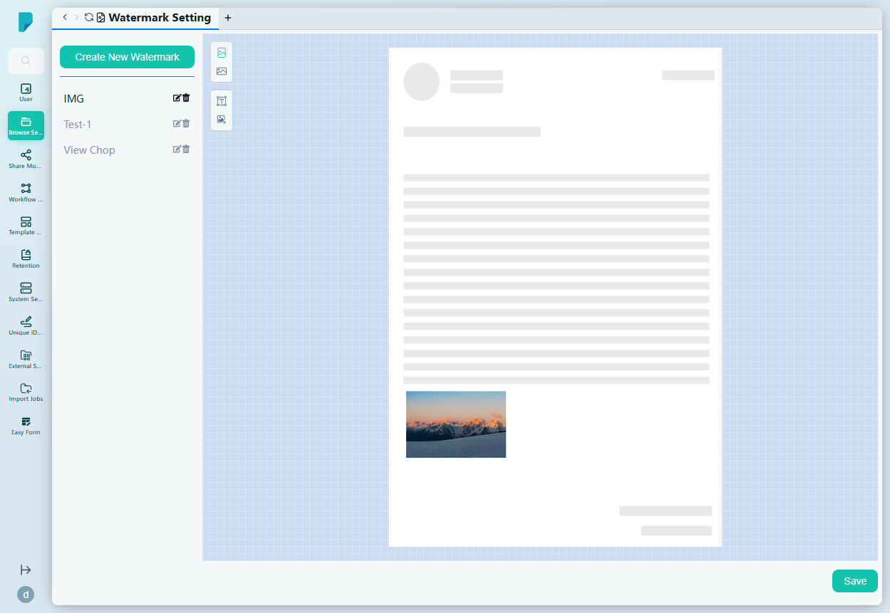
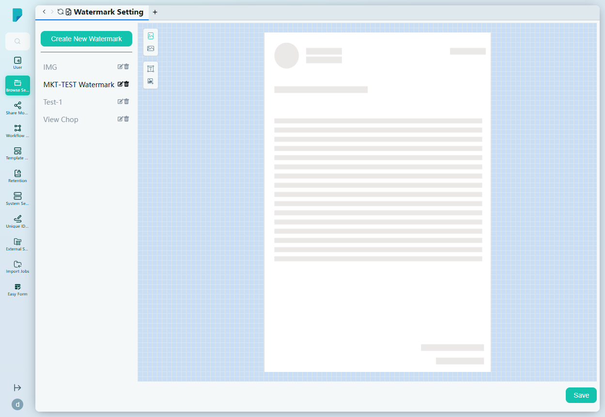
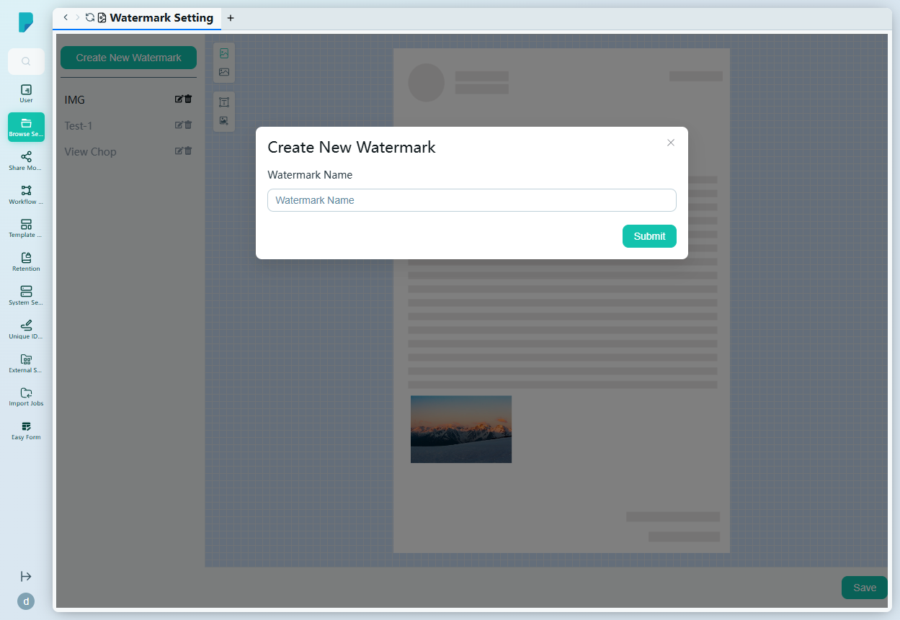

# Watermark Setting

**Menu path:** Admin → Browse Setting → Watermark Setting

## 此畫面的用途
水印設計工作室。管理員在此建立具名水印——放置於文件頁面預覽上的文字或圖像元素——儲存後可在系統為文件蓋印的任何位置重複使用（例如檢視、下載或列印時）。此網站上現有三個水印：IMG、Test-1 及 View Chop。

## 工具列與操作
- **Create New Watermark** — 開啟建立對話框。
- **Watermark list**（左面板）— 所有已儲存的水印，每個均附**編輯（鉛筆）**及**刪除（垃圾桶）**圖示。
- **Save**（右下）— 儲存在編輯器中所作的變更。

## 列表與欄位
此頁沒有表格——版面為列表加編輯器：

- **左面板** — 具名水印列表；選取其中一個即載入編輯器。
- **編輯器畫布** — 完整的文件頁面預覽（頁首、內文及頁尾佔位符），以格線為背景。所選水印的元素會就地呈現——例如 IMG 水印顯示一個位於頁面左下方的圖像元素。畫布旁設有小型垂直工具列，提供水印元素工具（新增圖像／文字元素），元素可直接在頁面預覽上定位。

## 對話框與面板

### Create New Watermark
- **Watermark Name** — 新水印的自由文字名稱。
- **Submit** 建立水印（會在編輯器中以空白畫布開啟）；關閉（X）按鈕取消。

## 誰會使用
負責設計正式蓋印的系統管理員及檔案管理人員——包括機密聲明文字、公司印鑑、圖像印章等——套用於整個平台的文件。
