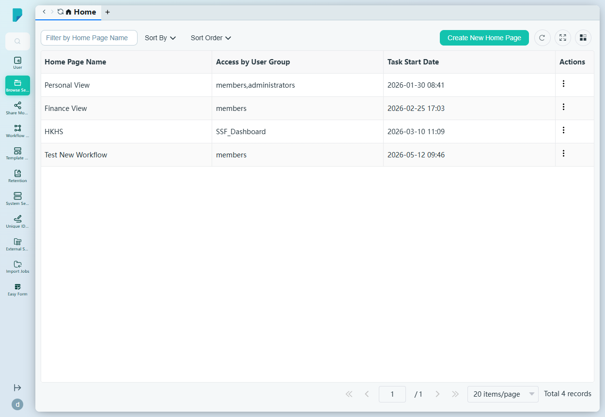
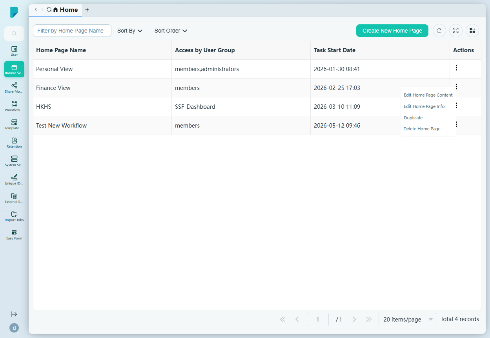
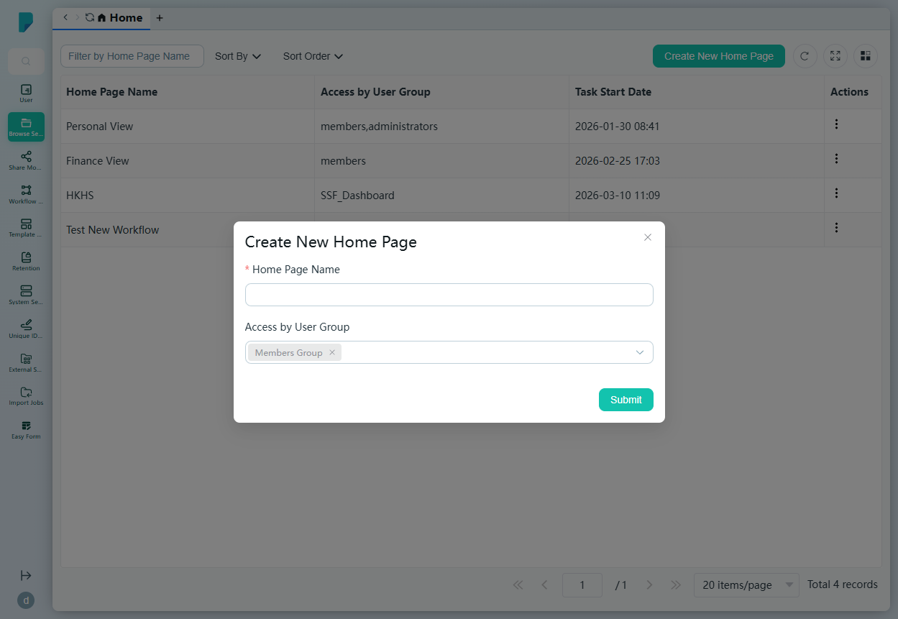

# Home (Browse Home Setting)

**Menu path:** Admin → Browse Setting → Home

## 此畫面的用途
設定客戶端 Browse 首頁檢視。每個「home page」都是為檔案瀏覽器度身訂造的登陸檢視，針對特定用戶群組——例如供所有人使用的 Personal View、供 members 群組使用的 Finance View，或供 SSF_Dashboard 群組使用的 HKHS 儀表板。管理員在此建立、編輯、複製及停用這些檢視。

## 工具列與操作
- **Filter by Home Page Name** — 自由文字篩選框。
- **Sort By** — 核取方塊群組：Access by User Group、Task Start Date、Home Page Name。
- **Sort Order** — A–Z 或 Z–A。
- **Create New Home Page** — 開啟建立對話框。
- 表格工具圖示：**Refresh**、**Full screen**、**Column settings**，另設顯示總記錄數的分頁頁尾。

## 列表與欄位
- **Home Page Name** — 檢視的名稱（Personal View、Finance View、HKHS、Test New Workflow）。
- **Access by User Group** — 可看到此首頁檢視的群組（例如 members、administrators、SSF_Dashboard）。
- **Task Start Date** — 檢視顯示的時間戳（例如 2026-01-30 08:41）。
- **Actions** — 每列的 ⋯ 選單，包括：
  - **Edit Home Page Content** — 編輯檢視的版面／小工具。
  - **Edit Home Page Info** — 編輯名稱及群組存取設定。
  - **Duplicate** — 複製此首頁。
  - **Delete Home Page** — 將其移除。

## 對話框與面板

### Create New Home Page
- **Home Page Name**（必填）。
- **Access by User Group** — 用戶群組多選欄位，預填「Members Group」（可移除標籤）。
- **Submit** 建立首頁；關閉（X）按鈕取消。

## 誰會使用
塑造每個團隊首先看到什麼的系統管理員——為每個對象提供切合其文件、儀表板及日常工作的 Browse 首頁。
