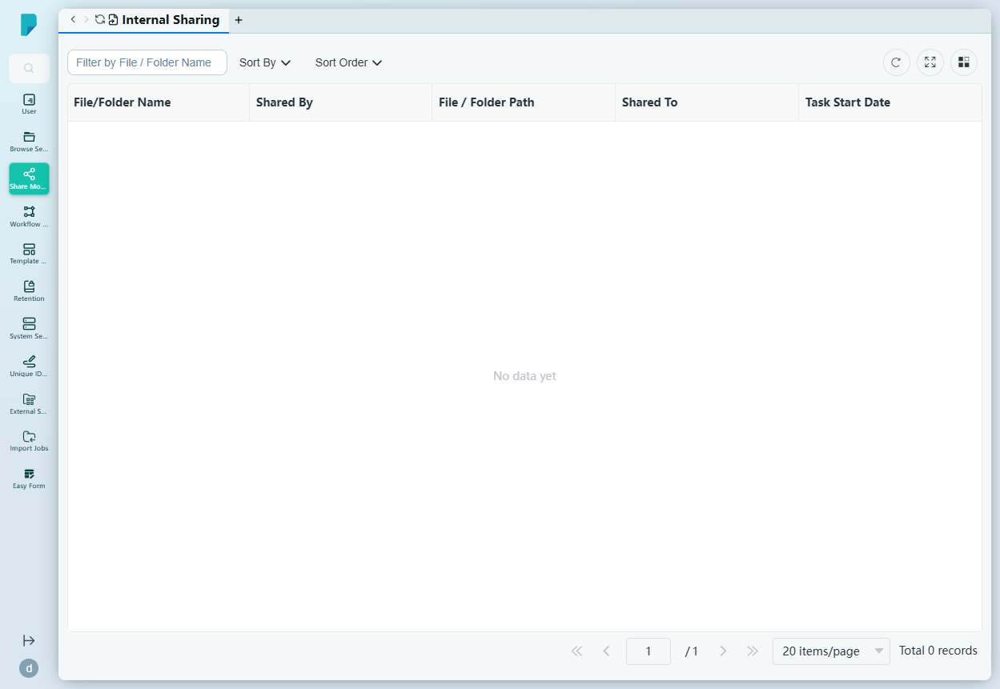

# Internal Sharing

**Menu path:** Admin → Share Module → Internal Sharing

## 此畫面的用途
管理員監察網站內所有內部分享的總覽頁——即機構內用戶與其他用戶或群組分享的每個檔案或資料夾。此頁讓管理員在單一位置審核誰分享了什麼、該項目位於何處，以及分享給誰。

## 工具列與操作
- **Filter by File / Folder Name** — 自由文字篩選框。
- **Sort By** — 核取方塊群組：File/Folder Name、Shared By、Shared To、Task Start Date。
- **Sort Order** — A–Z 或 Z–A。
- 表格工具圖示：**Refresh**、**Full screen**、**Column settings**，另設顯示總記錄數的分頁頁尾。

## 列表與欄位
- **File/Folder Name** — 被分享項目的名稱。
- **Shared By** — 建立分享的用戶。
- **File / Folder Path** — 該項目在儲存庫中的位置。
- **Shared To** — 接收的用戶或群組。
- **Task Start Date** — 分享開始的時間。

列表目前為空（「No data yet」，0 筆記錄）——此網站上沒有任何內部分享。

## 對話框與面板
沒有——此頁為唯讀的審核列表；分享本身由終端用戶在客戶端網站上建立。

## 誰會使用
需要掌握內部資訊分享情況的系統管理員及合規人員——在不接觸用戶內容的情況下，識別過度分享的檔案並審核存取情況。
