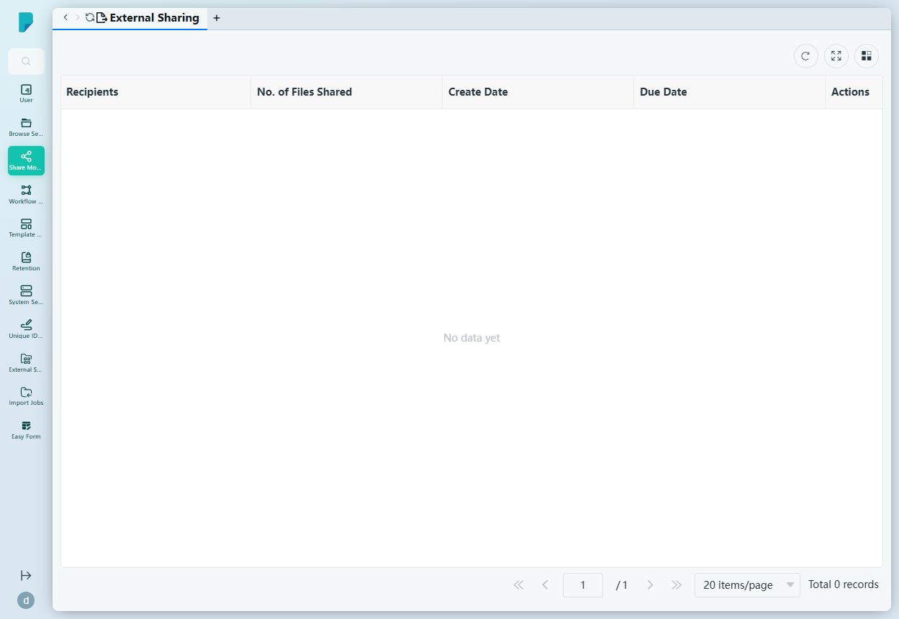

# External Sharing

**Menu path:** Admin → Share Module → External Sharing

## 此畫面的用途
管理員對所有外部分享的監察視圖 —— 即用戶發送到機構以外的檔案。管理員可以在同一個列表中審核誰收到了甚麼、分享了多少檔案,以及每個分享何時到期。

## 工具列與操作
- 表格工具圖示:**Refresh**、**Full screen**、**Column settings**,另設分頁頁尾顯示記錄總數。
- (此頁沒有篩選列。)

## 列表與欄位
- **Recipients** —— 分享的外部收件人。
- **No. of Files Shared** —— 該分享包含的檔案數量。
- **Create Date** —— 分享的建立日期。
- **Due Date** —— 分享的到期日期。
- **Actions** —— 針對個別分享的行內操作。

此列表目前為空(顯示「No data yet」,0 筆記錄)—— 此站點上沒有任何外部分享。

## 對話框與面板
無 —— 此頁為唯讀的審核列表;外部分享本身由終端用戶在客戶端網站建立。

## 誰會使用
系統管理員、合規及保安主任 —— 負責追蹤流出機構的資訊,核實每個外部分享的收件人、數量及到期日。
