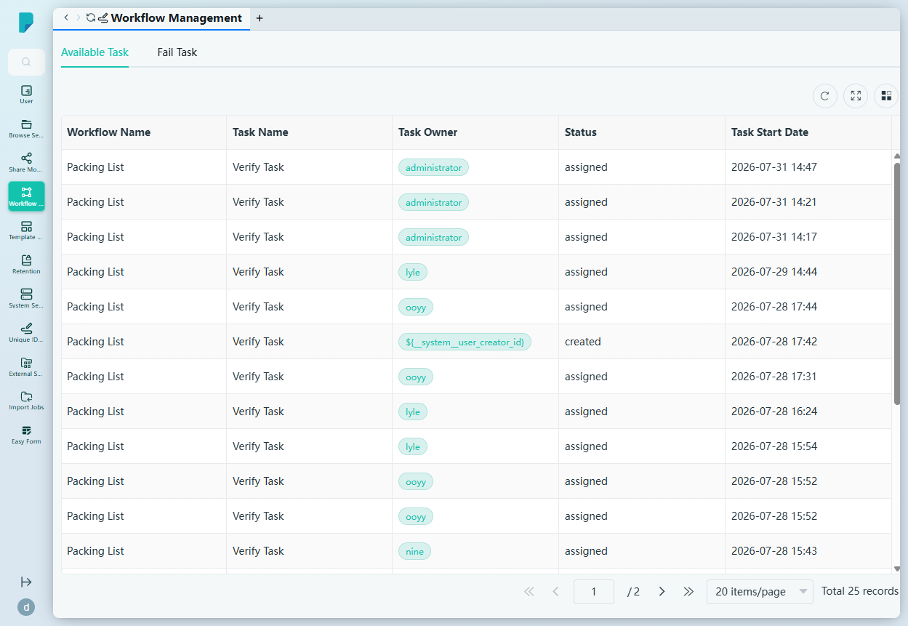
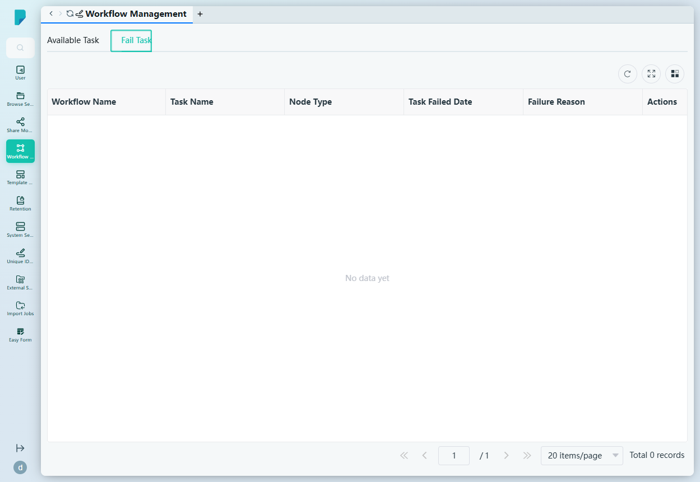

# Workflow Management

**Menu path:** Admin → Workflow Management → Workflow Management

## 此畫面的用途
運作中工作流程的營運儀表板。管理員可監察全站每個進行中的工作流程任務 —— 誰是負責人、狀態如何、何時開始 —— 並可檢視一個需要跟進的失敗任務專屬佇列。

## 工具列與操作
- **Available Task / Fail Task 分頁** —— 在現行任務與失敗任務之間切換。
- 表格工具圖示:**Refresh**、**Full screen**、**Column settings**,另設分頁頁尾顯示記錄總數。
- 列為唯讀(沒有行內操作);此畫面屬監察視圖。

## 列表與欄位

### Available Task 分頁
- **Workflow Name** —— 工作流程定義(例如 Packing List、teo)。
- **Task Name** —— 目前的步驟(例如 Verify Task、New User Task)。
- **Task Owner** —— 被指派者(例如 administrator、lyle、ooyy;未能解析的範本負責人會顯示為 `${__system__user_creator_id}`)。
- **Status** —— 任務狀態(assigned、created)。
- **Task Start Date** —— 任務開始日期。

此站點有 25 個進行中的任務(共 2 頁)。

### Fail Task 分頁
- **Workflow Name**、**Task Name**、**Node Type**、**Task Failed Date**、**Failure Reason**、**Actions** —— 目前為空(沒有失敗任務)。

## 對話框與面板
未見任何對話框 —— 兩個分頁均為唯讀監察列表。

## 誰會使用
系統管理員及工作流程操作員 —— 負責確保流程順暢運作:及早發現卡住或未指派的任務,並在用戶察覺前處理失敗項目。
