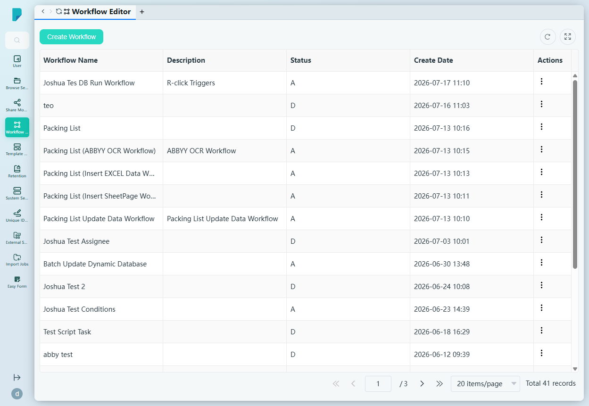
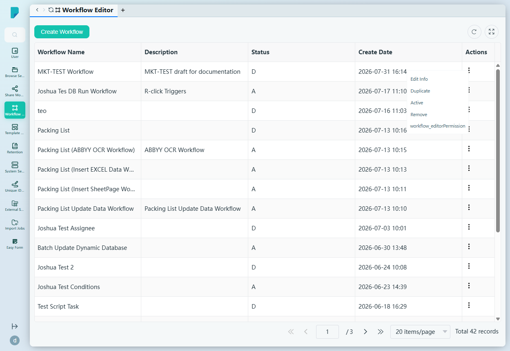
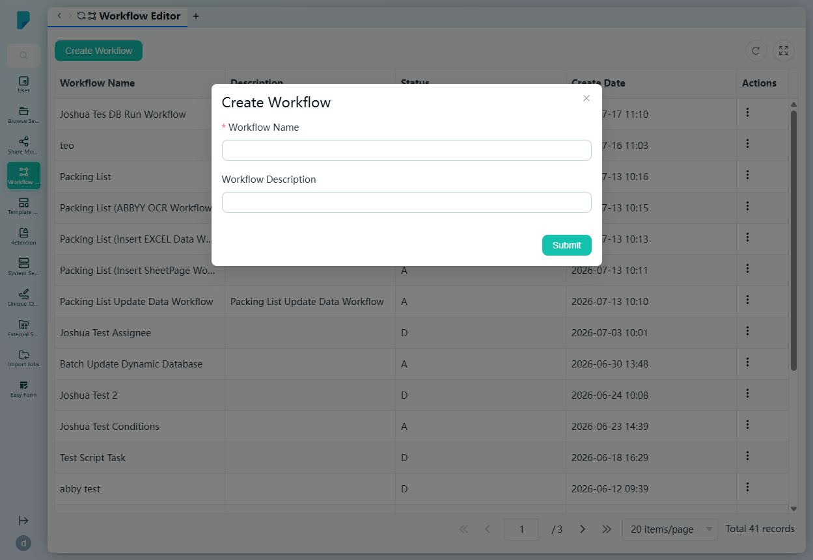
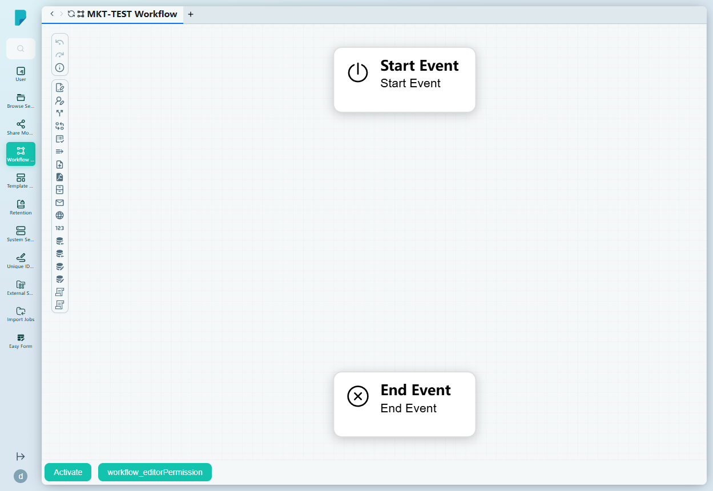
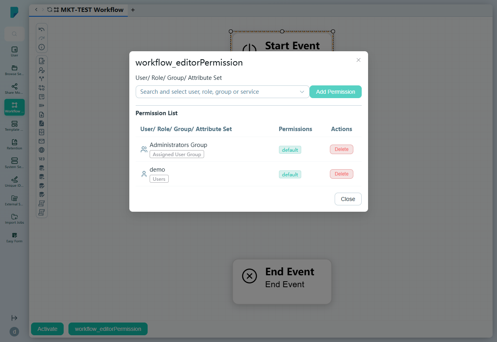

# Workflow Editor

**Menu path:** Admin → Workflow Management → Workflow Editor

## 此畫面的用途
工作流程設計的中心:列出站點上所有工作流程定義(此處有 41 個),並提供視覺化設計器,用於繪製、設定、發佈及分享流程。每個工作流程都是一個帶版本的定義 —— 草稿可安全編輯,之後再啟用投入運作。

## 工具列與操作
- **Create Workflow** —— 開啟建立對話框。
- 表格工具圖示:**Refresh**、**Full screen**,另設分頁頁尾(41 筆記錄,共 3 頁)。

## 列表與欄位
- **Workflow Name** —— 定義的名稱。
- **Description** —— 自由文字描述。
- **Status** —— **A**(已啟用/已發佈)或 **D**(草稿/已停用)。
- **Create Date** —— 建立時間戳。
- **Actions** —— 每列的 ⋯ 選單,包括:
  - **Edit Info** —— 編輯名稱/描述。
  - **Duplicate** —— 複製該工作流程。
  - **Active** —— 啟用/發佈。
  - **Remove** —— 刪除。
  - **workflow_editorPermission**[未翻譯的標籤] —— 開啟分享對話框(見下文)。

## 對話框與面板

### Create Workflow
- **Workflow Name**(必填)。
- **Workflow Description** —— 可選的自由文字。
- **Submit** 建立草稿並在設計器中開啟。

### 視覺化設計器
拖放式畫布(支援平移)。新草稿會以一個 **Start Event** 節點及一個 **End Event** 節點開始,在其間建立流程。

- **左側工具列** —— 頂部為復原/重做/歷史記錄圖示(未有變更前停用),其下是包含 18 種可拖曳節點類型的**節點面板**:
  - User Form、User Signature Task
  - Condition Task、Transform Task、Validate Task
  - Sub Process、Upload File
  - Document Generation Task、Filing Documents Task
  - Email Task、HTTP Task
  - Unique Id Generator
  - Insert Dynamic Database、Batch Insert Dynamic Database、Update Dynamic Database、Batch Update Dynamic Database
  - Http JSON Edit、Script Task
- **底部工具列** —— **Activate**(發佈草稿;會驗證 Start 任務是否已設定表單)及 **workflow_editorPermission**(分享)。
- **Properties 面板**(右側)—— 顯示所選節點的設定。

### Workflow permission 對話框
控制誰可以使用/編輯該工作流程:

- **User/ Role/ Group/ Attribute Set** —— 可搜尋的選擇器(「Search and select user, role, group or service」)。
- **Add Permission** —— 向所選項目授予存取權。
- **Permission List** —— 現有的授權,欄位包括 User/Role/Group/Attribute Set、Permissions、Actions(每項授權可 Delete);觀察到的預設值:Administrators Group(Assigned User Group,預設)及建立者(Users,預設)。
- **Close** 按鈕。

## 誰會使用
系統管理員及流程設計人員 —— 負責設計審批及自動化流程,由簡單的簽核到以指令碼及數據驅動的流程,然後發佈並分享給執行這些流程的團隊。
