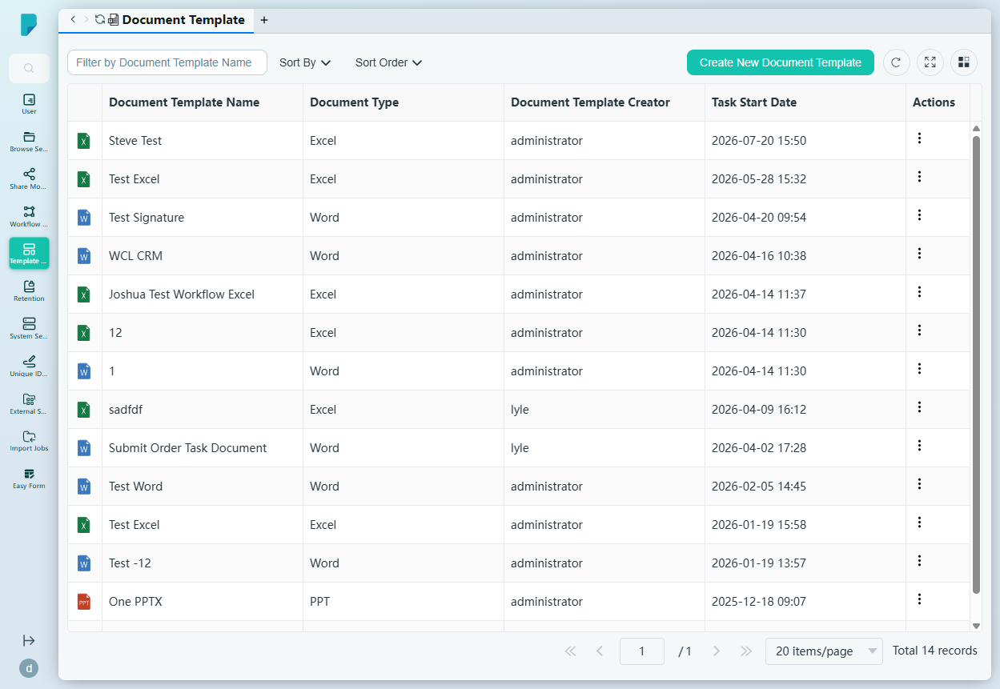
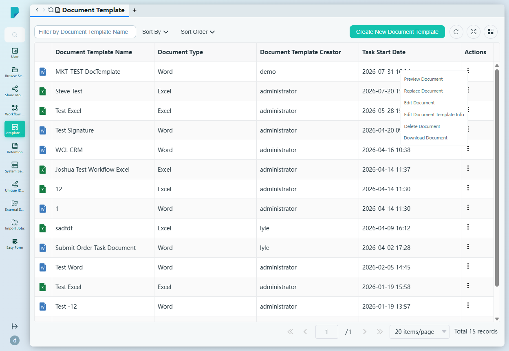
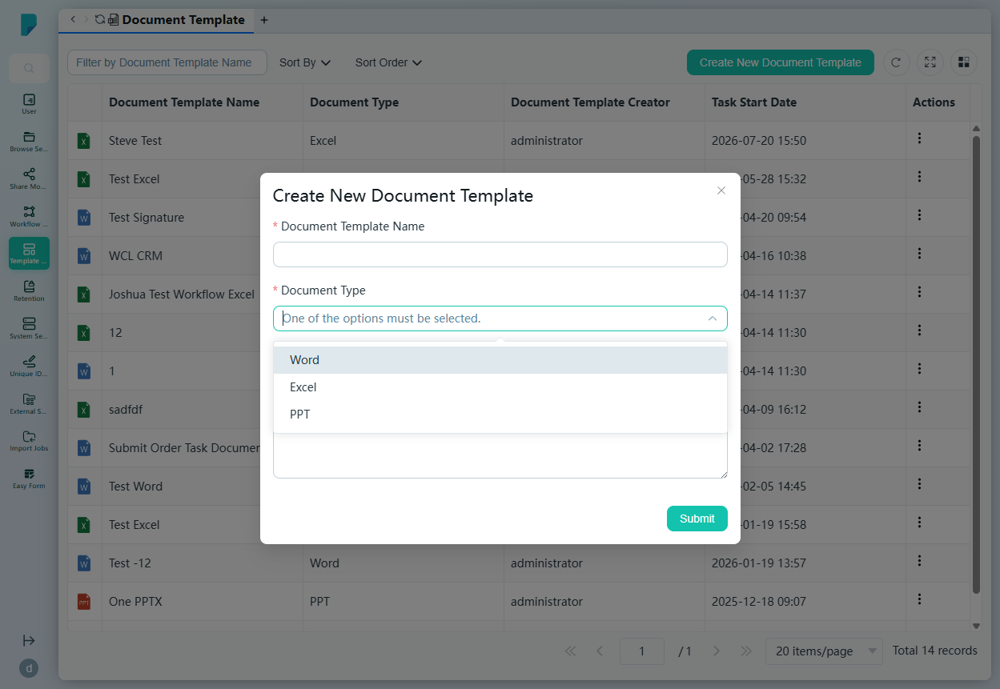
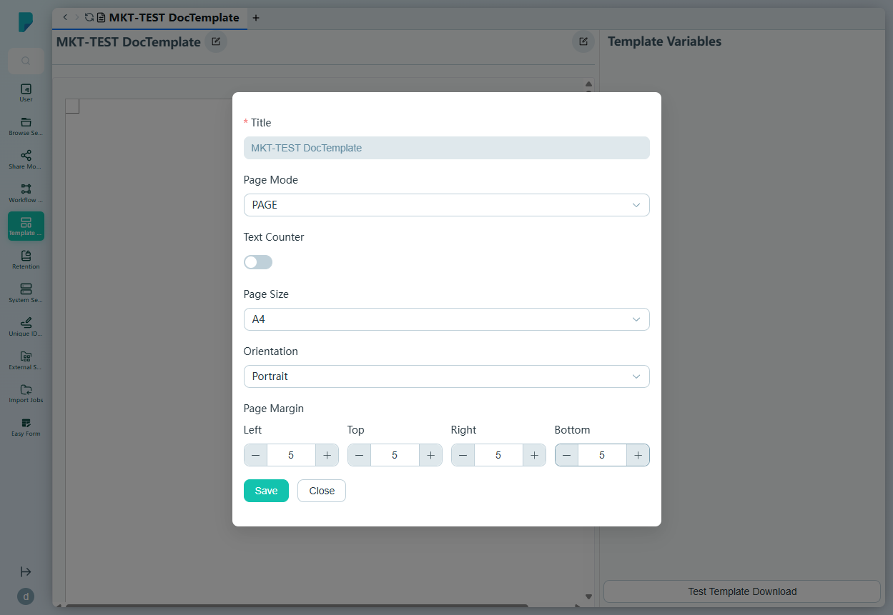

# Document Template

**Menu path:** Admin → Template Management → Document Template

## 此畫面的用途
文件範本(Word、Excel、PowerPoint)的範本庫,供整個平台產生文件之用 —— 由工作流程的文件產生任務到用戶自行建立文件均會使用。管理員在此上載、編輯、預覽及停用範本;每列會顯示範本的檔案類型圖示。

## 工具列與操作
- **Filter by Document Template Name** —— 自由文字篩選框。
- **Sort By** —— 核取方塊群組:Document Template Creator、Document Template Name、Document Type、Task Start Date。
- **Sort Order** —— A–Z 或 Z–A。
- **Create New Document Template** —— 開啟建立對話框。
- 表格工具圖示:**Refresh**、**Full screen**、**Column settings**,另設分頁頁尾顯示記錄總數。

## 列表與欄位
- **(圖示)** —— 檔案類型圖示(Word / Excel / PPT)。
- **Document Template Name** —— 範本名稱。
- **Document Type** —— Word、Excel 或 PPT。
- **Document Template Creator** —— 上載者。
- **Task Start Date** —— 建立時間戳。
- **Actions** —— 每列的 ⋯ 選單,包括:
  - **Preview Document** —— 檢視範本。
  - **Replace Document** —— 上載新檔案取代原有範本。
  - **Edit Document** —— 在線上編輯器中開啟範本。
  - **Edit Document Template Info** —— 編輯名稱/描述。
  - **Delete Document** —— 刪除。
  - **Download Document** —— 下載範本檔案。

## 對話框與面板

### Create New Document Template
- **Document Template Name**(必填)。
- **Document Type**(必填)—— 下拉選單:Word、Excel、PPT。
- **Description** —— 可選的多行文字。
- **Submit** 建立範本並在線上編輯器中開啟。

### 範本編輯器
建立(或編輯)範本會開啟線上文件編輯器,附設 **Template Variables** 側面板及 **Test Template Download** 按鈕(以範本產生一份示例文件)。另有一個頁面設定對話框用於設定文件:

- **Title**(必填,已預先填入)。
- **Page Mode** —— 下拉選單(PAGE)。
- **Text Counter** —— 開關。
- **Page Size** —— 下拉選單(A4)。
- **Orientation** —— 下拉選單(Portrait)。
- **Page Margin** —— Left / Top / Right / Bottom 微調框(各預設為 5)。
- **Save** 及 **Close** 按鈕。

## 誰會使用
系統管理員及範本負責人 —— 負責維護機構的標準信件、表格及試算表,確保每份產生的文件保持品牌一致及內容最新。
