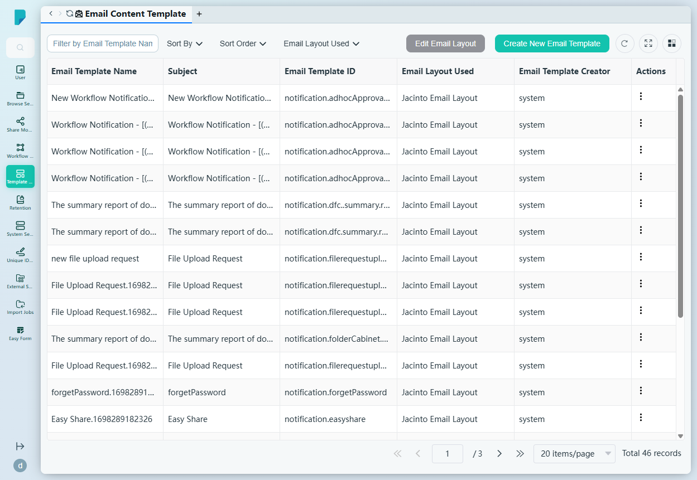
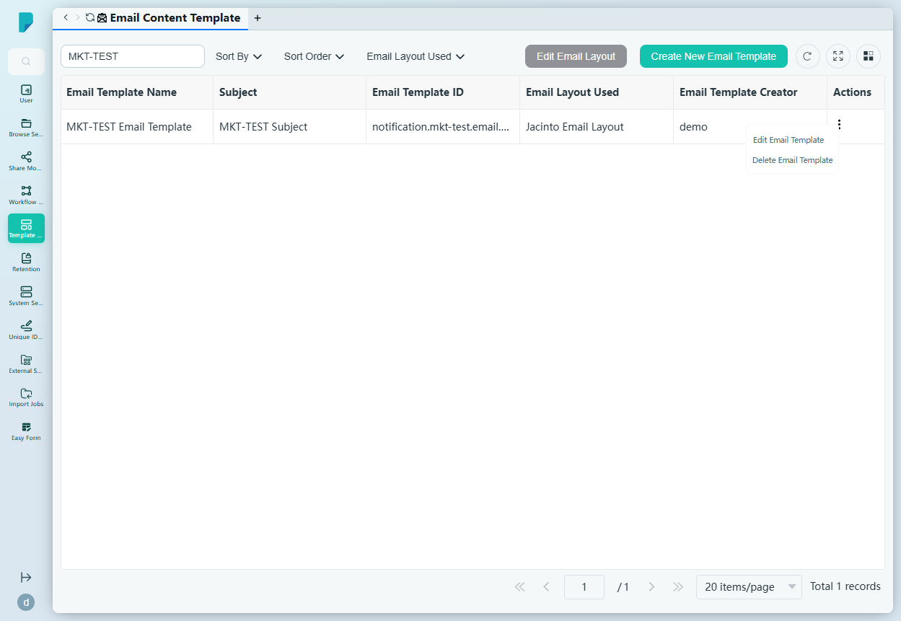
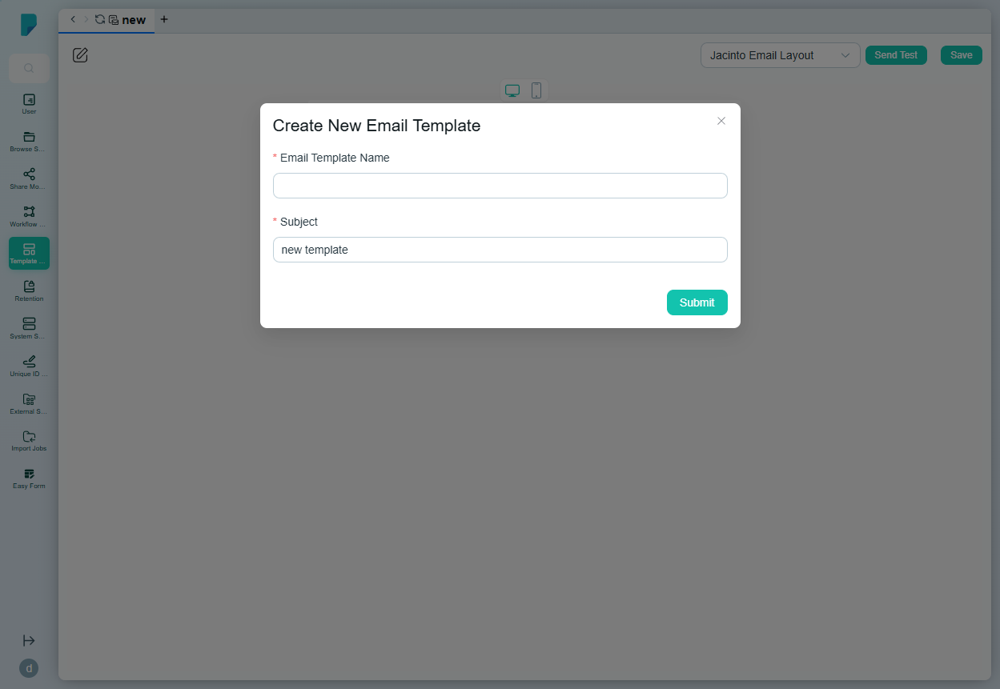
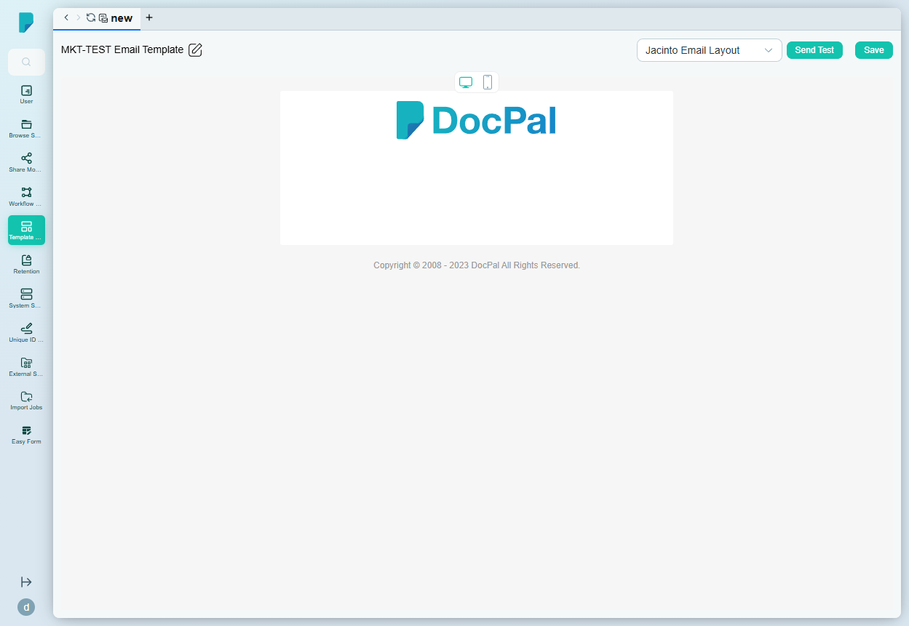

# Email Content Template

**Menu path:** Admin → Template Management → Email Content Template

## 此畫面的用途
平台所發出所有電郵的登記冊 —— 工作流程通知、分享邀請、密碼重設、上載請求等(此處有 46 個範本,大部分屬系統所有)。管理員可管理這些電郵的主旨、內文及版面,並可自行新增自訂範本。

## 工具列與操作
- **Filter by Email Template Name** —— 自由文字篩選框。
- **Sort By** —— 核取方塊群組:Email Template Creator、Email Template ID、Email Template Name、Subject。
- **Sort Order** —— A–Z 或 Z–A。
- **Email Layout Used** —— 按版面篩選(此站點:Jacinto Email Layout)。
- **Edit Email Layout** —— 開啟共用電郵版面進行編輯。
- **Create New Email Template** —— 開啟建立對話框及編輯器。
- 表格工具圖示:**Refresh**、**Full screen**、**Column settings**,另設分頁頁尾(此處共 3 頁)。

## 列表與欄位
- **Email Template Name** —— 顯示名稱(例如 New Workflow Notification、forgetPassword、Easy Share)。
- **Subject** —— 電郵主旨行,支援佔位符,例如 `[(${businessKey})]`。
- **Email Template ID** —— 觸發該範本的機器鍵值(例如 `notification.adhocApproval.submitted`、`notification.forgetPassword`;自訂範本會獲派自動產生的 ID,如 `notification.mkt-test.email.template`)。
- **Email Layout Used** —— 包裹電郵的共用版面(Jacinto Email Layout)。
- **Email Template Creator** —— 內建範本顯示為 `system`,否則為建立者。
- **Actions** —— 每列的 ⋯ 選單,包括 **Edit Email Template** 及 **Delete Email Template**。

## 對話框與面板

### Create New Email Template
- **Email Template Name**(必填)。
- **Subject**(必填)—— 電郵的主旨行。
- **Submit** 建立範本並開啟編輯器。

### 電郵範本編輯器
- **Layout selector** —— 選擇電郵版面的下拉選單(Jacinto Email Layout)。
- **Send Test** —— 發送測試電郵。
- **Save** —— 儲存變更。
- 一個富文本內文編輯器(contenteditable),內文下方顯示標準頁尾(「Copyright © 2008 - 2023 DocPal All Rights Reserved.」)。

## 誰會使用
系統管理員 —— 負責掌管平台的對外形象:用戶及外部收件人所收到每封通知電郵的品牌風格、措辭及版面。
