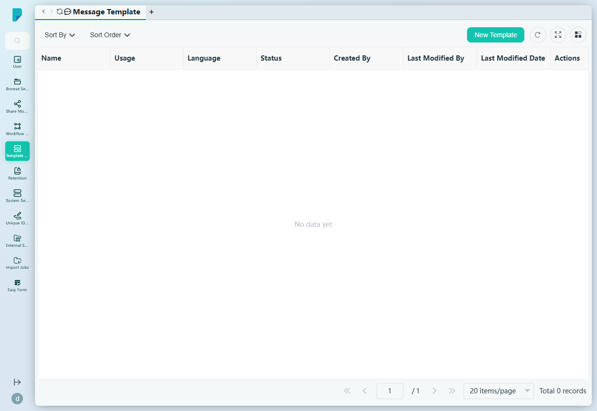
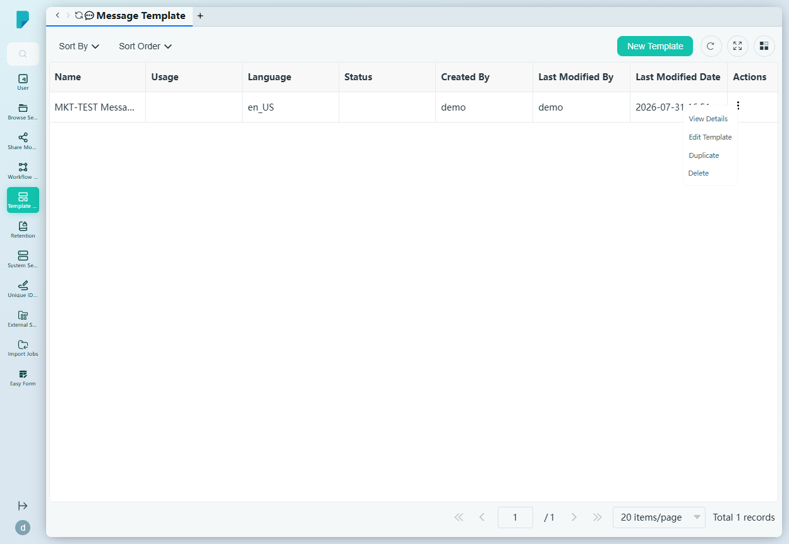
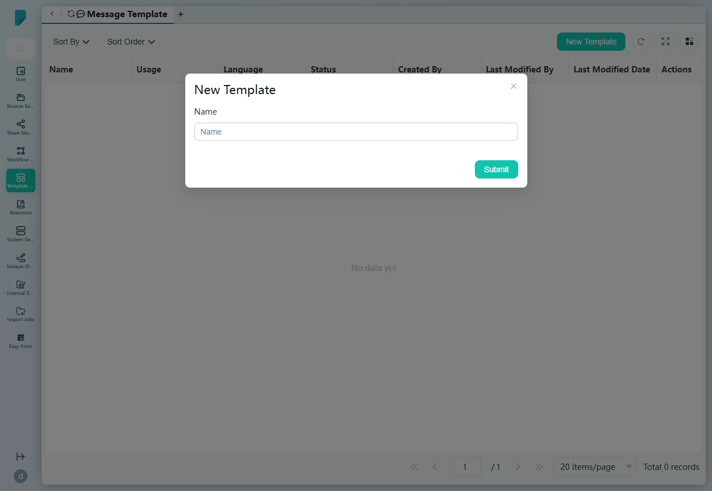
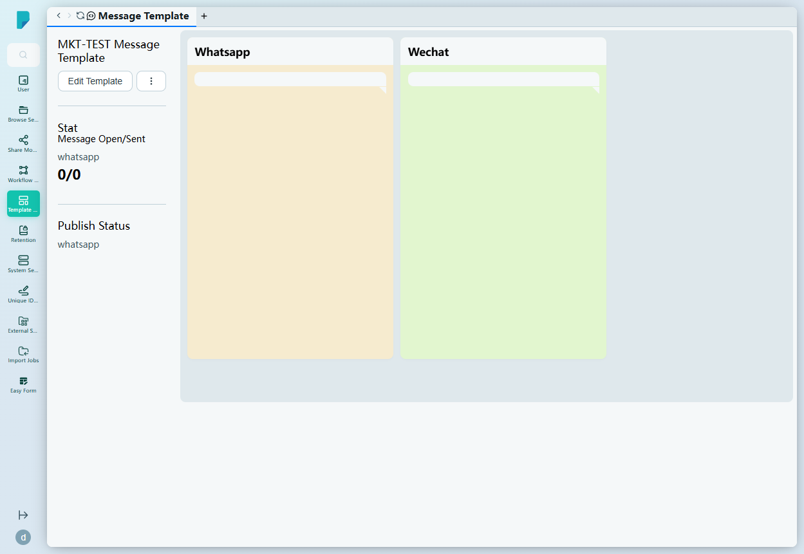

# Message Template

**Menu path:** Admin → Template Management → Message Template

## 此畫面的用途
聊天頻道（WhatsApp、WeChat）訊息範本的註冊表。Email Content Templates 負責電郵內容，而此畫面管理透過即時通訊應用程式發送的範本——包括各頻道的發佈狀態，以及開啟／發送統計數據。

## 工具列與操作
- **Sort By** — 複選框群組：Created By、Language、Last Modified By、Last Modified Date、Name、Status。
- **Sort Order** — A–Z 或 Z–A。
- **New Template** — 開啟建立對話框。
- 表格工具圖示：**Refresh**、**Full screen**、**Column settings**，以及附總記錄數的分頁頁尾。

## 列表與欄位
- **Name** — 範本名稱。
- **Usage** — 範本的用途。
- **Language** — 範本的語言地區設定（例如 en_US）。
- **Status** — 發佈狀態。
- **Created By** / **Last Modified By** — 擁有者及最後編輯者。
- **Last Modified Date** — 最後變更時間戳。
- **Actions** — 每列的 ⋯ 選單，包括：
  - **View Details** — 開啟詳情面板（見下文）。
  - **Edit Template** — 編輯範本。
  - **Duplicate** — 複製範本。
  - **Delete** — 刪除範本。

## 對話框與面板

### New Template
- **Name** — 範本名稱。
- **Submit** 建立範本；關閉（X）按鈕取消。

### 範本詳情面板（View Details）
- 標頭顯示範本名稱、**Edit Template** 按鈕及選單按鈕。
- **Stat** — 各頻道的使用計數（Message Open/Sent，例如 whatsapp 0/0）。
- **Publish Status** — 各頻道的發佈狀態（例如 whatsapp）。
- 頻道列表：**Whatsapp**、**Wechat**。

## 誰會使用
管理官方 WhatsApp／WeChat 訊息的系統管理員及客戶互動團隊——追蹤哪些範本已在各頻道發佈，以及其表現如何。
