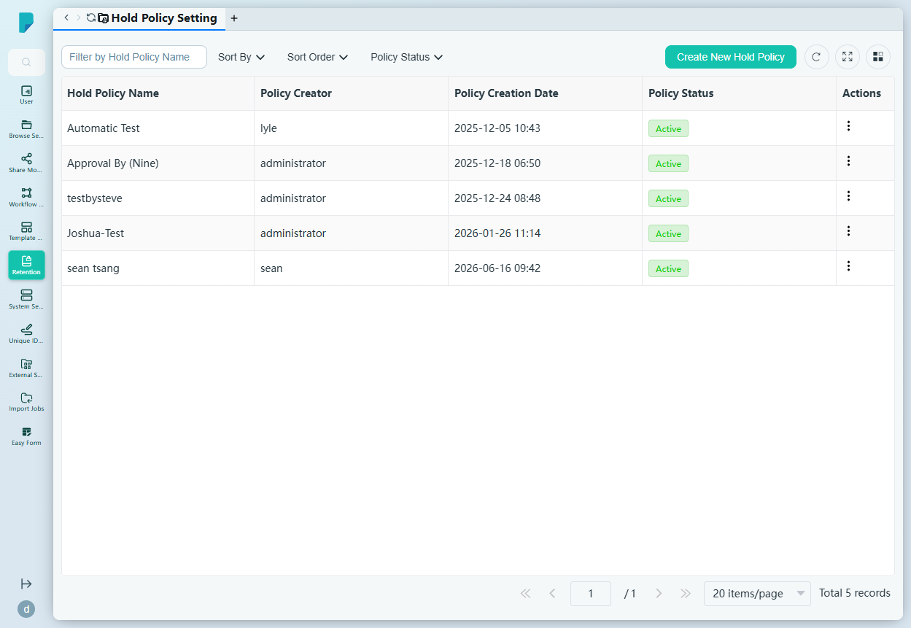
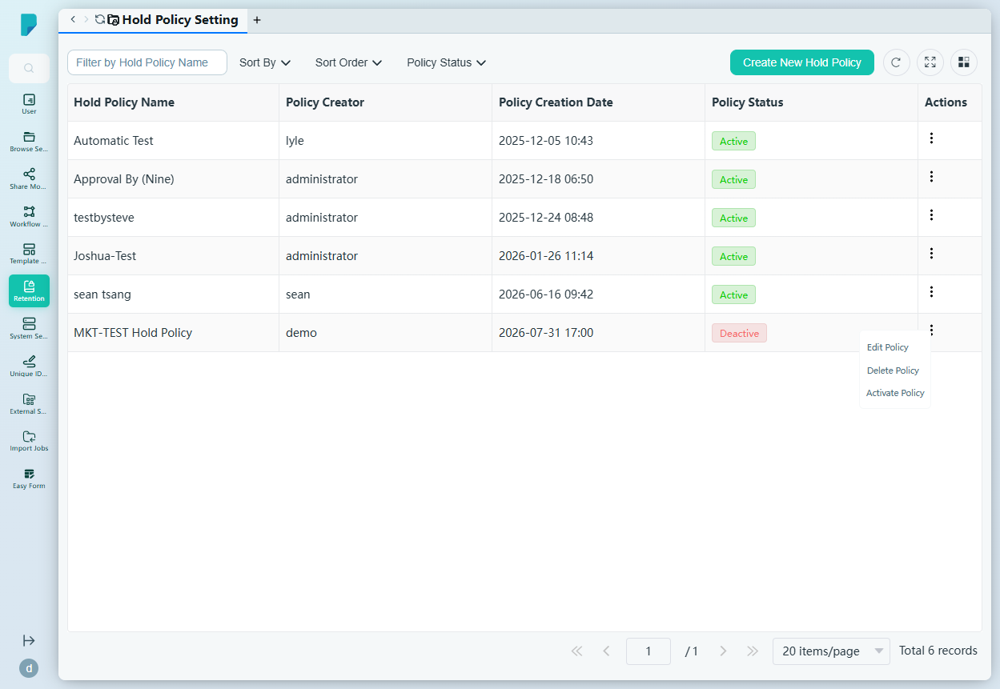
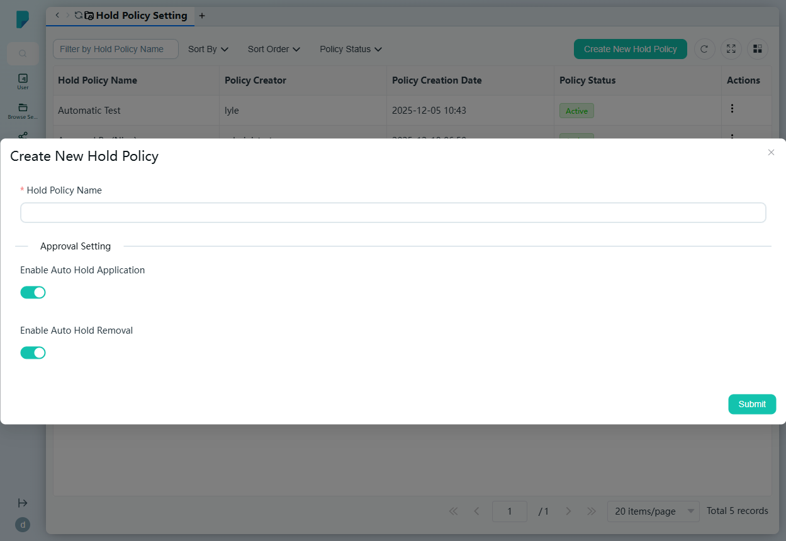

# Hold Policy Setting

**Menu path:** Admin → Retention → Hold Policy Setting

## 此畫面的用途
法律凍結（Legal Hold）管理。Hold Policy 會凍結文件，防止其被刪除或銷毀——可手動或自動套用——直至凍結解除為止。管理員在此建立政策、控制凍結是否自動套用及解除，並啟用或停用每項政策。

## 工具列與操作
- **Filter by Hold Policy Name** — 自由文字篩選框。
- **Sort By** — 複選框群組：Hold Policy Name、Policy Creation Date、Policy Creator、Policy Status。
- **Sort Order** — A–Z 或 Z–A。
- **Policy Status** — 按 Active / Deactive 篩選。
- **Create New Hold Policy** — 開啟建立對話框。
- 表格工具圖示：**Refresh**、**Full screen**、**Column settings**，以及附總記錄數的分頁頁尾。

## 列表與欄位
- **Hold Policy Name** — 政策名稱（例如 Automatic Test、Approval By (Nine)）。
- **Policy Creator** — 建立者。
- **Policy Creation Date** — 建立時間戳。
- **Policy Status** — Active 或 Deactive（新政策初始為 Deactive）。
- **Actions** — 每列的 ⋯ 選單，包括：
  - **Edit Policy** — 編輯政策設定。
  - **Delete Policy** — 刪除政策。
  - **Activate Policy** — 啟用政策。

## 對話框與面板

### Create New Hold Policy
- **Hold Policy Name**（必填）。
- **Approval Setting** 區段：
  - **Enable Auto Hold Application** — 開關（預設開啟）：凍結自動套用，無需手動審批。
  - **Enable Auto Hold Removal** — 開關（預設開啟）：凍結自動解除。
- **Submit** 建立政策（狀態為 Deactive，直至啟用）；關閉（X）按鈕取消。

## 誰會使用
負責執行法律凍結的檔案管理人員、合規主任及管理員——確保涉及調查或訴訟的文件不會被銷毀，並以受控、可審計的方式解除凍結。
