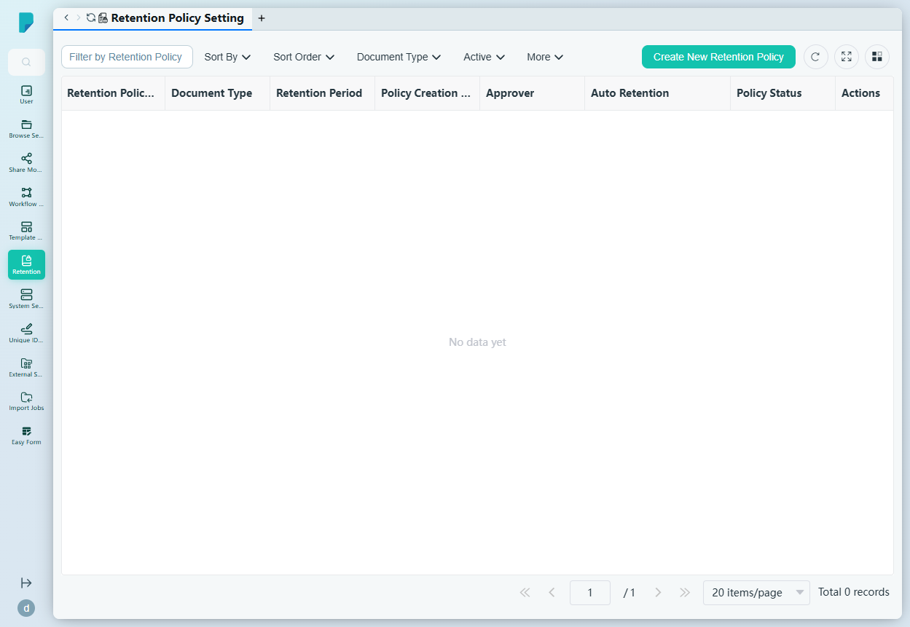
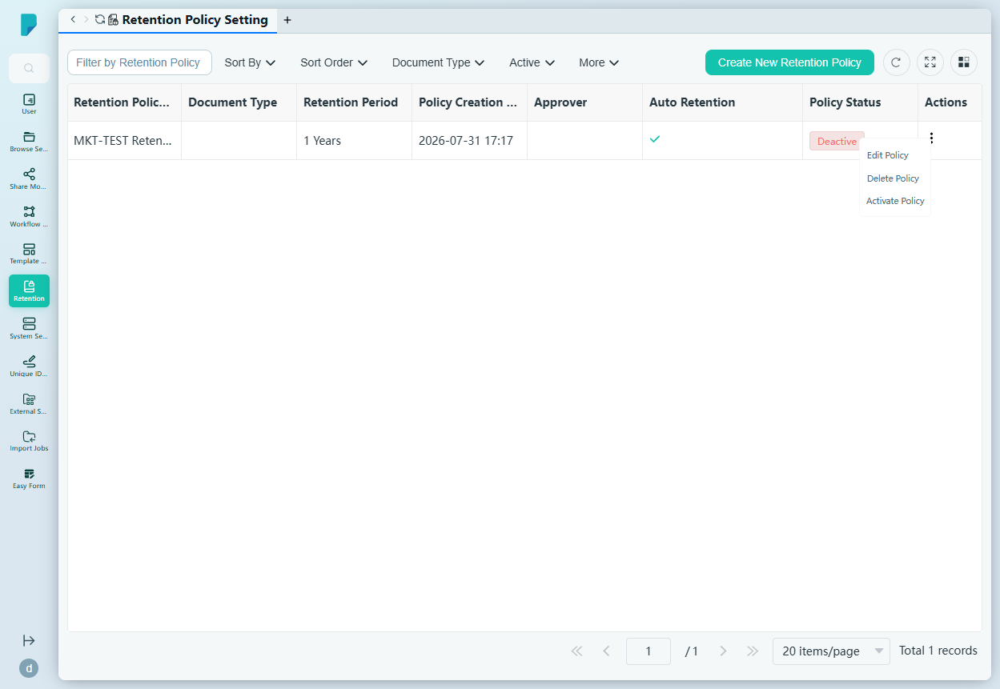
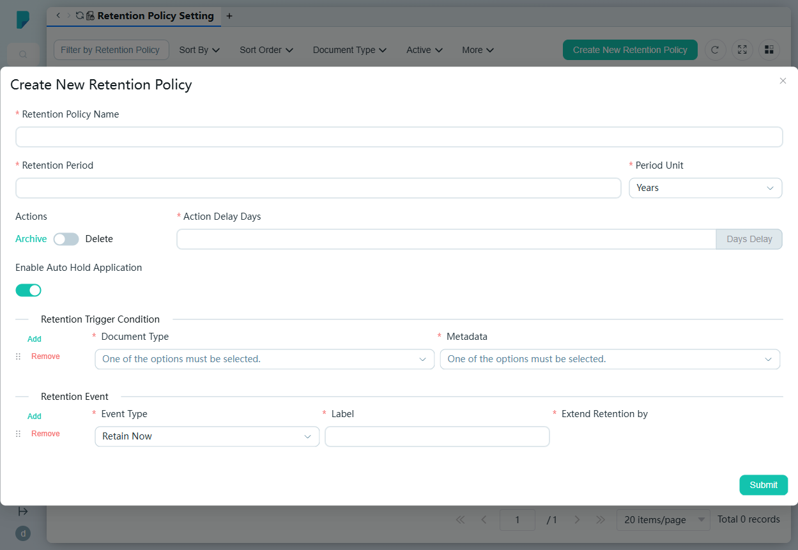

# Retention Policy Setting

**Menu path:** Admin → Retention → Retention Policy Setting

## 此畫面的用途
檔案保留規則管理。Retention Policy 定義指定類型的文件須保留多久、保留期屆滿後的處理方式（歸檔或刪除），以及可延長保留期的事件。政策初始為 Deactive，啟用後方會生效。

## 工具列與操作
- **Filter by Retention Policy Name.** — 自由文字篩選框。
- **Sort By** — 複選框群組：Approver、Policy Creation Date、Policy Status、Retention Period、Retention Policy Name。
- **Sort Order** — A–Z 或 Z–A。
- **Document Type** — 按文件類型篩選（沒有政策時顯示 "No Data"）。
- **Active** — 按 Active / Deactive 篩選。
- **More** — 顯示更多排序／篩選控制項。
- **Create New Retention Policy** — 開啟建立對話框。
- 表格工具圖示：**Refresh**、**Full screen**、**Column settings**，以及附總記錄數的分頁頁尾。

## 列表與欄位
- **Retention Policy Name** — 政策名稱。
- **Document Type** — 政策所管轄的類型。
- **Retention Period** — 例如 "1 Years"。
- **Policy Creation Date** — 建立時間戳。
- **Approver** — 審批負責人（如有設定）。
- **Auto Retention** — 啟用自動保留時顯示 ✓。
- **Policy Status** — Active 或 Deactive（新政策初始為 Deactive）。
- **Actions** — 每列的 ⋯ 選單，包括 **Edit Policy**、**Delete Policy** 及 **Activate Policy**。

## 對話框與面板

### Create New Retention Policy
- **Retention Policy Name**（必填）。
- **Retention Period**（必填）+ **Period Unit**（必填）— 下拉選單：Years、Months、Days。
- **Actions** — Archive ⇄ Delete 切換：保留期屆滿時的處置動作。
- **Action Delay Days**（必填）— 執行動作前的等候日數，附 "Days Delay" 單位按鈕。
- **Enable Auto Hold Application** — 開關（預設開啟）。
- **Retention Trigger Condition** — 可重複的列（Add / Remove，可拖曳重新排序）；每列將一個 **Document Type**（必填，來自 238 種類型的註冊表）與一個 **Metadata** 日期欄位（必填；選項：create_date、modify_date）配對，保留時鐘即由該日期起計。
- **Retention Event** — 可重複的列（Add / Remove，可拖曳重新排序）；每列設有 **Event Type**（必填 — Retain Now 或 Extend）、**Label**（必填）及 **Extend Retention by**（必填，附 "Days" 單位按鈕）——即可延長保留期的事件。
- **Submit** 建立政策（Deactive，直至啟用）；關閉（X）按鈕取消。

## 誰會使用
負責執行保留時間表的檔案管理人員及合規主任——確保文件按法規要求保存確切的期限，其後準時歸檔或銷毀，並以合規事件合理地延長保留時鐘。
