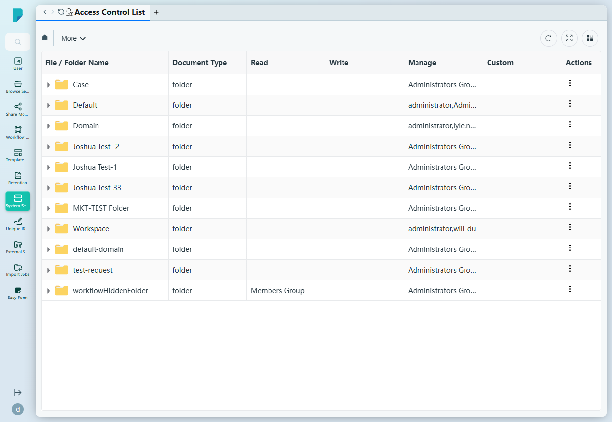
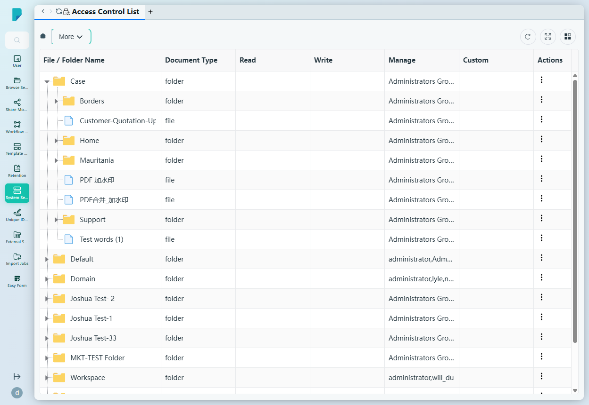
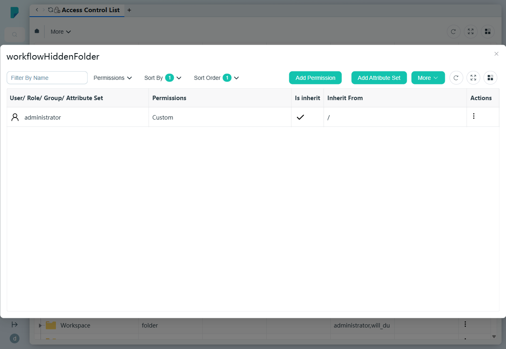

# Access Control List

**Menu path:** Admin → System Setting → Access Control List

## 此畫面的用途
整個文件庫的安全地圖。每個根資料夾——以及其下的每個資料夾和檔案——均以可展開的樹狀結構列出，並顯示其有效的 Read / Write / Manage / Custom 權限授予，讓管理員清楚看到各處誰可以做甚麼，並可深入查看任何項目的詳細權限列表。

## 工具列與操作
- **More** — 顯示 Sort By 及 Sort Order 控制項。
- 表格工具圖示：**Refresh**、**Full screen**、**Column settings**。

## 列表與欄位
文件庫的可展開樹狀結構（⌄）——根層例如 Case、Default、Domain、Workspace、default-domain、test-request、workflowHiddenFolder；展開資料夾即可顯示其子資料夾及檔案。

- **File / Folder Name** — 項目名稱。
- **Document Type** — 資料夾或檔案。
- **Read** — 獲授予讀取權限的用戶／群組（例如 workflowHiddenFolder：Members Group）。
- **Write** — 獲授予寫入權限的用戶／群組。
- **Manage** — 獲授予管理權限的用戶／群組（例如 Administrators Group、administrator）。
- **Custom** — 自訂權限授予。
- **Actions** — 每列的 ⋯ 選單，包括 **View Details**（權限詳情面板）及 **toggleExpand**（展開／收合樹狀節點）。

## 對話框與面板

### 權限詳情面板（View Details）
顯示所選項目的完整權限列表：

- **Sort By**、**Sort Order**、**Add Permission**、**Add Attribute Set** 及 **More** 控制項。
- 欄位：**User/ Role/ Group/ Attribute Set**（被授權者）、**Permissions**（例如 Custom）、**Is inherit**（該授予是否繼承而來）、**Inherit From**（授予來源的上層，例如 `/`）、**Actions**。

## 誰會使用
負責審計及管治整個文件庫存取權限的系統管理員及安全主任——核實權限繼承、發現過於寬鬆的授予，並將權限管理細緻至單一檔案。
