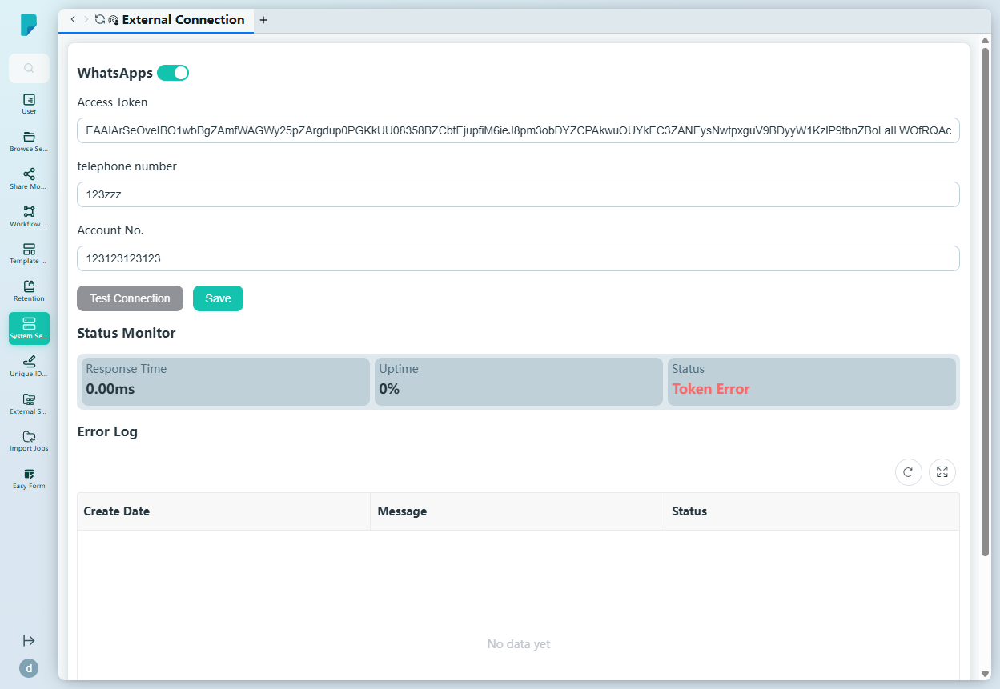

# External Connection

**Menu path:** Admin → System Setting → External Connection

## 此畫面的用途
外部訊息服務的整合中心。在此網站上，它託管 WhatsApp 連接：憑證、連線測試、即時健康監察及錯誤日誌——管理員維持 WhatsApp 訊息範本所依賴的頻道正常運作所需的一切，盡在這裡。

## 工具列與操作
- **WhatsApps** 區段標頭附 **enable switch**（目前為開啟）— 開啟或關閉此整合。
- 連接表單：
  - **Access Token** — WhatsApp Business API 存取權杖（以憑證欄位形式儲存及顯示）。
  - **telephone number** — 已連接的電話號碼。
  - **Account No.** — WhatsApp Business 帳戶號碼。
- **Test Connection** — 向外部服務驗證憑證。
- **Save** — 儲存連接設定。

## 列表與欄位

### Status Monitor
連接的即時健康狀況：

- **Response Time** — 最近一次量得的延遲（0.00ms）。
- **Uptime** — 可用率百分比（0%）。
- **Status** — 目前狀態（此網站上為 **Token Error**，即已設定的權杖現時被外部服務拒絕）。

### Error Log
連接錯誤的表格，設有 **Create Date**、**Message** 及 **Status** 欄位（目前為空），附 Refresh 及 Full screen 控制項和分頁頁尾。

## 對話框與面板
無——本頁為單一設定表單加上監察區段。

## 誰會使用
負責第三方整合的系統管理員——將 DocPal 連接至 WhatsApp Business、監察其健康狀況，並在用戶察覺之前診斷憑證故障。
