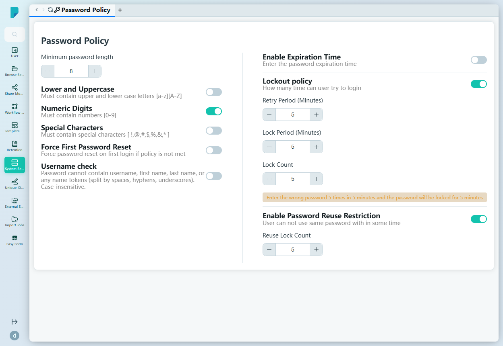

# Password Policy

**Menu path:** Admin → System Setting → Password Policy

## 此畫面的用途
整個網站的密碼規則。單一表單控制網站上每位用戶的密碼強度要求、首次登入強制執行、到期、帳戶鎖定及密碼重用限制。此網站的目前設定如下所示。

## 工具列與操作
沒有工具列——本頁為單一政策表單，以開關及數值微調器（spinner）操作（未見明確的 Save 按鈕；各切換開關即為控制項）。

## 列表與欄位
並非列表——而是政策欄位：

### Complexity
- **Minimum password length** — 微調器，8–24（目前：8）。
- **Lower and Uppercase** — 必須包含大寫及小寫字母 [a-z][A-Z]（目前：關閉）。
- **Numeric Digits** — 必須包含數字 [0-9]（目前：**開啟**）。
- **Special Characters** — 必須包含特殊字符 [ !,@,#,$,%,&,* ]（目前：關閉）。

### Enforcement
- **Force First Password Reset** — 如密碼不符合政策，首次登入時強制重設密碼（目前：關閉）。
- **Username check** — 密碼不得包含用戶名、名字、姓氏，或任何以空格、連字號或底線分隔的名字片段；不區分大小寫（目前：關閉）。
- **Enable Expiration Time** — 設定密碼到期時間（目前：關閉）。

### Lockout policy（目前：**開啟**）
"How many times can a user try to log in"——附即時提示 "Enter the wrong password 5 times in 5 minutes and the password will be locked for 5 minutes"：
- **Retry Period (Minutes)** — 1–255（目前：5）。
- **Lock Period (Minutes)** —（目前：5）。
- **Lock Count** — 1–255（目前：5）。

### Password reuse（目前：**開啟**）
- **Enable Password Reuse Restriction** — 用戶不得重用近期密碼。
- **Reuse Lock Count** — 封鎖多少個先前密碼，1–10（目前：5）。

## 對話框與面板
無。

## 誰會使用
制定機構憑證標準的系統管理員及安全主任——在易用性與暴力破解及密碼循環再用風險之間取得平衡。
