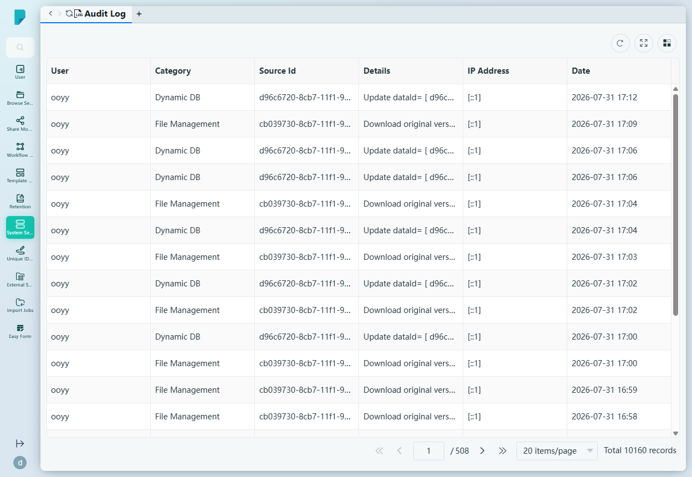

# Audit Log

**Menu path:** Admin → System Setting → Audit Log

## 此畫面的用途
平台的完整活動紀錄（此網站共有 10,160 條紀錄）。每個用戶操作——包括文件下載、資料庫更新等——都會記錄操作者、涉及的對象、來源位置及時間，為管理員及審計人員提供單一的鑑證級資料來源。

## 工具列與操作
- 表格工具圖示：**Refresh**、**Full screen**、**Column settings**，另設分頁頁尾（此處共 508 頁——每頁 20 項）。
- 此頁沒有篩選列或匯出按鈕；紀錄按頁瀏覽，最新者排最前。

## 列表與欄位
- **User** — 執行操作的帳戶（例如 ooyy）。
- **Category** — 所屬功能範疇（例如 File Management、Dynamic DB）。
- **Source Id** — 受影響對象的 ID（例如文件或紀錄的 UUID）。
- **Details** — 操作的可讀描述，例如「Download original version of document […]」或「Update dataId= [ … ] record in tableId= [ … ]」。
- **IP Address** — 用戶端的 IP（例如 `[::1]`）。
- **Date** — 操作的時間戳。

## 對話框與面板
無——此頁為唯讀的日誌檢視器。

## 誰會使用
系統管理員、保安團隊及審計人員，用於調查事故、證明合規，以及重組任何文件或紀錄的完整事發經過。
