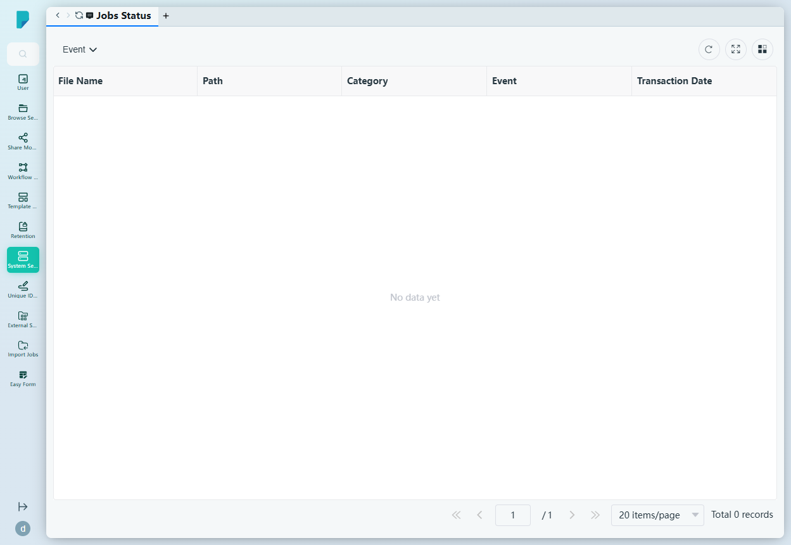

# Jobs Status

**Menu path:** Admin → System Setting → Jobs Status

## 此畫面的用途
背景工作監察器。平台處理的每個檔案相關工作——轉換、傳輸、訊息發送及其他非同步作業——都會列出其目標檔案、類別、目前事件狀態及時間戳，讓管理員監察佇列，並及早發現卡住或失敗的工作。

## 工具列與操作
- **Event** — 按工作事件／狀態篩選：CREATE、PENDING、COMPLETED、FINISH、ERROR、PENDING_FOR_SENDING_MESSAGE。
- 表格工具圖示：**Refresh**、**Full screen**、**Column settings**，另設顯示總紀錄數的分頁頁尾。

## 列表與欄位
- **File Name** — 工作所處理的檔案。
- **Path** — 檔案在儲存庫中的路徑。
- **Category** — 工作的類別。
- **Event** — 工作的目前狀態（CREATE / PENDING / COMPLETED / FINISH / ERROR / PENDING_FOR_SENDING_MESSAGE）。
- **Transaction Date** — 記錄工作事件的時間。

此列表目前為空（「No data yet」，0 條紀錄）——此網站沒有已排入佇列或已記錄的工作。

## 對話框與面板
無——此頁為唯讀的監察列表。

## 誰會使用
系統管理員及營運人員，負責維持平台非同步流水線的健康運作——確認工作順利完成，並在錯誤演變成用戶投訴之前將其截獲。
