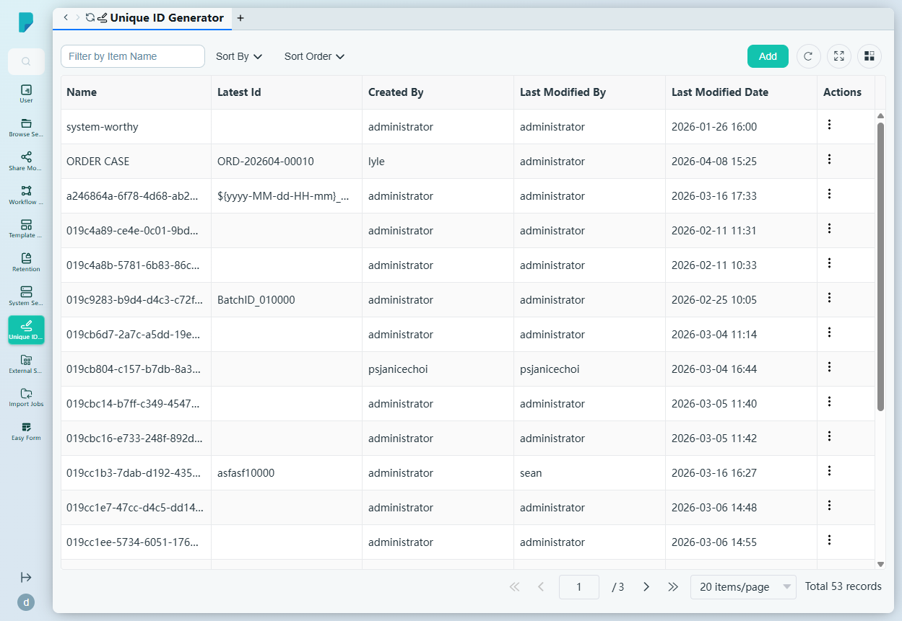
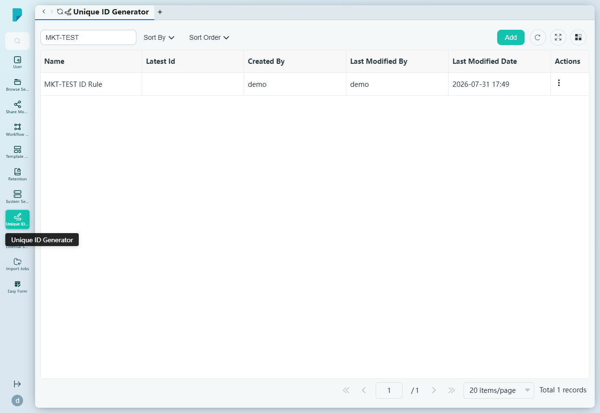
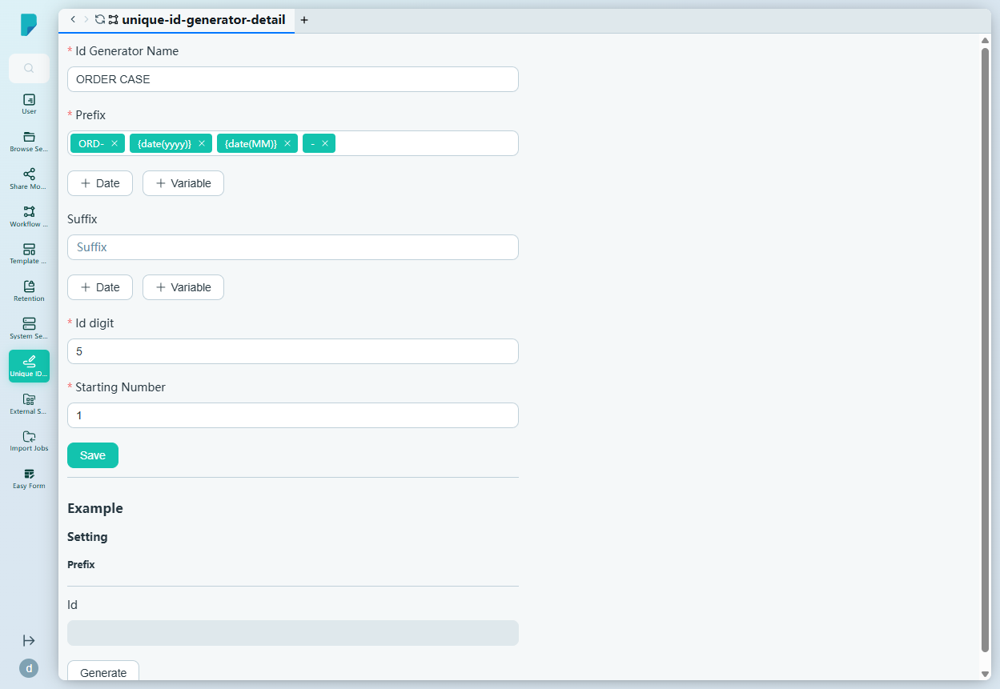

# Unique ID Generator

**Menu path:** Admin → Unique ID Generator

## 此畫面的用途
ID 產生規則的登記冊（此網站共有 53 條）。每條規則透過組合固定文字、日期代碼及遞增序號，產生獨一無二且易讀的識別碼——訂單編號、個案編號、批次 ID 等。規則可供文件類型、工作流程及任何需要受控唯一 ID 的地方使用。

## 工具列與操作
- **Filter by Item Name** — 自由文字篩選框。
- **Sort By** — 複選框群組：Name、Latest Id、Created By、Last Modified By、Last Modified Date。
- **Sort Order** — A–Z 或 Z–A。
- **Add** — 透過複製現有設定來建立規則（會提示輸入新名稱）。
- 表格工具圖示：**Refresh**、**Full screen**、**Column settings**，另設分頁頁尾（此處共 3 頁）。

## 列表與欄位
- **Name** — 規則名稱（例如 ORDER CASE、system-worthy）。
- **Latest Id** — 最近簽發的 ID（例如 `ORD-202604-00010`、`${yyyy-MM-dd-HH-mm}_010015`、`BatchID_010000`）。
- **Created By** / **Last Modified By** — 建立及修改者。
- **Last Modified Date** — 最後修改時間戳。
- **Actions** — 每列的 ⋯ 選單，提供 **Edit**（開啟規則編輯器）、**Duplicate**（以新名稱複製規則）及 **Delete**。

## 對話框與面板

### Rule editor (Edit)
- **Id Generator Name**（必填）。
- **Prefix**（必填）— 以可移除標籤形式顯示的有序代碼列表，例如 `ORD-`、`{date(yyyy)}`、`{date(MM)}`、`-`；**Date** 及 **Variable** 按鈕可分別插入日期格式代碼及變數，兩者之間亦可直接輸入自由文字。
- **Suffix** — 可選的結尾文字，同樣設有 **Date** / **Variable** 代碼按鈕。
- **Id digit**（必填）— 序號位數（例如 5 → `00010`）。
- **Starting Number**（必填）— 序號的起始值（例如 1）。
- **Save** 儲存規則。
- **Example** 區塊 — 一個 **Id** 預覽欄位及一個 **Generate** 按鈕，可在不實際簽發的情況下預覽下一個 ID（例如按上述格式產生 `ORD-202607-00001`）。

## 誰會使用
系統管理員，負責統一全機構的編號方式——讓每個個案、訂單及批次都擁有可預測、可審計、不會重複的識別碼。
