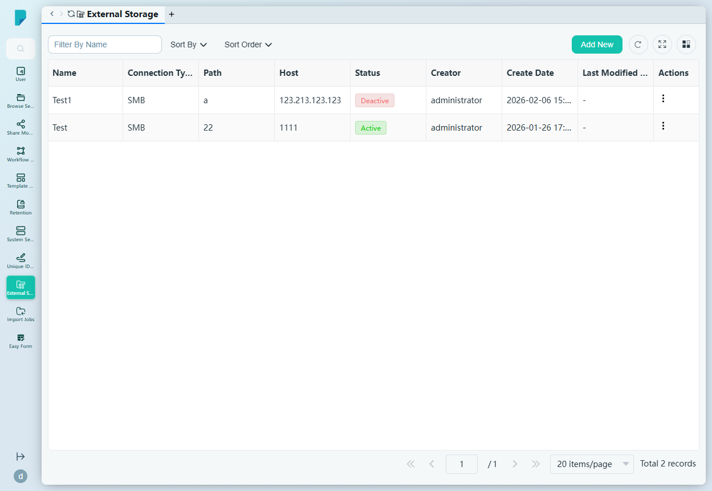
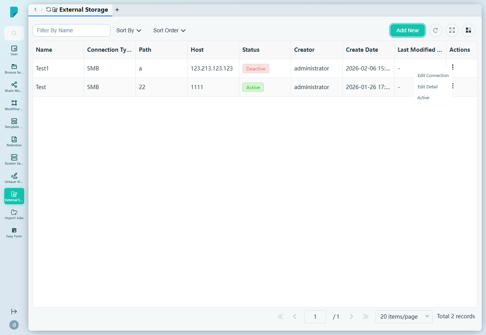
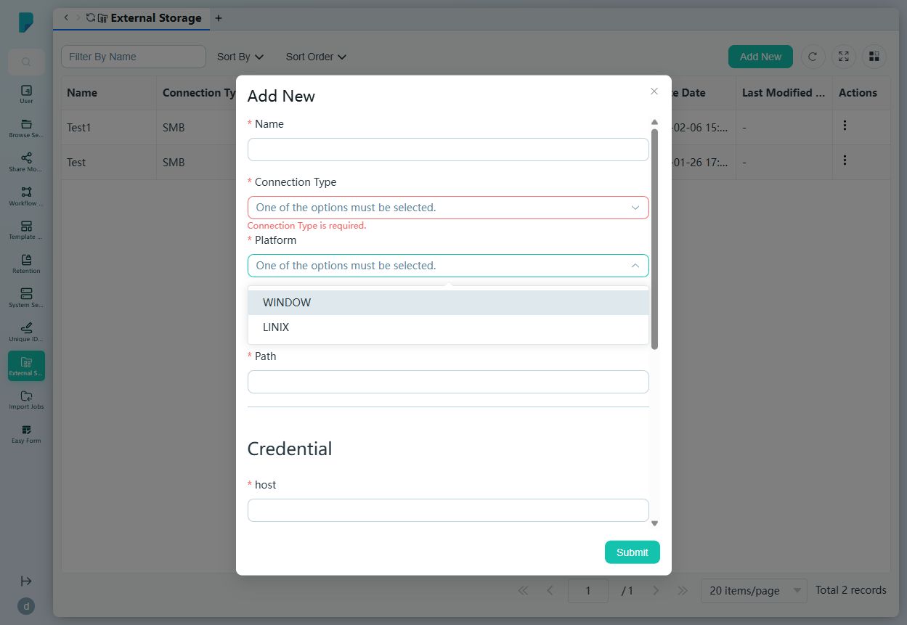

# External Storage

**Menu path:** Admin → External Storage

## 此畫面的用途
外部儲存連線的登記冊——即網絡共享（SMB），文件檔案可存放於主要儲存庫以外的位置。管理員可在此新增連線、保管其登入憑證，並將每個連線切換為 Active 或 Deactive，以控制檔案是否流向該連線。

## 工具列與操作
- **Filter By Name** — 自由文字篩選框。
- **Sort By** — 複選框群組：Name、Create Date、Status、Last Modified Date。
- **Sort Order** — A–Z 或 Z–A。
- **Add New** — 開啟連線對話框。
- 表格工具圖示：**Refresh**、**Full screen**、**Column settings**，另設顯示總紀錄數的分頁頁尾。

## 列表與欄位
- **Name** — 連線名稱（Test1、Test）。
- **Connection Type** — 目前兩列均為 SMB。
- **Path** — 共享路徑。
- **Host** — 伺服器地址。
- **Status** — Active 或 Deactive。
- **Creator** — 連線的建立者。
- **Create Date** / **Last Modified Date** — 時間戳。
- **Actions** — 每列的 ⋯ 選單，提供 **Edit Connection**、**Edit Detail** 及 **Active**（啟用連線）。

## 對話框與面板

### Add New
- **Name**（必填）。
- **Connection Type**（必填）— 下拉選單；此網站為 SMB。
- **Platform**（必填）— 下拉選單：WINDOW、LINIX [sic]。
- **Work Group**（必填）— SMB 工作群組。
- **Path**（必填）— 共享路徑。
- **Credential** 區塊 — **host**（必填）、**Username**（必填）、**Password**（必填）、**Shared Secret**（可選）、**Port**（必填，預設遮罩顯示）。
- **Status** — Active 開關（預設開啟）。
- **Submit** 建立連線；關閉（X）按鈕則取消。

## 誰會使用
系統管理員及基礎架構負責人，將 DocPal 的儲存延伸至企業檔案伺服器——擴充容量之餘，亦讓檔案保留在機構自行掌控的基礎架構之上。
