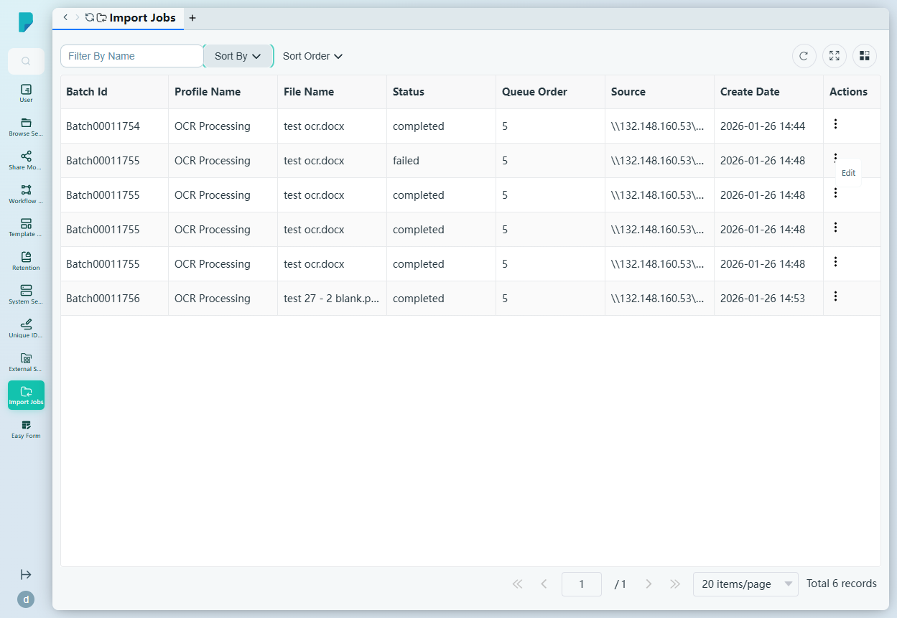

# Import Jobs

**Menu path:** Admin → Import Jobs

## 此畫面的用途
批量匯入及處理工作的監察器。來自受監察網絡來源的檔案會按批次處理（例如 OCR Processing）；此畫面顯示每個批次、其來源、在佇列中的位置，以及完成或失敗的狀態。

## 工具列與操作
- **Filter By Name** — 自由文字篩選框。
- **Sort By** — 複選框群組：Profile Name、Create Date、Status。
- **Sort Order** — A–Z 或 Z–A。
- 表格工具圖示：**Refresh**、**Full screen**、**Column settings**，另設顯示總紀錄數的分頁頁尾。
- 沒有新增按鈕——工作源自已設定的匯入來源，而非從此畫面建立。

## 列表與欄位
- **Batch Id** — 工作的批次識別碼（例如 Batch00011754）。
- **Profile Name** — 處理設定檔（例如 OCR Processing）。
- **File Name** — 已匯入的檔案（例如 test ocr.docx）。
- **Status** — completed 或 failed。
- **Queue Order** — 工作在處理佇列中的位置。
- **Source** — 檔案的來源網絡路徑（例如 `\\132.148.160.53\Docpaltest\processing\Batch00011754`）。
- **Create Date** — 工作的建立時間。
- **Actions** — 每列的 ⋯ 選單，提供 **Edit**。

## 對話框與面板
除每列的 Edit 操作外，未見其他對話框或面板。

## 誰會使用
系統管理員及營運人員，負責監察匯入流水線——確認批次依序處理，並截獲失敗的匯入以便重新處理。
