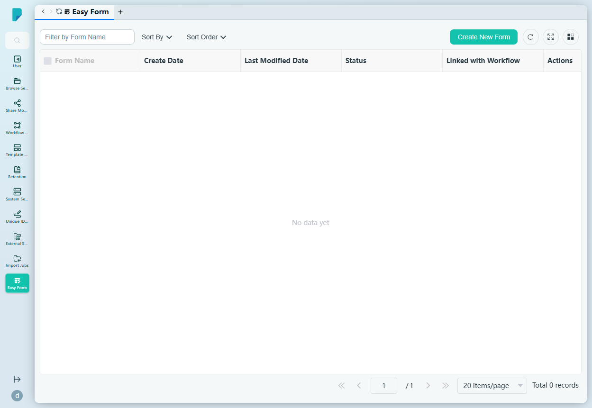
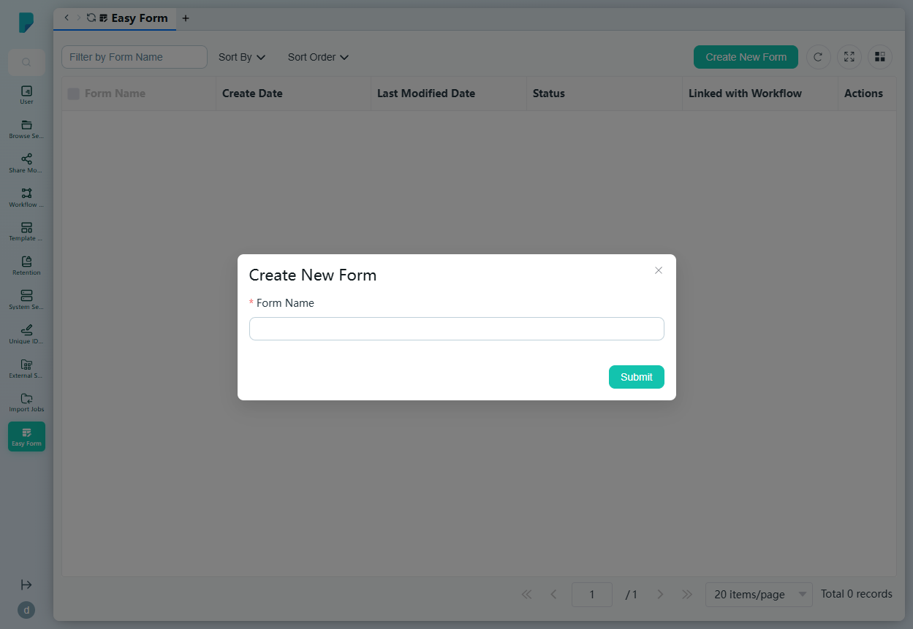
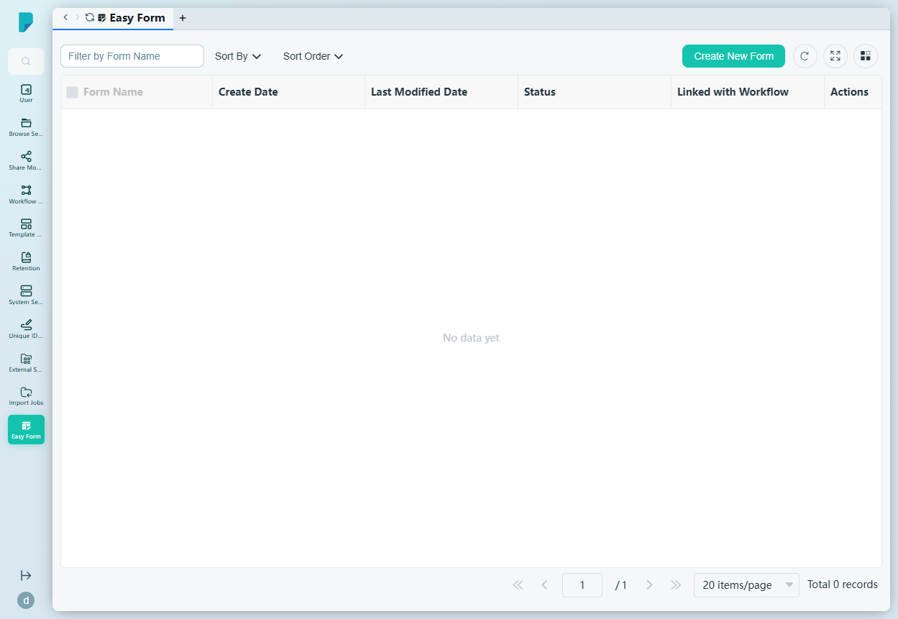

# Easy Form

**Menu path:** Admin → Easy Form

## 此畫面的用途
Easy Form 的登記冊——可設計、發佈並連結至工作流程的輕量級資料擷取表格（列表設有「Linked with Workflow」欄）。管理員在此建立表格，並管理其狀態及工作流程關聯。

## 工具列與操作
- **Filter by Form Name** — 自由文字篩選框。
- **Sort By** — 複選框群組：Create Date、Form Name、Status、Last Modified Date。
- **Sort Order** — A–Z 或 Z–A。
- **Create New Form** — 開啟建立對話框。
- 表格工具圖示：**Refresh**、**Full screen**、**Column settings**，另設顯示總紀錄數的分頁頁尾。

## 列表與欄位
- **（選取複選框）** — 列選取。
- **Form Name** — 表格名稱。
- **Create Date** / **Last Modified Date** — 時間戳。
- **Status** — 表格的發佈狀態。
- **Linked with Workflow** — 表格所連結的工作流程。
- **Actions** — 每列的操作選單。

## 對話框與面板

### Create New Form
- **Form Name**（必填）。
- **Submit** 建立表格；關閉（X）按鈕則取消。

## 此網站觀察到的已知問題（2026-07-31）
表格列表 API 故障：`POST /admin/api/dms/easy-form/page` 回傳 HTTP 500，內容為 `{"code":700,"data":null,"message":null,"result":false}`，因此即使已有表格存在，列表仍一律顯示「No data yet」。表格建立本身正常——建立測試表格時 `POST /admin/api/dms/easy-form` 回傳 200——但之後列表無法載入（同樣回傳 500），與已知的用戶端 Easy Form 故障情況一致。

## 誰會使用
系統管理員及流程負責人，用於建立快速資料擷取表格並將其接入工作流程。
